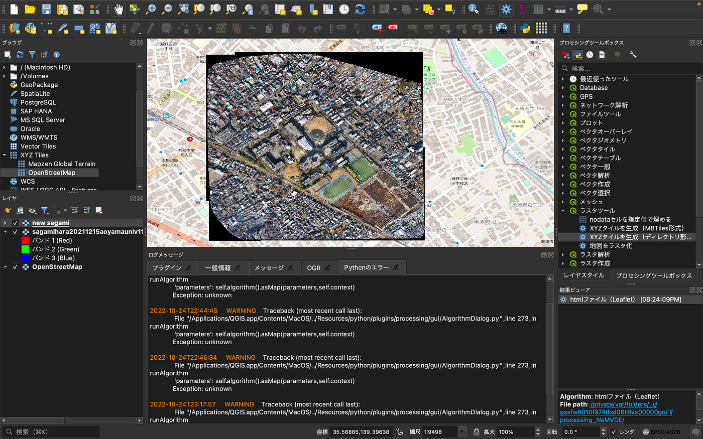

### OSS4SDG Hackathonドローン部 中間発表

ドローン部の小澤です。今回は10月ハッカソンの中間発表を記載させて頂きます！

> テーマ

ドローン部のテーマは、UNVTportableにドローンの空撮画像をインストールする一連のマニュアル化をすることです。そのためにはまず、**GeoTIFF形式からXYZスタイル**へ変換する必要があります。方法としてはQGISもしくはgdal2tilesなどがありますが、今回はQGISを使用しました。

やるべきこととしては、
・QGISのダウンロード
・プラグインのダウンロード
・データ変換
でした。

詳細に関しては、以下に記載しています。
[https://github.com/furuhashilab/drone_UN-EC_OSS4SDG_hachathon2022/issues/1](https://github.com/furuhashilab/drone_UN-EC_OSS4SDG_hachathon2022/issues/1)

⚠︎Mac画面なので、WindowsPCだと多少違う可能性もあります。

> 分からなかった用語に関して

・オルソモザイク→航空写真はたくさんの写真を一つにまとめたものであり、そのつなぎ目で生じた歪みを補正すること。出来たものはオルソ画像。

・ A GeoTIFF→位置情報の画像データ（生のデータ） 地理参照情報（座標参照系などが埋め込まれている・プラグイン 初期設定にないものに新しい機能を追加する事

・プラグイン 初期設定にないものに新しい機能を追加する事。ＱＧＩＳだけではできないこともインストールすると新しい機能も使えるようになる。
