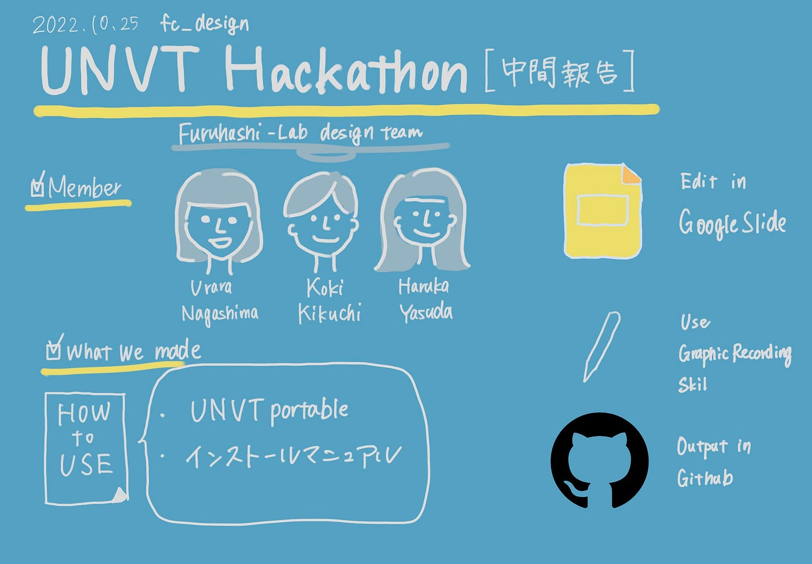

## UNVTハッカソン中間報告デザイン部

デザイン部のHarukaです。

10月のオンラインハッカソンのテーマはUNVT portable.

デザイン部では、マニュアルの作成を行なっています。

### 作成の流れ

1. まず去年開発に関わっていたKokiからUNVT portableの概要を説明してもらいました。メンバーの認識を合わせます。

1. UNVT portable を説明する[既存スライド](https://docs.google.com/presentation/d/1iJA84DVKmgCKfYh5lDX1xKMyVrd_GXOd2gQ_3dn3WKo/edit?usp=sharing)を元に、マニュアルを作成します。

1. 3人で、スライドの取捨選択と、追加項目を整理し各自作業をしました。

Urara/Koki が文面作成・編集・デザイン調整

Harukaがグラレコ要素の追加

このような分担で進めました。

### 成果物

[マニュアルのGoogleSlide](https://docs.google.com/presentation/d/1-uUq_5YMXbEXBDoM9XUHi9zCOVmKVVlscOJ1A0XdMW0/edit#slide=id.g117a7752a08_0_5)（日本語版）

[コンテンツ格納されたGithub](https://github.com/unvt/portable)

> UNVT portableを把握する上で参考にしたGithubページ

[GitHub - unvt/portable: UNVT Portable
"UNVT Portable" is a package for RaspberryPi that functions as a map hosting server and can be freely accessed from a…github.com](https://github.com/unvt/portable)

[Issues · unvt/washi
New issue Have a question about this project? Sign up for a free GitHub account to open an issue and contact its…github.com](https://github.com/unvt/washi/issues?page=2&q=is%3Aissue+is%3Aopen)
