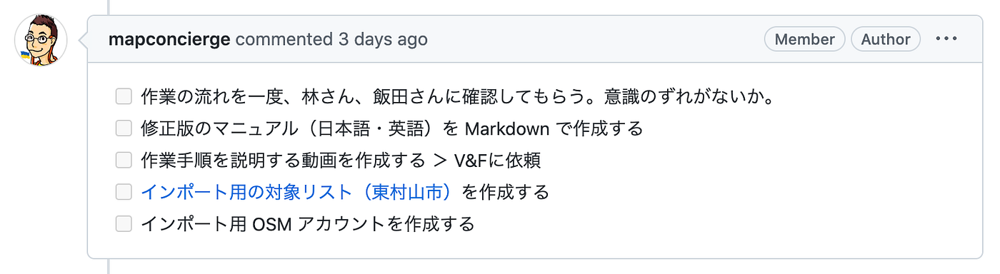
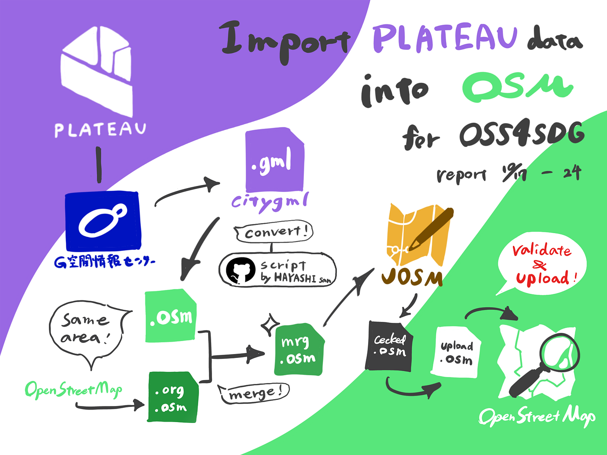

### OSS4SDG Hackathon 中間報告

Youthチームの中間報告をさせていただきます。

#### ハッカソン概要

YouthMappersAGU部のテーマは

_**[PLATEAU](https://www.mlit.go.jp/plateau/)データの[OSM](https://openstreetmap.jp/)へのインポートになります。_**

概要としては

・インポート作業用のマニュアルを完成させること

・作業の動作チェックをする

・実際PLATEAUデータをOSMに流し込む（今回の対象地域は東村山市）

詳細は[GitHub](https://github.com/furuhashilab/youth_UN-EC_OSS4SDG_hachathon2022)に記載

#### おおまかな作業の流れ

[Qiitaで公開されているインポート手順（ドラフト）を参考に作業していく。](https://qiita.com/nyampire/items/1c10afdd36750c87154d)

（作業マニュアル v0.9 アーカイブは[こちら](https://github.com/furuhashilab/youth_UN-EC_OSS4SDG_hachathon2022/issues/7)）

あらかじめPCに[Java](https://www.java.com/ja/)と[JOSM](https://josm.openstreetmap.de/wiki/Ja:Download)をダウンロードしておく

1. 対象地域のcitygmlファイルをCityGML形式で[ダウンロード](https://www.geospatial.jp/ckan/dataset/plateau)し、zip展開する。

1. 変化スクリプトcitygml-osmを[ダウンロード](https://github.com/yuuhayashi/citygml-osm/releases)する。

1. 1stから3rdまでのスクリプトを回す。

→ここでCityGMLファイルを.osmに変換し、そこに該当する範囲のデータを.org.osmで保存。それらを比較、マージすることでmrg.osm出力し保存する。ファイル数が多いと時間がかかる。

4. .mrg.osmをJOSMで開き、既存のOSMデータとPlateauデータが同じ領域で重なる部分があった場合、対象オブジェクトに`"MLIT_PLATEAU:fixme"`タグが付与されるため、`"MLIT_PLATEAU:fixme"=*`のフィルタを有効化し、反転させて、タグがついていないデータ（つまり、Plateauデータそのままのオブジェクト）だけを表示させる。

背景画像にBingやMaxarなど、なるべく撮影年度の新しい衛星写真をセットし、明らかに現状存在しない建物オブジェクトがある場合、そのオブジェクトを削除する。

5. チェックの完了したファイルを名前をつけて保存する。

形式はchecked.osm

6. 4thスクリプトを回し、アップロード用ファイルに変換する。

cheched.osm → upload.osm

7. JOSMでupload.osmを開き、妥当性検証後、osm.orgへアップロード

8. OSM wikiの対象リストにインポート済みであることを記載する。

#### [林さんからの手順書修正依頼](https://github.com/furuhashilab/youth_UN-EC_OSS4SDG_hachathon2022/issues/7#issuecomment-1287774283)

*.mrg.osm での操作に関して、「オブジェクトの削除」以外の操作は絶対にやめてほしい。消すか消さないかの２択以外はやらないようにしてください。

#### 現在の改善点・不明点

・ `"MLIT_PLATEAU:fixme"`が付与されていないデータの確認を行う際、
反転しない方が見やすいのではないか？？

・upload.osmの妥当性検証でノードの重複をどこまで修正するのか？

#### 確認しておくこと・今後の流れ

#### グラレコ

