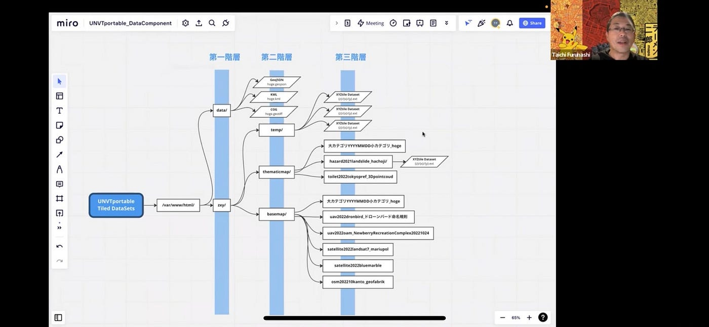

### UNVT Portable タイルデータセットフォルダの構造化について

**ドローン部の小澤です！UNVT Portableのファイルの構造化についてまとめます！**

> 最終案

初めに、以下の表が古橋先生と平澤先輩が話し合いを行ってくださり、最終案として決定したものです。

構造化をしたことがない人にとっては全く意味の分からない表だと思うので、（自分も最初はさっぱりでした）一つずつ説明して行きます！

> 構造化と命令規則について

まず初めに、考える内容は「構造化」と「命令規則」があります。「構造化」とはどういった分類でファイルを保存するかを決める内容であり、「命令規則」はそれらのファイルの名前をどう統一化するか、です（あってますよね、、汗汗）。自分は最初、ここの違いが分かっていなかったので、一応記述しておきました！

> 構造化の詳細について

一番初めにくる、[/var/www/html/]に関してですが、これはLinuxOSでは基本固定のため、そのまま使用するそうです。

次に第一階層についてですが、[data/]と[zxy/]に分かれます。[zxy/]はタイルデータの保存先で、[data/]はタイルデータ以外のデータの保存先になります。

第二階層に関して、[data/]ではKMLデータや、GeojSONデータなどを分離して格納します。[zxy/]においては、地図データは「主題図」と「一般図」に分類することができるため、保存フォルダ先もそれぞれ[themathicmap]と[basemap]に分類されます。しかし、その二つ以外の「とりあえず保存したいデータ」もある場合のために[temp/]を用意します。

> 第三構造と命令規則について

次に第三構造についてです。ここがタイルデータの最終的なデータ分類地となり、「命令規則」によってファイル保存の方法をルール化します。
最終的な命令規則は[大カテゴリYYYYMMDD小カテゴリ_hoge]となりました。様々な討論の結果、「そのファイルが何のデータなのか」を明確にするために「大カテゴリ」と「小カテゴリ」を用いることとなりました。
それ以外にも、記載するべき事項は[_hoge]に書きます。そして最後にXXZYの保存形式で保存します。

以上がタイルデータの構造化と命令規則に関する説明となります！自分も初の内容でわかりずらい内容も多かったと思いますが、ご指摘頂けたら幸いです🙇よろしくお願いします。
