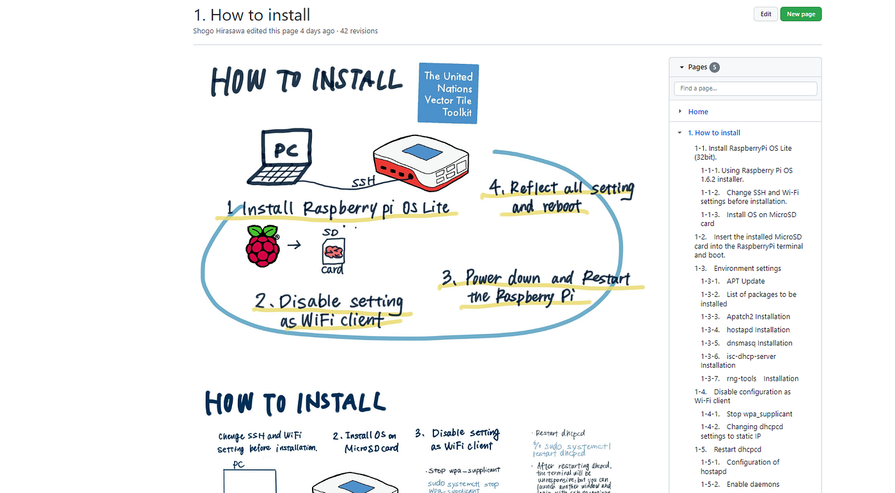
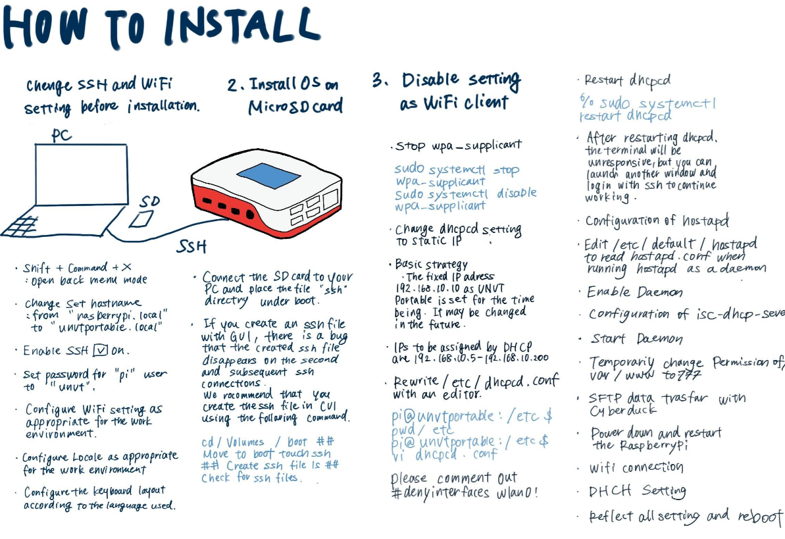
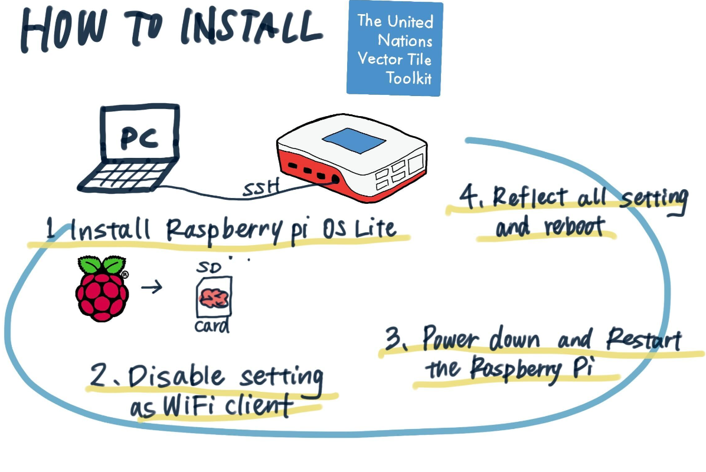

### UNVT Hackathon報告・デザイン部

こんにちは～デザイン部です！

私たちはUNVTハッカソンにおいて

> ・UNVTportableについての[スライド](https://docs.google.com/presentation/d/1-uUq_5YMXbEXBDoM9XUHi9zCOVmKVVlscOJ1A0XdMW0/edit?usp=sharing)の作成

> ・[unvt](https://github.com/unvt)/[portable](https://github.com/unvt/portable)のWikiページ作成＠Github

を行いました。

スライドについては中間報告ではるかさんが記載してくださっているのでこちらをどうぞご覧ください。

[UNVTハッカソン中間報告デザイン部 — Furuhashi(mapconcierge)Lab. — Medium](https://medium.com/furuhashilab/unvt%E3%83%8F%E3%83%83%E3%82%AB%E3%82%BD%E3%83%B3%E4%B8%AD%E9%96%93%E5%A0%B1%E5%91%8A%E3%83%87%E3%82%B6%E3%82%A4%E3%83%B3%E9%83%A8-50472725e061)

さて今回力を入れたのは・unvt/portableのWikiページ作成＠Githubです。

以前先生と平澤さんが[furuhashilab](https://github.com/furuhashilab)/[Tochizi-hai-OpenDataHackathon](https://github.com/furuhashilab/Tochizi-hai-OpenDataHackathon)のissueにupしたものを英語翻訳し、まとめました。

ツリー状になっていたものをWikiページとして作成しなおし、目次の充実も図りました。

作成したあとのみんなで作りあげた感がすごく良かったです。

わたしとこうきでページの作成を行い、最後にはるかさんがグラレコ要素を盛り込んでくださいました。やはり文字だけよりグラレコがあると視覚的に印象が良くなるなあと感動しました。

みなさん、夜分遅くまでお疲れ様でした。

成果物はこちら↓

[Home · unvt/portable Wiki (github.com)](https://github.com/unvt/portable/wiki)
