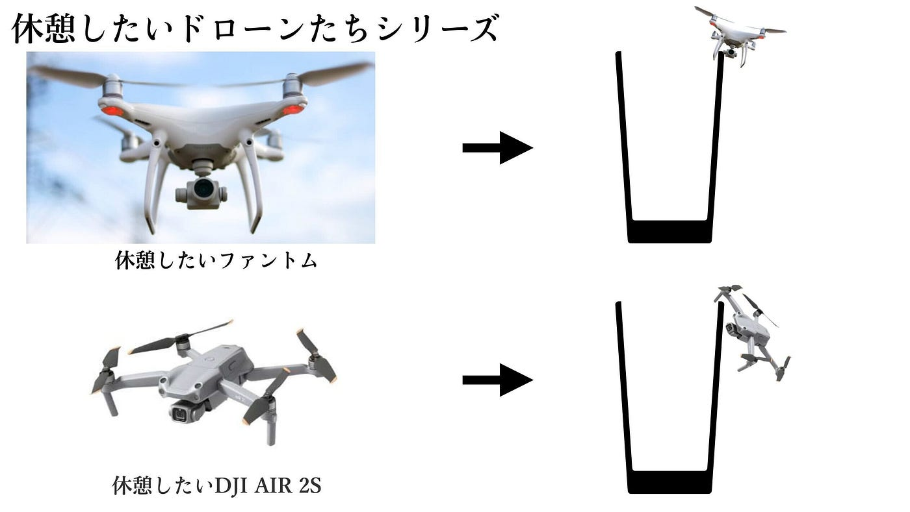
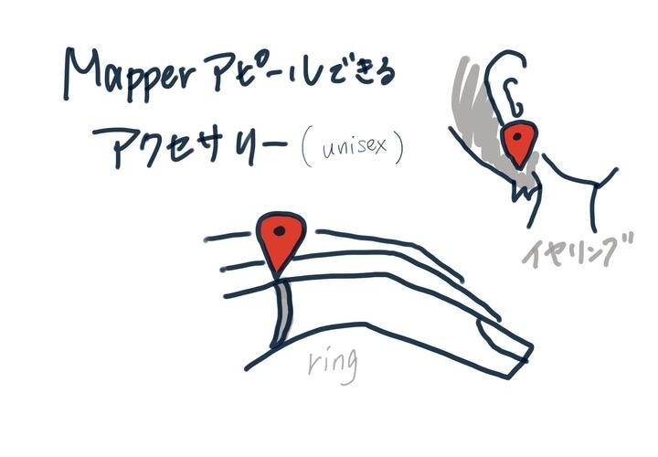
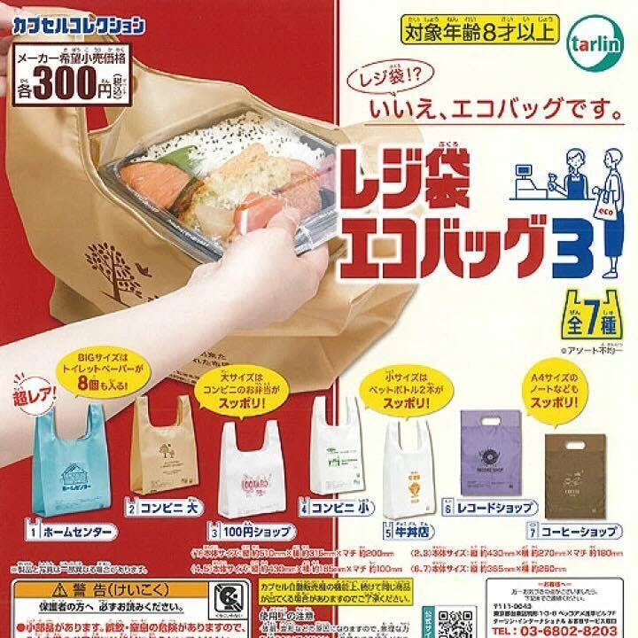
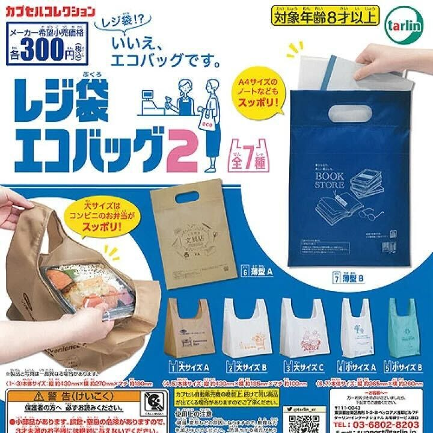
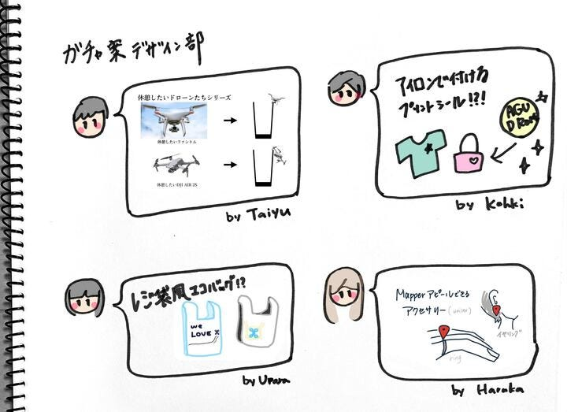

### デザイン部週報

こんにちは！デザイン部です。

無事にUNVTハッカソンを終えたということで、今週はデザイン部ガチャガチャの案出しを行いました。

### たいゆう案

> テーマは「休憩したいドローンたち」。

> コップのふち子を真似た案なのですが、「つっかかったドローンたち」などにすると、ドローンに対する危険なイメージがついてしまう可能性があると思い、このような題名にしました。「作成方法」→ 3Dプリンター
「量産可能性」→ ドローン自体の構造が細かいため、作成時間に時間がかかってしまう可能性があります、、(´;ω;｀)

> 「需要」→ マニアックですが、だからこそ面白みがあるかと思いました。
「シチュエーション」→ 子供向けイベントを想定しましたが、シュールな作品のため大人向けイベントにも対応できると思いました。

だそうです♪

ドローンファンにはけっこう刺さるアイデアだなあと思いました。

### こうき案

> ガチャ案は、「公式アイロンプリントシール」です！

> アイロンプリントで古橋ゼミやドローンバード、YouthMappersAGU等のロゴを作成します！

> 布に貼れる状態にすることで、身の回りのものや機材に貼り付けられます。

> ノベルティとしても有効！

プリントシールという案は思いつかなったので用途もたくさんあり、素晴らしいアイデアだと思いました♪

### はるかさん案

> マッパーの印になるアクセサリー

常にガチャガチャをチェックしている私ですが、今リングの指輪がとても流行っているのですごくいいと思いました。

勝手にアイデアをプラスすると、バリエーションを増やすために小さく印刷したおしゃれなデザイン地図をカプセルに入れたらよりワクワクしそうだなと思いました(*'▽')

### うらら案

> ガチャガチャブームで結構出たのが、レジ袋風のエコバッグ。

> RICOHのプリンターをフル活用してドローンや地図のモチーフなどを使い、お店のレジ袋風エコバッグを作る。

例:

参考：[レジ袋!?いいえ、エコバッグです♪レジ袋デザインのエコバッグがカプセルトイに登場！ | 電撃ホビーウェブ (dengeki.com)](https://hobby.dengeki.com/news/1245662/)

ユニークな案が出て面白いなと思いました。

これからより量産しやすく、レベルの高いガチャガチャを目指して頑張っていきます！

グラレコ

