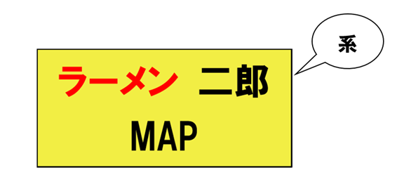
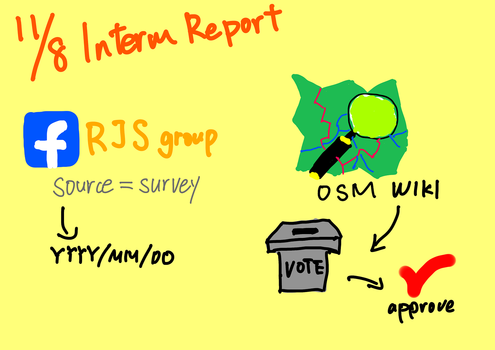

### 卒論中間報告

こんにちは、4年の鈴木です。卒論の中間報告としてブログを書かせていただきます。よろしくお願いいたします。

#### 議題

・進捗状況

・現地調査に関して

・新規タグの提案プロセス

・今後の作業

#### 進捗状況

・8月11日に行ったゼミ論構想発表より今日まで行った作業としては、神奈川県内の二郎系店舗と全国の二郎店舗を把握すること及び、それらすべての店舗の営業時間を現地調査していく作業。

— — 現時点で二郎系店舗は県内に82店舗確認できている。うち現地調査を終えている店舗は７店舗。

— — 直系の二郎店舗は今年に入り一橋学園前店がオープンし、全42店舗となった。現地調査済みは2店舗。

#### 現地調査に関して

残り期間から考えて圧倒的に現地調査を行えていない。

→ [Ibuki Shibayama](None)の提案でFacebookの[ラーメン二郎を愛する会](https://www.facebook.com/groups/389660794496077/)（RJS/Ra-men Jiro Society）グループにおいて、全国のラーメン二郎店舗及び、県内の二郎系店舗を訪れた際に営業時間の情報の提供をお願いする。

#### 新規タグ提案プロセスまとめ

1. 提案wikiページをstatus: draftとして作成する

1. テンプレートをページの先頭に複写して、内容を英語で記入する

1. ページの詳細（proposalやrationale、examplesなど）を書く

1. 提案ページをstatus: proposedにし、[タグ付けメーリングリスト](https://lists.openstreetmap.org/listinfo/tagging)に参加後、[tagging@openstreetmap.org](mailto:tagging@openstreetmap.org) 宛に RFC (Request For Comments)を送信する。

1. RCFから2週間は議論ページで議論を行い、問題等を解決したら投票依頼 (Request for Voting) をタグ付けメーリングリストに投稿する。

1. 8件以上の承認投票か10票以上の投票があった場合は74％以上の承認を得られれば、タグの承認を得ることができる。

[wiki提案プロセス](https://wiki.openstreetmap.org/wiki/JA:%E6%8F%90%E6%A1%88%E3%83%97%E3%83%AD%E3%82%BB%E3%82%B9#%E6%8F%90%E6%A1%88%E3%83%9A%E3%83%BC%E3%82%B8%E3%82%92%E4%BD%9C%E6%88%90%E3%81%99%E3%82%8B)

#### 今後について

・FacebookのRJSに現地調査の依頼をする

・新規タグの考案

・新規タグの提案ページ作成及び新規タグの必要性などの理由をまとめる

#### GitHub

[Repository](https://github.com/furuhashilab/2022gsc_SotaSuzuki/blob/main/README.md)

[Issue](https://github.com/orgs/furuhashilab/projects/11/views/1)

#### グラレコ

