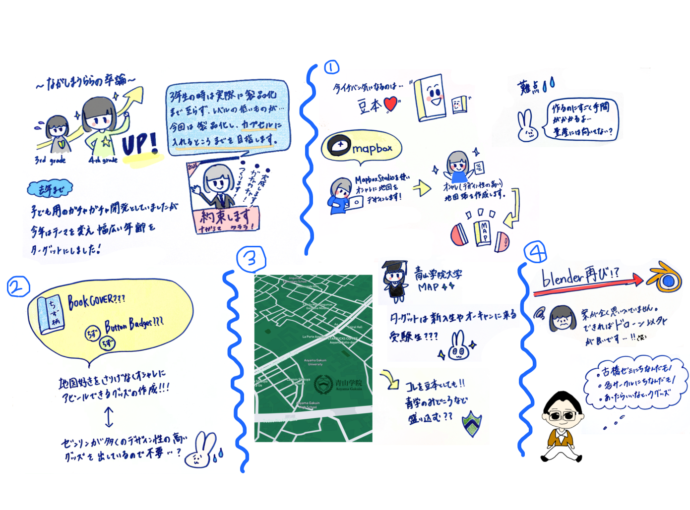

### 卒論中間発表byうらら

こんにちは！うららです。（夜中の3時です）

#### 卒論中間報告です。

私の卒論では、ワークショップ用にジオガチャ開発を行い、それを提案するものです。

昨年2021年度には子供向けのワークショップ用ジオガチャ開発を行ったが、今年度は新たに年齢層を設定せず制作することとしています。

私の場合スライドを見ていただいた方がわかりやすいとおもいますので、以下のリンクを一読していただけたら幸いです。

> [https://docs.google.com/presentation/d/1866suqwLz4JEbvIHWrlENDz-KaY4n0p6jdKYFQTIyIE/edit?usp=sharing](https://docs.google.com/presentation/d/1866suqwLz4JEbvIHWrlENDz-KaY4n0p6jdKYFQTIyIE/edit?usp=sharing)

これまで作りたいものがたくさんあり、決まっていない状態だったのですが、毎日TwitterやInstagramなどのSNSで、かなり流通しているものなどを見て取捨選択したおかげでガチャガチャ案はかなり絞れてきました。

スライド内にある

> 案①デザイン性重視の、世界を旅する地図帳豆本作成

> 案②青学のキャンパス歩きマップ

> 案③Mapbox Studioを使用し地図製品作成

> 案④ブレンダーを使用しフィギュア作成

これらがかなり有力な案として残りました。

②は、やはり最後に青学生としてなにか青学に関するもの（オープンキャンパスで配布できるものなど）を作ってみたいと思い残しました。

③に関しては先生のRicohのコピー機をお借りするかもしれません。

その際には宜しくお願い致します。

現在缶バッジの機械を購入するか悩んでいます。おそらく購入します。

なにかおすすめがある方は教えてください。

### グラレコ

