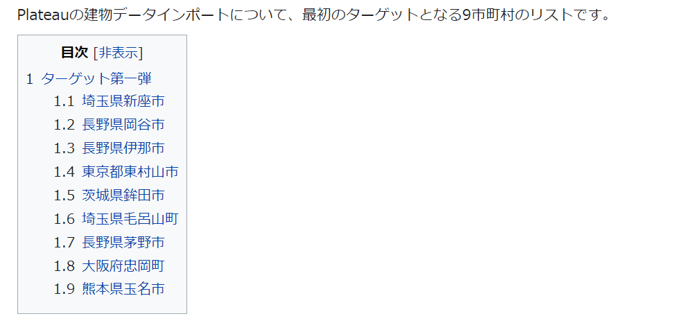
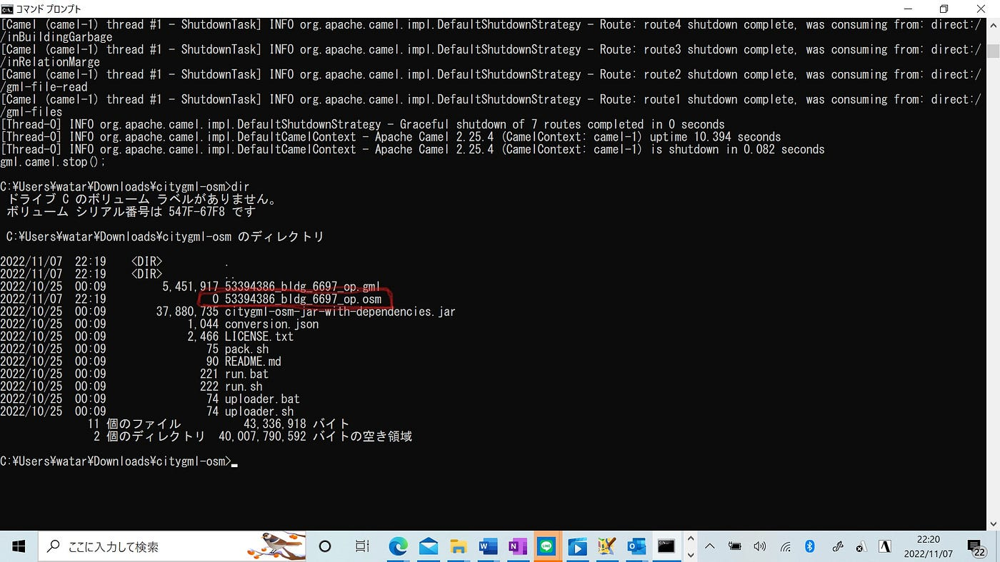

### ゼミ論中間報告

こんにちは。3年の吉田です！

今回はゼミ論の中間報告を行っていきたいと思います。

私のゼミ論は**PLATEAU LOD1建物データをOpenStreetMapにインポート**する作業です。

[中間報告GoogleSlide](https://docs.google.com/presentation/d/1A5Yb1D7qLo6XY12csjGxUPEjJGgAOKIO5YXb4gvhicU/edit?usp=sharing)

[OpenStreetMap](https://www.openstreetmap.org/#map=11/35.7582/139.4323)ではまだまだ3D建物データがなかったり整備されていない地域が多くあることを受け、現在全国56都市の3D都市モデルのオープンデータ化が完了している[PLATEAU](https://www.mlit.go.jp/plateau/)のLOD1建物データをOSMにインポートしようと考えました。

インポートする地域は[OSM Wiki](https://wiki.openstreetmap.org/wiki/JA:MLIT_PLATEAU/imports_list)にあるこちらの9都市を優先していきたいと考えています！

まずは自分の居住地から一番近い東京都東村山市からインポート作業を進めていきます！(現地調査しやすいため)

> _**使用する主なツール_**

・[JAVA](https://www.java.com/ja/)

・[JOSM](https://josm.openstreetmap.de/)

・ターミナル(またはコマンドプロンプトor PowerShell)

・[OSM Wiki](https://wiki.openstreetmap.org/)

・[PLATEAU-BLDG](http://surveyor.mydns.jp/task-bldg/city) (事後検証のTasking Manager代わり)

です。

作業手順/マニュアルは古橋先生が作成したこちらの[GitHub](https://github.com/yuuhayashi/citygml-osm/issues/94#issuecomment-1301339233)をもとに進めていきます。

> _**課題_**

私はwindows11ユーザーなのですが、コマンドプロンプト、Powershellで**citygmlを.osm形式に変換し、保存するという1stコマンド**が実行できず.osmファイルが0kbになってしまうといいうことが起きました。

原因を突き止めるとともに、それまではMacで作業をすることにしました！

また、Windowsユーザー向けのマニュアル作成も必要だと感じました。
