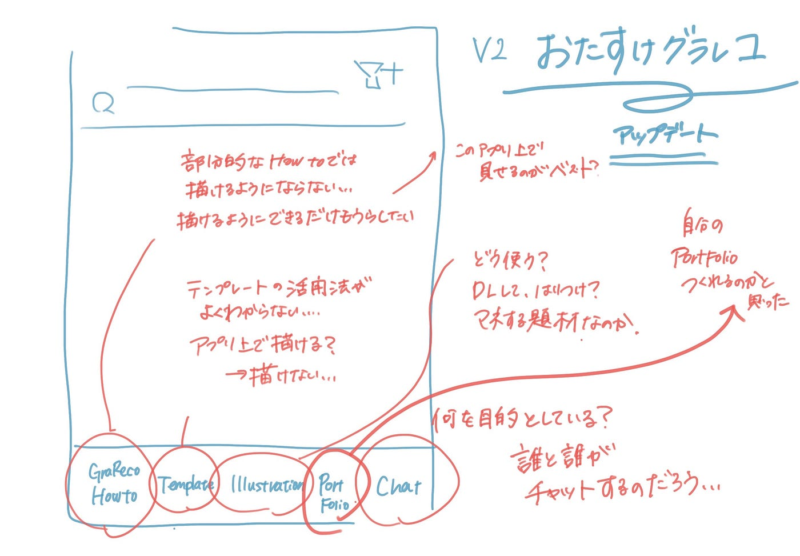

### ゼミ論中間発表_おたすけグラレコアップデート

4年の安田遥です。

グラフィックレコーディング補助アプリ『おたすけグラレコ』のアップデートを行っています。

### 現状のアプリの課題

グラフィックレコーディング（以下グラレコ）の経験者で、古橋研の所属ではない人、まだおたすけグラレコを触ったことがない人にヒアリングをしました。

#### ・使い方がよくわからない
どういうシーンでどのような使われ方をするのか。

**How to’sタブ**：このアプリの使い方？グラレコのHowto's？
**Templateタブ**：このタブ内で描き始められるようなイメージを持ったが出来ない。どう使うのか。
**chatタブ**：誰と？何を？チャットするのかわからない。

などが課題としてあがりました。

今回のアップデートでは、2つのことができるようになることを目指します。

1. **準備時に確認すべきことがわかる**

**2. 実践前に見ておきたいものが集まっている**

2つを実現するために以下の内容を追加したいと考えています。

**・クライアント（自分）との打ち合わせチェックリスト作成**

**・具体例、気をつけることリスト**

具体的な内容案はスライドにまとめました。

内容のGit Hubレポジトリ

[https://github.com/furuhashilab/2022gsc_HarukaYasuda](https://github.com/furuhashilab/2022gsc_HarukaYasuda)
