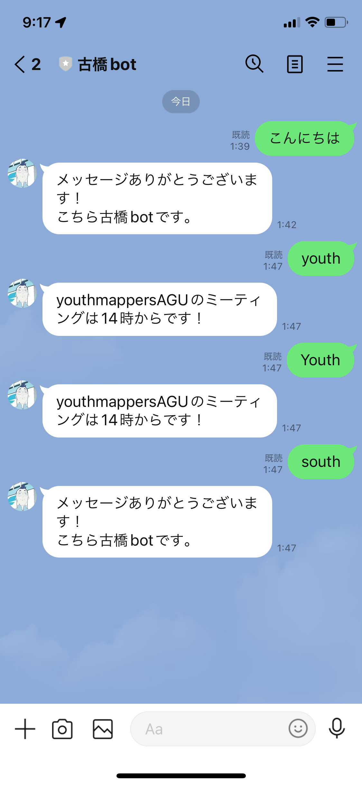
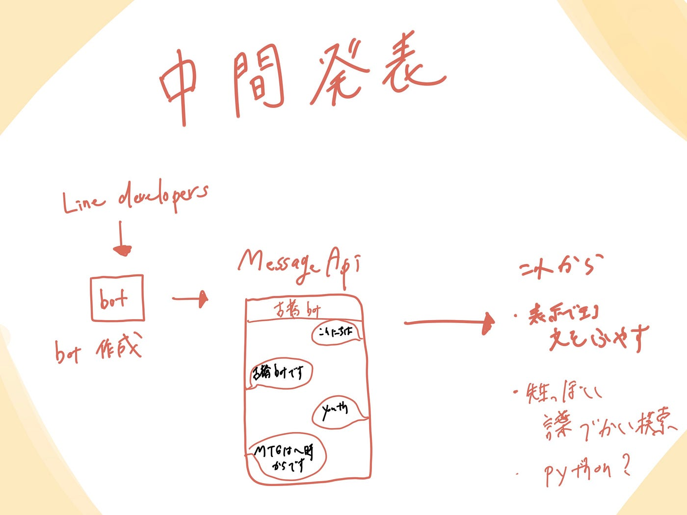

### ゼミ論中間発表

こんにちは ３年植松です。

ゼミ論の中間発表です。

私のゼミ論のテーマはラインにおける古橋botの作成です。

> 進捗状況

今回私はLINE DevelopersのMessageing APIを使用してbotを作ることにしました。試作段階のbotですが上記のQRコードから追加できます！

まず何か送ったら「メッセージありがとうございます！こちら古橋botです。」と送られるように設定しました。

そしてyouthというキーワードが送られたら「youthmappersAGUのミーティングは14時からです！」というふうに表示される設定にしました。

大文字のYouthと小文字のyouthは同じ設定で成功しましたが流石にsouthではyouthというふうには検知されませんでした。

> これからやること

・表示できるメッセージを増やす

・古橋教授っぽい言葉づかいのbotにしていく

よりたくさんのことをbotで行うために今後余裕があったらPython使って作っていこうと思います。資料が豊富だったのでなんだかいけそうな感じが今あります（笑）

