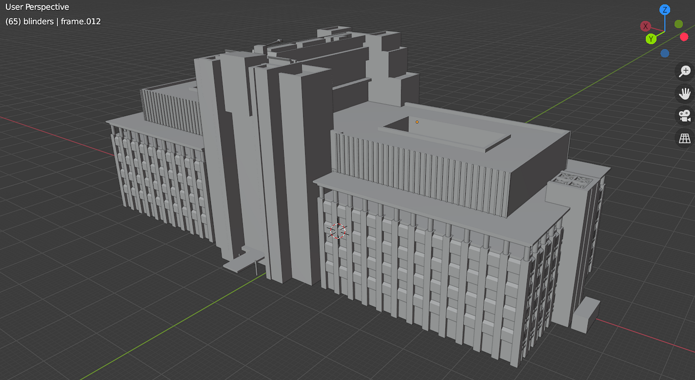
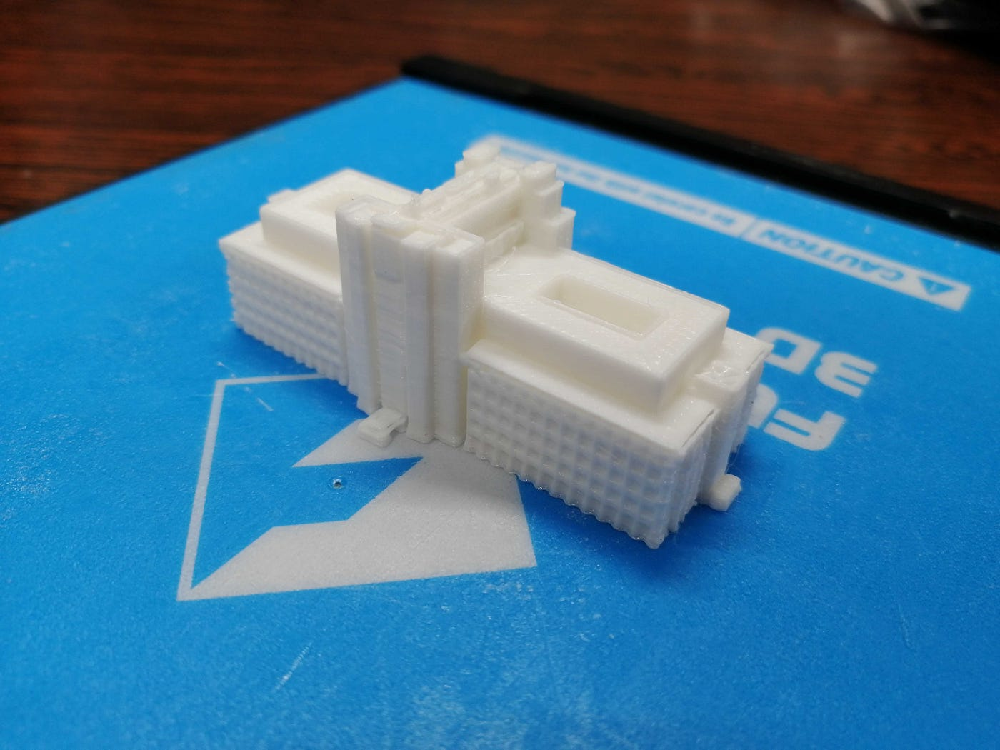
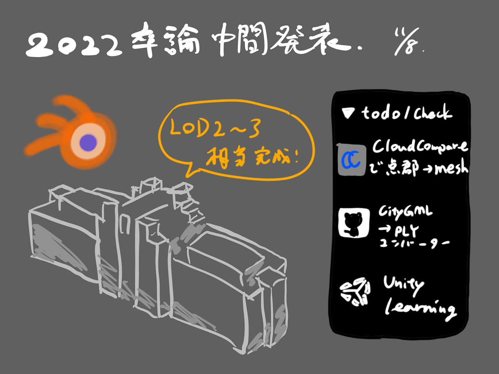

### 卒論2022中間発表 by 柴山

2022年度卒論の中間発表です。

今年は昨年度の[ゼミ論研究](https://github.com/furuhashilab/2021gsc_IbukiShibayama)の延長として、**『PLATEAUの整備フローを基にした相模原キャンパスの3D都市モデル制作とオープンデータとしての利用』**というテーマで卒論研究を行っていきます。

[GitHub - furuhashilab/2022gsc_IbukiShibayama: 2022年度古橋卒論用レポジトリ
2022年度古橋卒論用レポジトリ. Contribute to furuhashilab/2022gsc_IbukiShibayama development by creating an account on GitHub.github.com](https://github.com/furuhashilab/2022gsc_IbukiShibayama)

昨年度の発表や今年度の構想発表にて述べたように、モデリング・公開後の「利用」も重視しているため、なるべくモデリング作業を早く終わらせるつもりでしたが。。。

9月以降は想像以上にスケジュールが増えてしまったため、モデリング作業についての進捗は B棟 (LOD2~LOD3) 相当の完成までとなりました。。。

[2022gsc_IbukiShibayama/sc_b.stl at main · furuhashilab/2022gsc_IbukiShibayama
2022年度古橋卒論用レポジトリ. Contribute to furuhashilab/2022gsc_IbukiShibayama development by creating an account on GitHub.github.com](https://github.com/furuhashilab/2022gsc_IbukiShibayama/blob/main/tmp/sc_b.stl)

残りの棟のモデリングについては、構造が比較的簡単なものについてはCloudCompareのプラグインや、コンバーターを用いた方法も調査・検討中です。

[GitHub - GeoPythonJP/citygml-convert-tools
CityGML は、地理空間データのため標準データフォーマットです。 XMLベースで定義されているCityGMLは、中間データフォーマットと言われているように利用サイドが使いやすい形式に変換して利用することを想定されている。…github.com](https://github.com/GeoPythonJP/citygml-convert-tools)

今後やるべきことは以下の通りです。

- 最終発表までのスケジュール管理を練り直す

- 同時並行でUnityの使い方を学び、迅速に実装できるようにする

> _**スライド_**

> _**グラレコ_**

