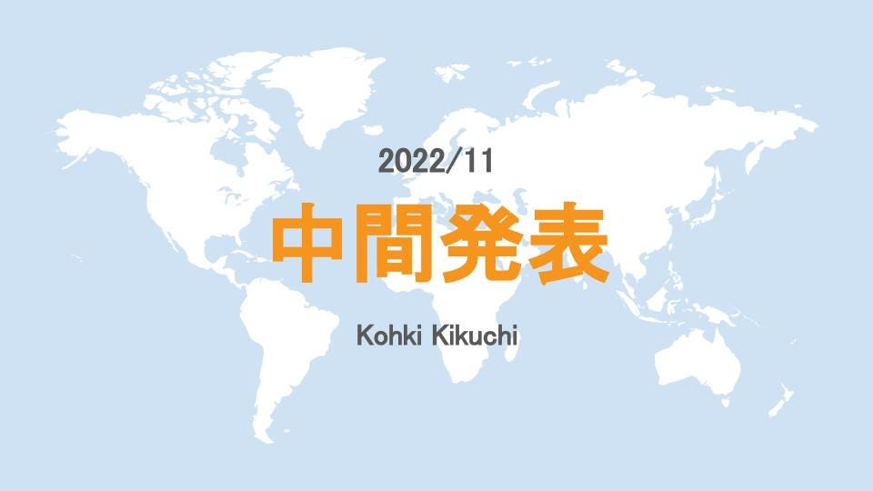
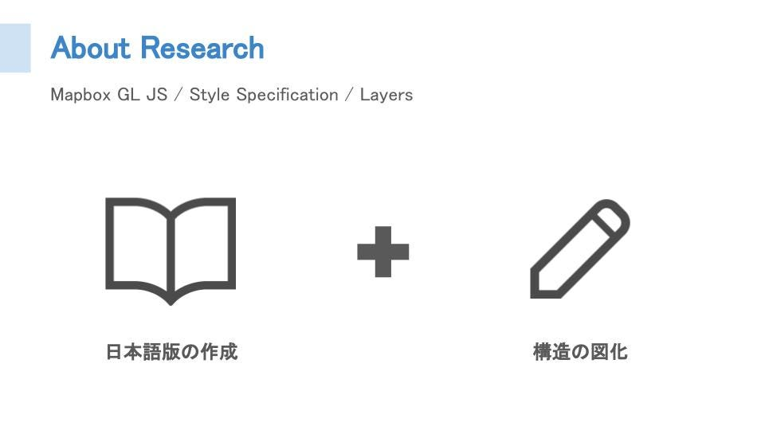
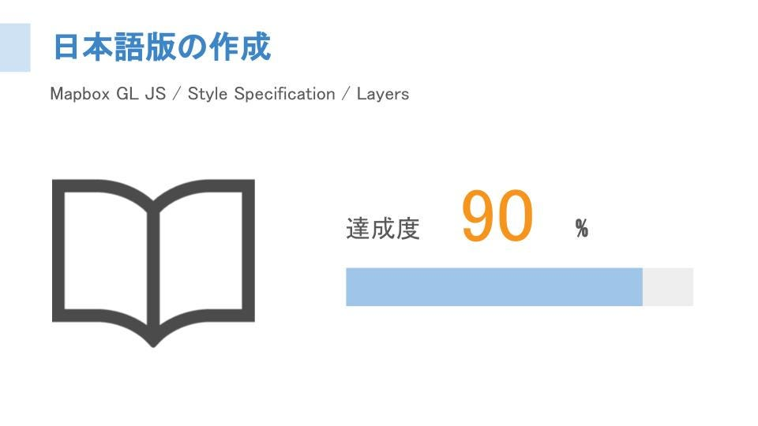
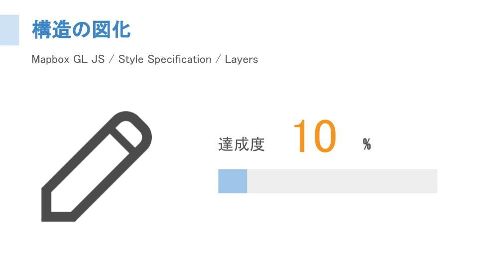
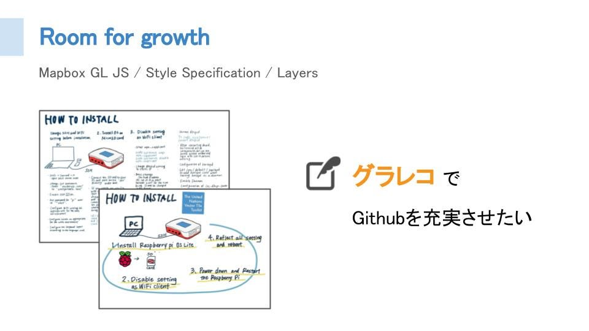

### 卒論中間報告

こんにちは！

4年の菊池です。

今年度の卒論は、「Mapbox GL JS Style Specificationの日本語訳作成と図式化」です。昨年のゼミ論で両者とも完成させましたが、改善点が多く見つかったので、今年度はそのアップデート版を作成しようと試みています。

まず日本語訳の方ですが、現在の達成度は約90%です！

昨年、一通り翻訳したこともありアップデートするだけです。現在そのアップデートも半分まで完了しました。

次に図式化の方ですが、達成度は約10%です。。

以下が昨年作成した図ですが、UMLクラス図のルールに則って作成できていない部分もあり、非常に中途半端です。今後、一新した図を作成した上で、Githubの機能を使ってコードで書くことを目指します！

最後になりますが、UNVTハッカソンを通してグラレコの重要性を再認識しました。UML図だけでなく、リポジトリ全体のグラレコを作成することもやりたいと思っています！

**[2022gsc_Kohki_Kikuchi**](https://github.com/furuhashilab/2022gsc_Kohki_Kikuchi)

**[StyleSpecification4mapbox**](https://github.com/furuhashilab/StyleSpecification4mapbox)
