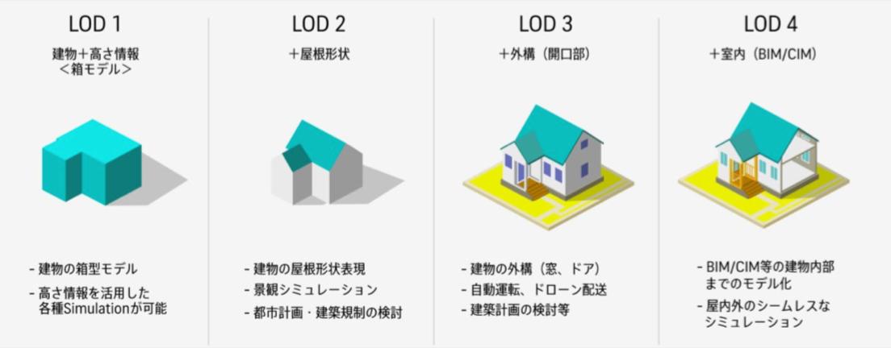

### 卒論中間発表

こんにちは。古橋ゼミ４年の葉賀なつみです。

今回は卒論の中間発表をレポートします。

私のテーマは、

**「PLATEAU LOD2 建物データのOSM用コンバーター開発(Java)」**です。

現在、国土交通省主導で日本全国の3D都市モデルの整備や活用、オープンデータ化を行うProject PLATEAUが進められています。

続々とPLATEAUデータが公開され、OSMへのインポートが行われています。前回の11月ハッカソンでもYouthチームが作業手順をまとめていました。

ここで扱っているのはLOD1の建物データです。一方、今回の私の卒論では建物の屋根形状を表現するLOD2をOSMにインポートする新規性のあるコンバーター開発を目指します。

このコンバーターが完成するとデジタル地図に建物の屋根形状を反映でき、地図の表現拡充や現実世界の再現率が上がるため、様々な場面で有効だと考えています。

先行研究

> ・[PLATEAU](https://www.mlit.go.jp/plateau/new-service/4-010/)

> ・[OSMへのインポート](https://qiita.com/nyampire/items/1c10afdd36750c87154d)

> ・[PLATEAUのCityGML Building LOD2のMVT化](https://qiita.com/frogcat/items/84b413c7e08c00b78c6a)

今後の作業として、先行研究としてあげたPLATEAUのCityGML Building LOD2のMapBox Vector Tile化を参考に、LOD2建物データをUNVTに変換してOSMにインポートしたいと考えています。

＜スライド＞

[https://docs.google.com/presentation/d/1WeXSfyOX_zXab1UgCIGrFo4yTMEZ6LF-u-LvFYfQ-CM/edit#slide=id.g185c1300673_0_47](https://docs.google.com/presentation/d/1WeXSfyOX_zXab1UgCIGrFo4yTMEZ6LF-u-LvFYfQ-CM/edit#slide=id.g185c1300673_0_47)

＜GitHubリポジトリ＞

[https://github.com/furuhashilab/2022gsc_NatsumiHaga](https://github.com/furuhashilab/2022gsc_NatsumiHaga)

＜グラレコ＞

coming soon...
