### ゼミ論中間発表

こんにちはモトヤです。今回ゼミの中間報告を行いたいと思います。

私のゼミ論は「タマサート大学周辺の（おすすめ）レストラン・カフェの店舗の地理空間情報の入力とその周辺のマッピング充実」です。

今回は

１,現地調査 ２，tag付け

の二つに分けて話していこうと思います。

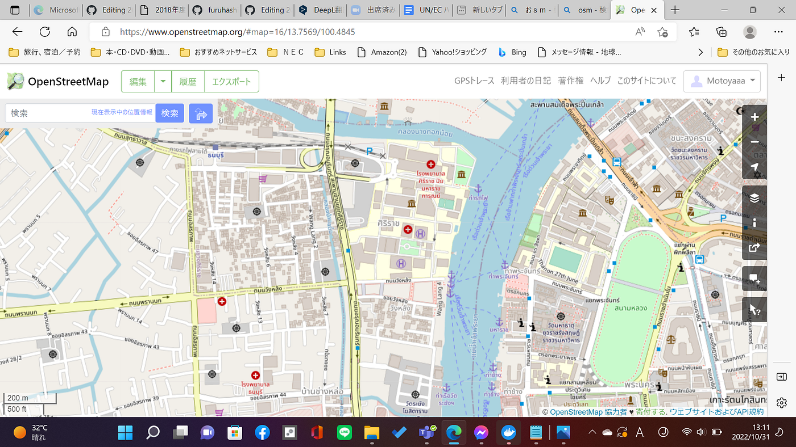

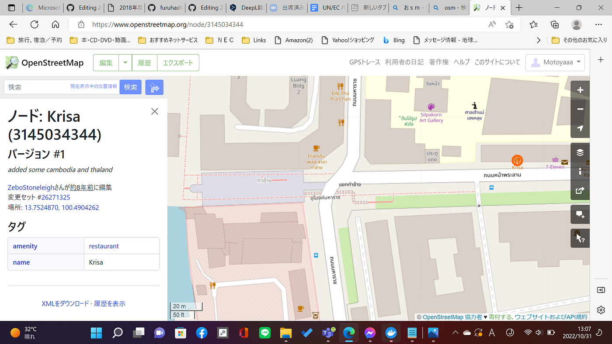

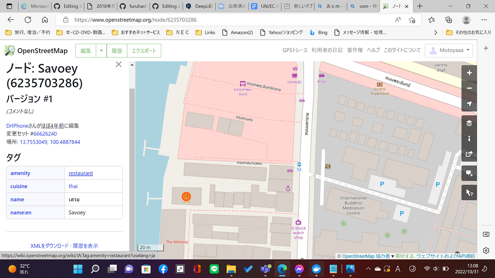

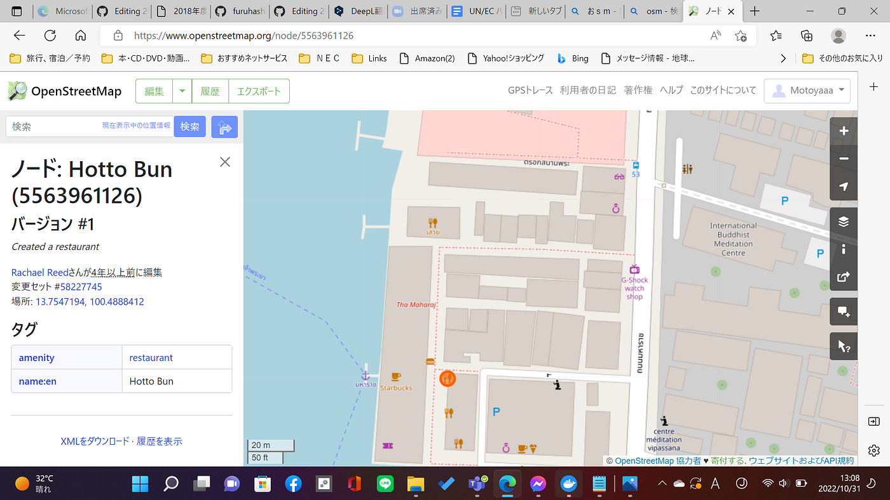

まず、課題としては、建物のデータが不十分であるという事です。（川の上にお店がある事、建物のタグが統一されておらず、情報が場所によって異なっているという点）。また、OSM上に表示されている建物の数も不十分である事の二点です。

そのため、私は表示されるtagの統一、またOSMの補充を行おうと思います。

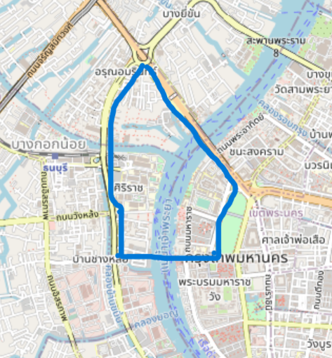

まずは、通学路の範囲であるこの青線を中心に行おうと思います。

１，現地調査（食べ歩き？？）

ひたすらいろんなお店に訪れています。タイは狭い路地にたくさんのレストランが隠れています。大学の近くの裏路地も例外ではなく、奥に入るとたくさんのレストランが隠れています(カオマンガイ、ソムタム、クルティアオ、トムヤムクン がおすすめです！！)

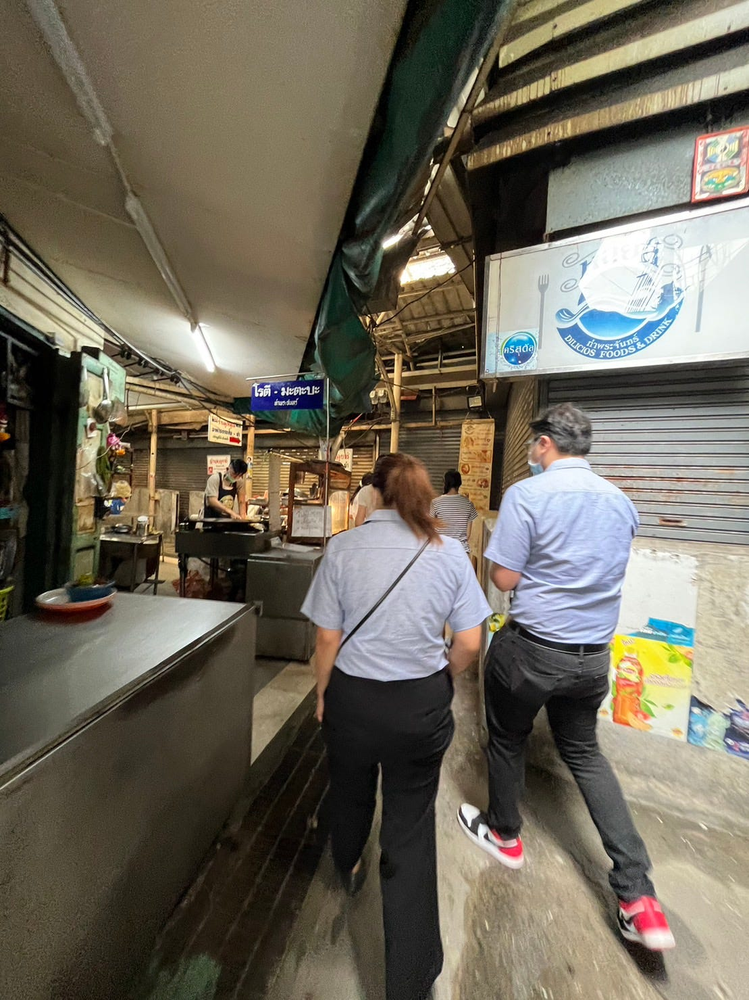

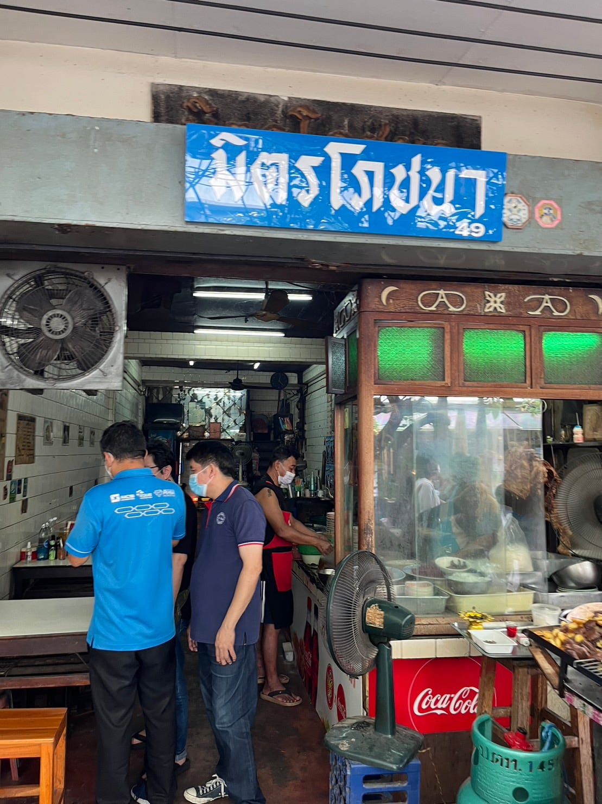

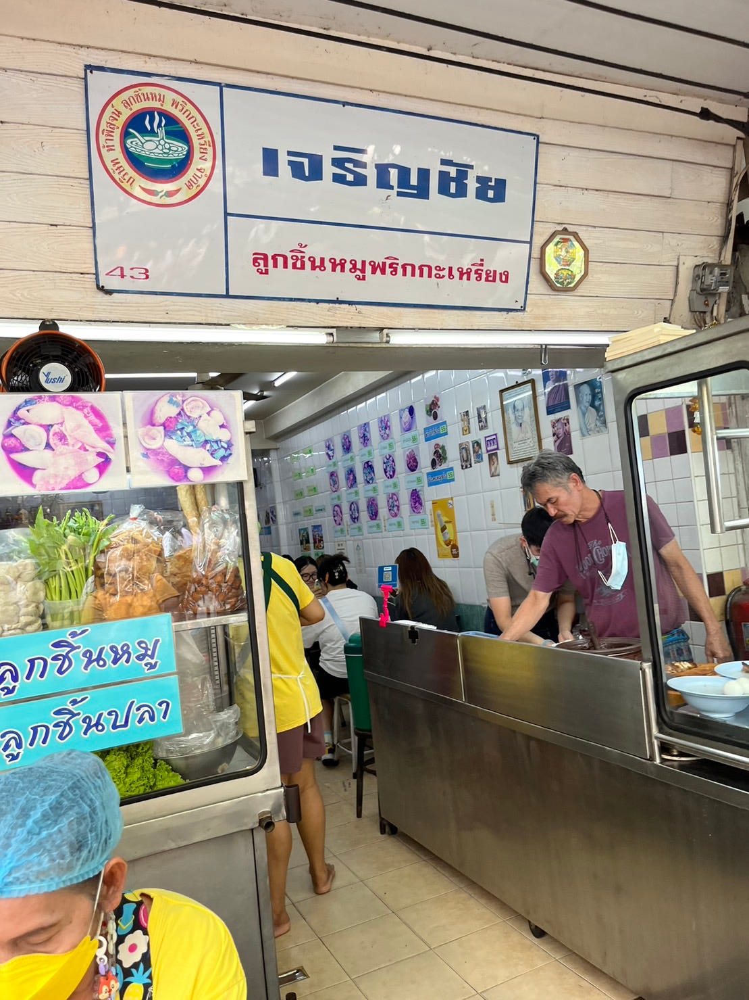

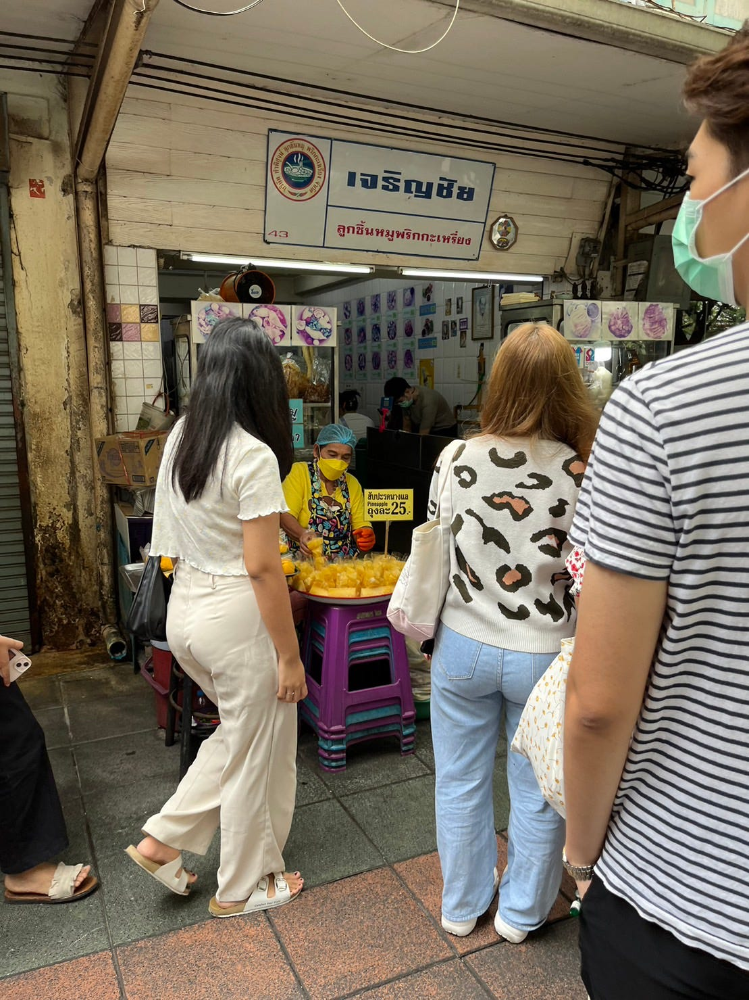

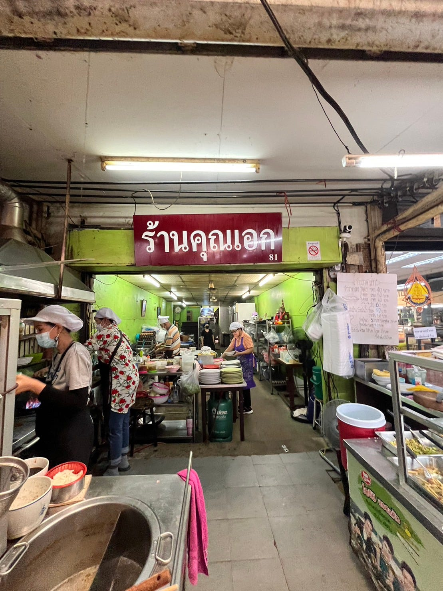

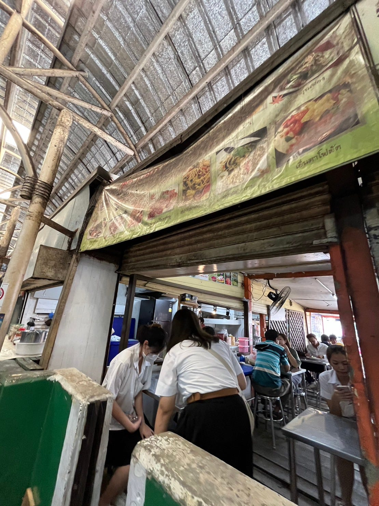

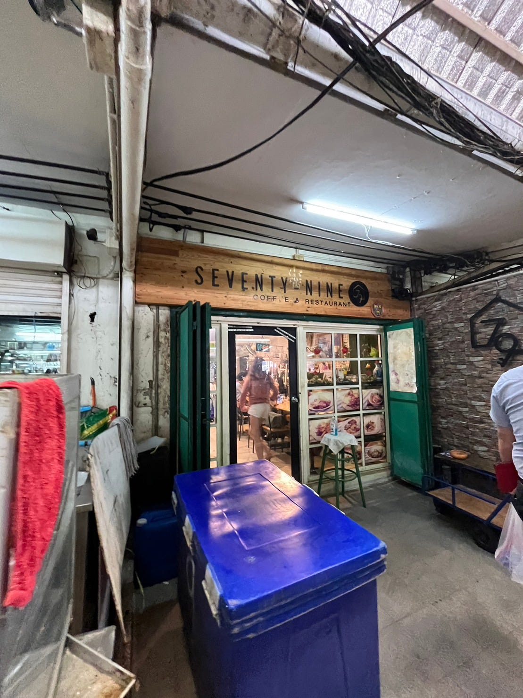

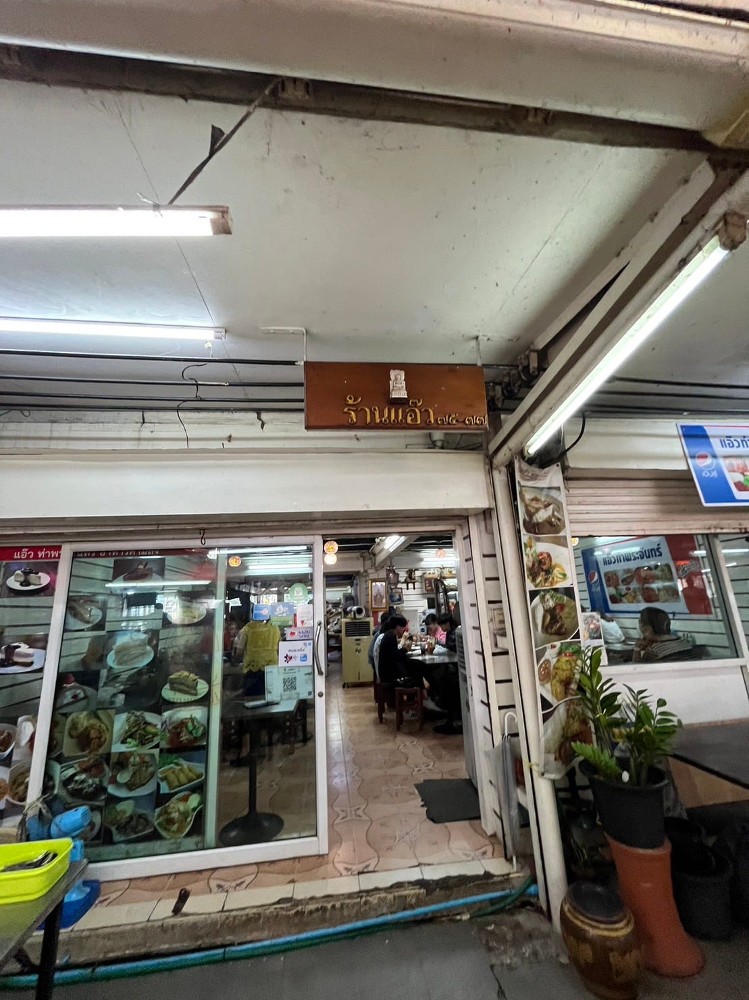

また、タイ語のメニューしかないためタイ人の友達と一緒に行くことでお店の情報などを取り入れています！！

２，tag付けについて

タグについて、「 name; En, amenity, cuisine, opening hours, takeaway, source=survey」で統一しようと思います。

まず、name;en とは、閲覧者（特に留学生）にとってタイ語での解読が困難だと思われるため、英語での表記で行うべきだと考えたからです。（友だちに頼りまくっています、、（笑））。そしてその建物はレストランなのか、カフェなのかを表示する。加えて、何時の時間にやっているのかが分かるようにopening hours を設定しました。そして持ち帰りが出来るのか、最後に情報源はどこなのかを示すためのタグを追加しようと思っています。

グラレコ

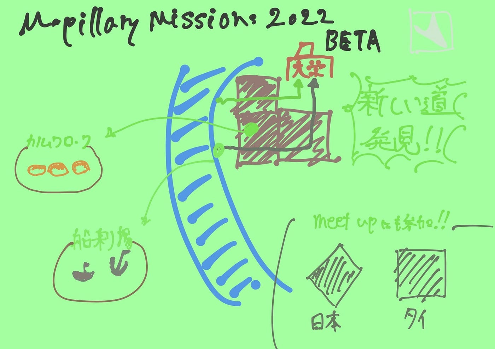
