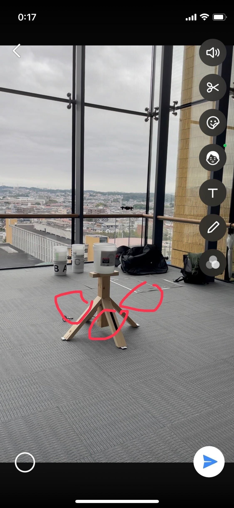
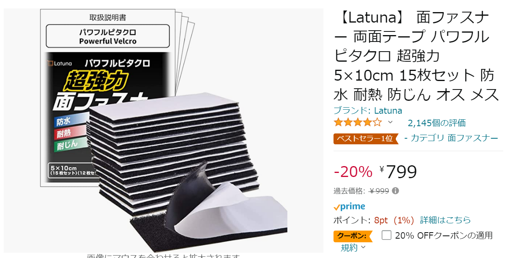
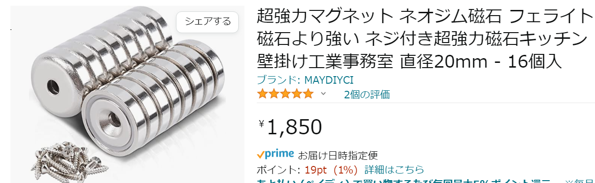
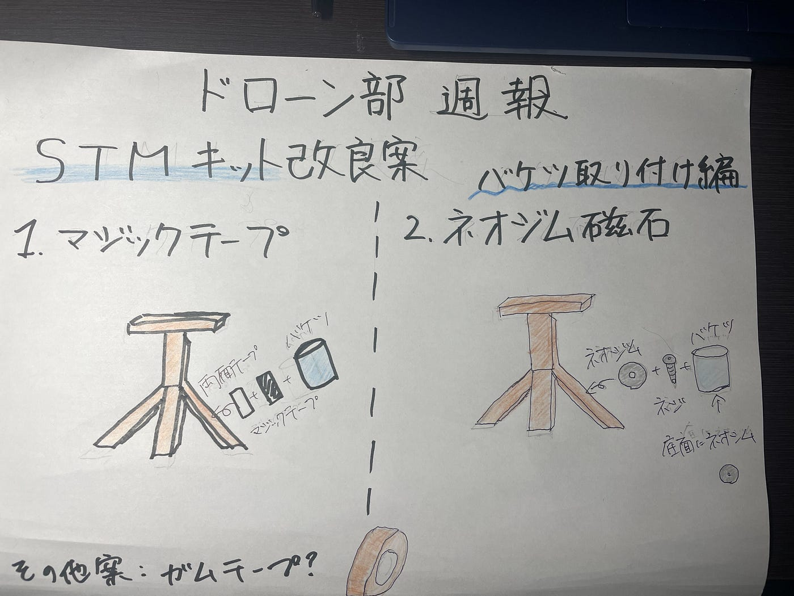

### ドローン部週報

こんにちは！3年の吉田です。

今回は練習用STMキットの改良案出しを行いました！

STMキットの側面に着けるバケツを固定するものが無かったので取り外し可能かつ安定して固定できるものの案だしをしていきました。

ポイントは

・準備、撤収になるべく手間がかからないもの

・管理しやすい、扱いやすいもの

・丈夫なもの

です！

> _**・マジックテープ_**

このSTMキットは長岡工大からお借りしているもので、借りた当初からマジックテープが張り付いていたので長岡工大の方々はマジックテープで固定を行っていたと思われます。

マジックテープで固定する場合はSTMキットの木の部分とバケツの底面に両面テープを貼り、マジックテープをつけて固定という形にしようと考えています！

[こちら](https://www.amazon.co.jp/Latuna-%E9%9D%A2%E3%83%95%E3%82%A1%E3%82%B9%E3%83%8A%E3%83%BC-%E3%83%91%E3%83%AF%E3%83%95%E3%83%AB%E3%83%94%E3%82%BF%E3%82%AF%E3%83%AD-5%C3%9710cm-15%E6%9E%9A%E3%82%BB%E3%83%83%E3%83%88/dp/B07XPLY6L8/ref=sr_1_5?adgrpid=52841056483&gclid=CjwKCAiA68ebBhB-EiwALVC-NqTjS3IzuIjZndOdn1QLJBGeTfYHn9X0WrJRCRZMLDS4aWTiO7rVFhoCIckQAvD_BwE&hvadid=611407713014&hvdev=c&hvlocphy=1009289&hvnetw=g&hvqmt=e&hvrand=15399919483164661972&hvtargid=kwd-310096754614&hydadcr=27298_14587105&jp-ad-ap=0&keywords=%E3%83%9E%E3%82%B8%E3%83%83%E3%82%AF%E3%83%86%E3%83%BC%E3%83%97%2B%E5%BC%B7%E5%8A%9B&qid=1668438439&qu=eyJxc2MiOiI1LjE2IiwicXNhIjoiNS4wNSIsInFzcCI6IjQuNzkifQ%3D%3D&sr=8-5&th=1)に両面テープとマジックテープ両方が備わったものがあるので古橋先生、買っていただきたいです！

> _**・ネオジム磁石_**

[ネオジム磁石](https://ja.wikipedia.org/wiki/%E3%83%8D%E3%82%AA%E3%82%B8%E3%83%A0%E7%A3%81%E7%9F%B3)は磁石の中でもかなり強いものですが、100均にも売っており入手しやすくなっています。

ネオジム磁石を取り付ける方法ですが、今回は中心部に穴が開いたネオジム磁石を用意し、ネジで固定するという方法で行きたいと思います。

ネオジム磁石の方も[こちら](https://www.amazon.co.jp/%E8%B6%85%E5%BC%B7%E5%8A%9B%E3%83%9E%E3%82%B0%E3%83%8D%E3%83%83%E3%83%88-%E3%83%8D%E3%82%AA%E3%82%B8%E3%83%A0%E7%A3%81%E7%9F%B3-%E3%83%95%E3%82%A7%E3%83%A9%E3%82%A4%E3%83%88%E7%A3%81%E7%9F%B3%E3%82%88%E3%82%8A%E5%BC%B7%E3%81%84-%E3%83%8D%E3%82%B8%E4%BB%98%E3%81%8D%E8%B6%85%E5%BC%B7%E5%8A%9B%E7%A3%81%E7%9F%B3%E3%82%AD%E3%83%83%E3%83%81%E3%83%B3%E5%A3%81%E6%8E%9B%E3%81%91%E5%B7%A5%E6%A5%AD%E4%BA%8B%E5%8B%99%E5%AE%A4-%E7%9B%B4%E5%BE%8425mm/dp/B0BF9JZ51Q/ref=asc_df_B09ZXZQQ6H/?tag=jpgo-22&linkCode=df0&hvadid=588955627594&hvpos=&hvnetw=g&hvrand=13686653745493123925&hvpone=&hvptwo=&hvqmt=&hvdev=c&hvdvcmdl=&hvlocint=&hvlocphy=1009289&hvtargid=pla-1674676377529&th=1)のものを購入お願いします！

とりあえずはこの二つを取り付けて試してみて、今後の策を練っていこうと思います！

> _**グラレコ_**

