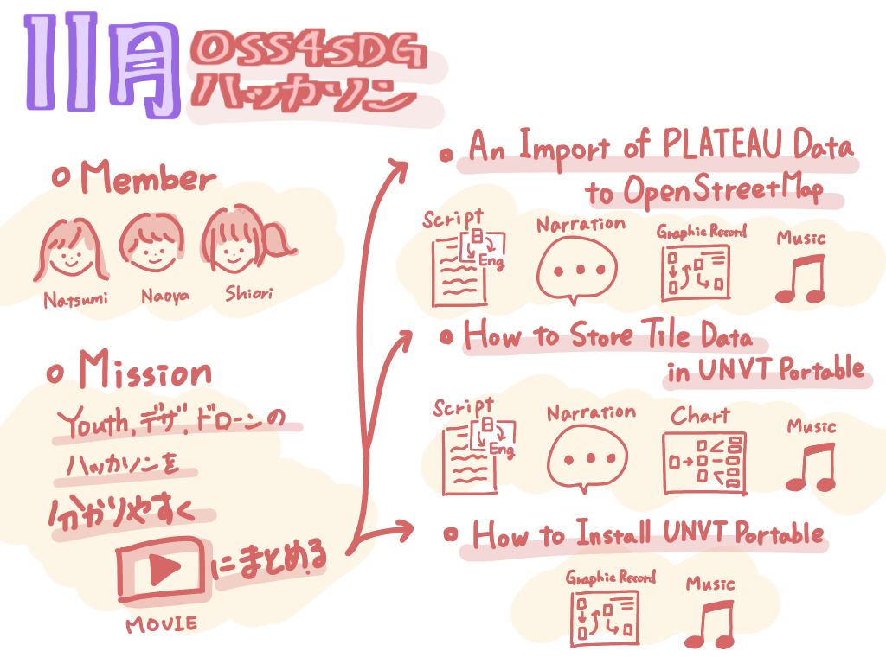

### VF週報

こんにちは。V＆Fです。

今週の週報ですが、少し前の10月ハッカソンのレポートがまだだったのでそれを書こうと思います。

> 今回のハッカソン

_**◯概要_**

・[https://github.com/furuhashilab/README/issues/33#issuecomment-1281762516](https://github.com/furuhashilab/README/issues/33#issuecomment-1281762516)

_**◯メンバー_**

・葉賀なつみ(4年)

・植松尚哉(3年)

_**◯テーマ_**

・YouthMappersAGU部、デザイン部、ドローン部のチームの動画コンテンツを制作する。

→具体的には1~2分程度のわかりやすい動画を英語(日本語字幕)で作る。

最終的に以下３本の動画を制作しました。

> ・『An Import of PLATEAU Data to OpenStreetMap』

> ・『How to Store Tile Data in UNVT Portable』

> ・『How to Install UNVT Portable』

GitHub repositories LINK →[https://github.com/furuhashilab/VF_UN-EC_OSS4SDG_hachathon2022](https://github.com/furuhashilab/VF_UN-EC_OSS4SDG_hachathon2022)

それぞれYouthMappersAGU部、デザイン部、ドローン部に協力してもらいながら進めました。

中間発表後に先生も含めて行なったミーティングで、グラレコを描く過程をタイムラプス化した映像をベースに動画を作るのが、親しみやすく華やかでよいと方針がまとまりました。古橋ゼミらしさもかなり出せる仕様になりました。

グラレコを動画にしたら、そこに音楽とナレーションを乗せていきます。

ナレーションはグラレコの動きに合わせて概要やマニュアルの手順説明をまずは日本語で作成し、英語が得意なゼミ生が中心となって英訳を行いました。

この作業にかなり時間がかかってしまい、予定通り進めることができなかったことが反省点です。

また、音楽はサウンドクラウドからライセンスを意識してBGMとなるものを探しました。

今回の総括として、グラレコを動画で使うことで表現力がかなり上がるように感じました。今後使える場面がいろいろ出てくると思うので、やり方などをある程度確立させたいでところです。

また、今回のハッカソンではこれまでと同様に分担作業が課題になりました。これにはGitHubをもっと使いこなすことに解決の糸口がありそうです。

＜グラレコ＞

