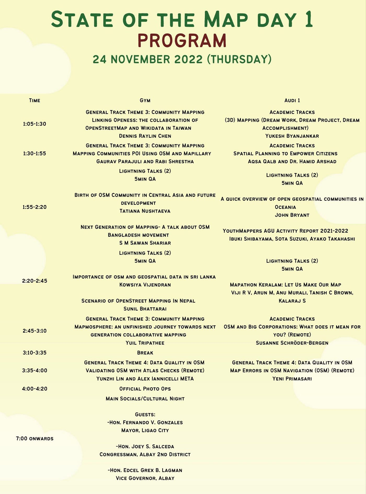
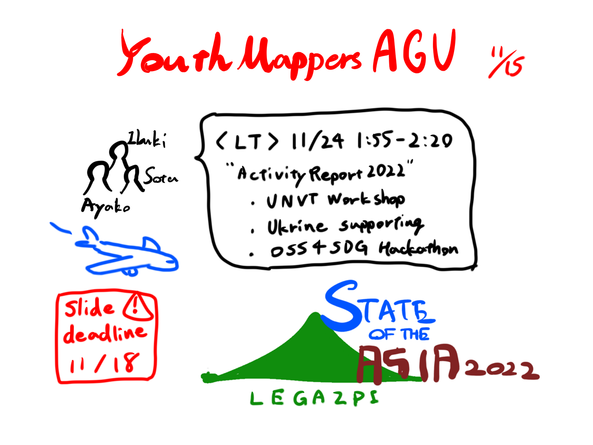

### フィリピン行ってきます

### YouthMappers AGU 週報

こんにちは。4年の柴山です。

いよいよ [Pista ng Mapa / State of the Map Asia 2022](https://l.facebook.com/l.php?u=https%3A%2F%2Fpistangmapa.github.io%2F2022%2F%3Ffbclid%3DIwAR0IwxdtqebqgXTIf3AuholkcW8MKOCd86_FAu9GKw10iwTFD663ugAPpDs&h=AT3aTTyLdRR4SPc-YEjfFG8jdvaOnnb1lswAVD8IycKd6f2XTx8qQFYdII3k5FYjR2FkJcmEt_0qm8Q640x3FhkAlZap-zzmQyQtVHqoWWw_MFRC6IEPLVrKy7uYJBiZAkDaLA) の開催が来週に迫ってきました！！

YouthMappers AGU チームからは私柴山と、 [SOTA SUZUKI](None)、 [Ayako Takahashi](None) が代表として登壇します。

先日5日間のプログラムが発表されました。

我々の発表は現地時間で11月24日 1:55–2:20 の枠となっています。今回はライブ配信はなく、当日の発表を録画して後日公開するとのことです。

YouthMappers AGU は Activity Report 2022 と題して5分間のLT発表を行います。話す内容はUNVTワークショップ、ウクライナマッピング支援、 OSS4SDG の活動などを予定しています。発表メンバーで Google drive 上でスライドやスクリプトを作成中ですが、出来上がるのがぎりぎりになってしましそうです笑

18日がスライド提出〆切なのでなんとか間に合わせます！

また、来年度に YouthMappers AGU からリージョナルアンバサダーを立候補する予定なので、 [motoyaaa](None) をはじめとした3年生のメンバーを Asia-Pacific の OSMコミュニティに紹介するつもりです。

> _**グラレコ_**

