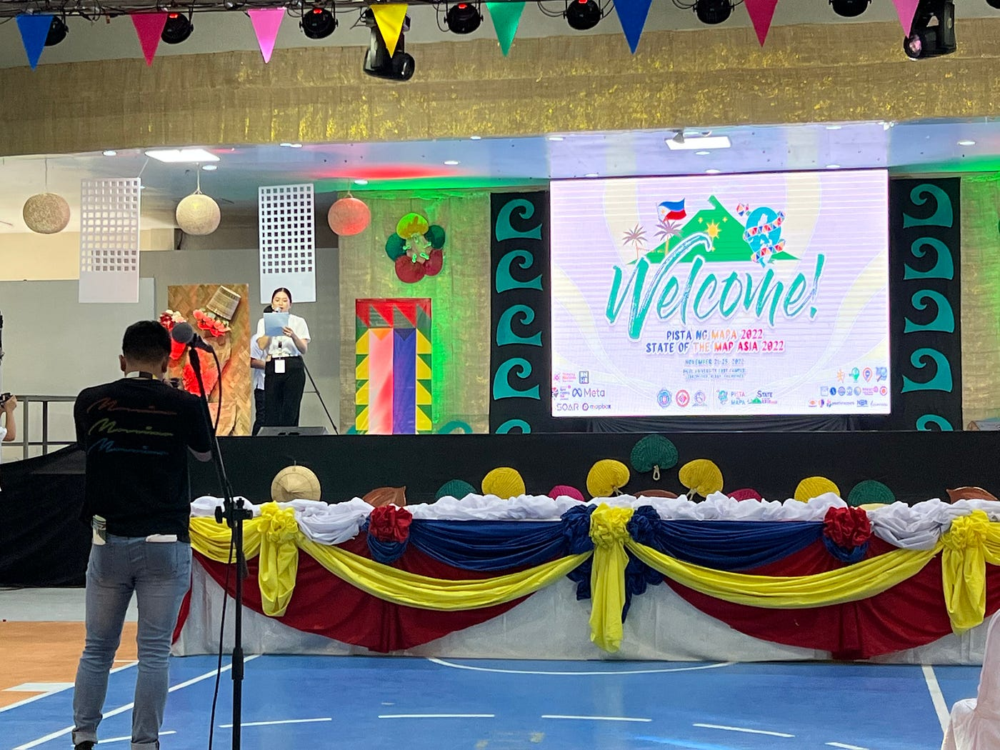
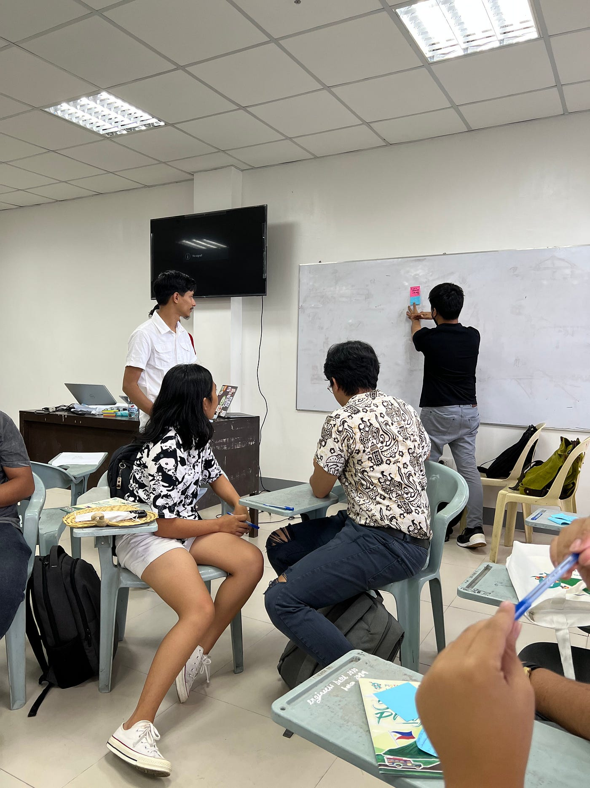
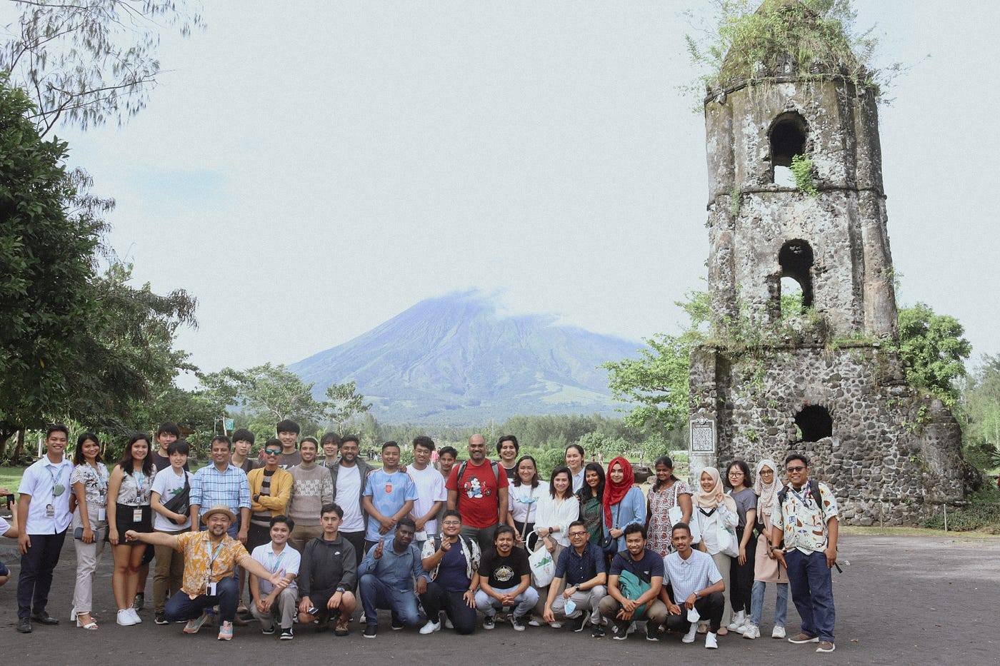
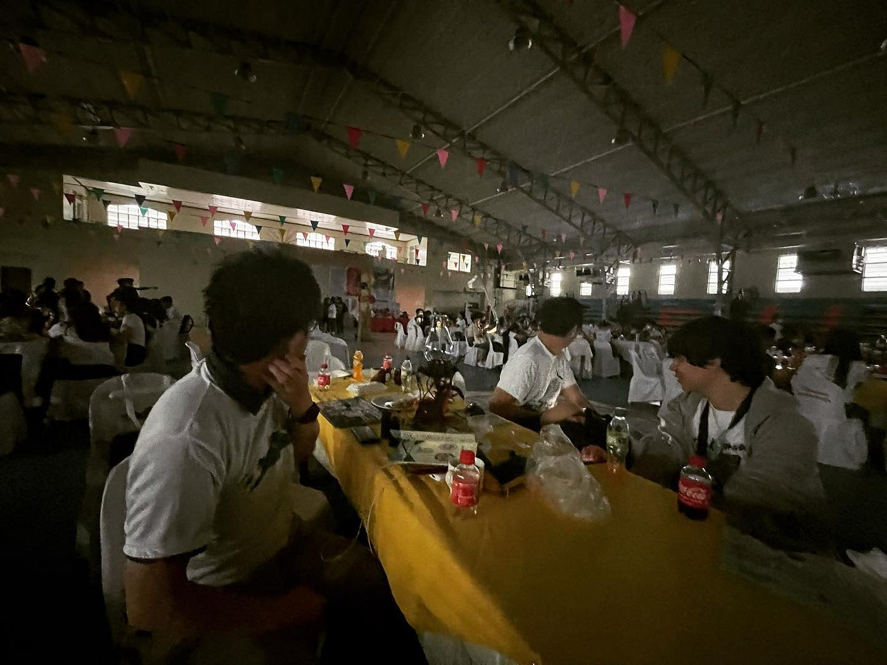
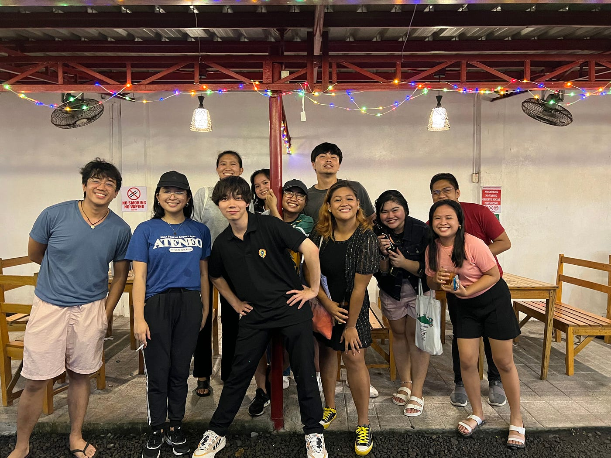

### 【中間報告】フィリピンでの国際会議

フィリピン レガスピ で開催されている**[Pista ng Mapa / State of the Map Asia 2022](https://pistangmapa.org/2022/) **に参加しています。

このカンファレンスはオープン マッピング、オープン データ、OpenStreetMapなどをテーマにアジア各国から多くのマッパーが集まり議論やコミュニケーションが行われる場となっています。

今回の会議は若い世代が多く参加しており、学生同士での活発な議論が行われています。

執筆時点ですでに4日が過ぎており、残すところラスト1日となりました。

現状までのPista ng Mapa / State of the Map Asia 2022での気づきを2つの要点にわけて書いていこうと思います。

#### **## 対面で会ためにオンラインで布石を打っておくべし**

コロナの影響でオンラインでの開催が続いた中で、久しぶりの対面開催になりました。これまで、SNSやオンライン会議でしか話したことなかったメンバーと初めて対面で会うことができました。

SNSでの事前の関わりがあったおかげで、対面で会った時にスムーズにコミュニケーションを取ることができました。

日頃のSNSでの発信がこのような形で活きてくることは意外でした。

直接、顔を合わせたことがなくてもSNSでの交流が布石をなって異国の地であってもホームのように振る舞うことができました。

自分が日頃何をしているのかを常にSNSで発信することで、相手が自身に興味を持ってくれるきっかけとなったり、対面での交流がスムーズになることを実感しました。

対面のためのオンラインでの布石づくりは今後も続けていきたいです。

#### ## 常にポートフォリオを見せれるようにすべし

日本ではいつでもどこでもネットに繋がりますが、海外に行く時は要注意です。

会議2日目には停電するハプニングが起こりました。

会場にWi-Fiが設置されていない、SSIDは表示されるけど全く接続できないなんてことは普通に起こります。

ネットに依存しないで、いつでもどこでも見せられるポートフォリオ作りが海外では必須であることを実感しました。

海外に出る時は、事前にスマホやPCにダウンロードしておくなど、オフラインを前提にしたポートフォリオを作ることを強くおすすめします。

### ## さいごに

国際会議に参加することで日本でまだ公開されていない情報にリーチできるなど多くの気づきが得られることもありますが、海外コミュニティのメンバーとの交流も醍醐味の一つです。
正直これが楽しみで参加しているところもあります笑

国際会議に参加してみようと少しでも思っている学生はぜひ積極的に参加してほしいです！
