### ドローン部 ハッカソン

今回はジオガチャという事で、各自それぞれが案を出していくことになりました。コンセプトは「地理空間情報学に対する興味関心が高まるような眼鏡ふきのデザイン」です。

もとや

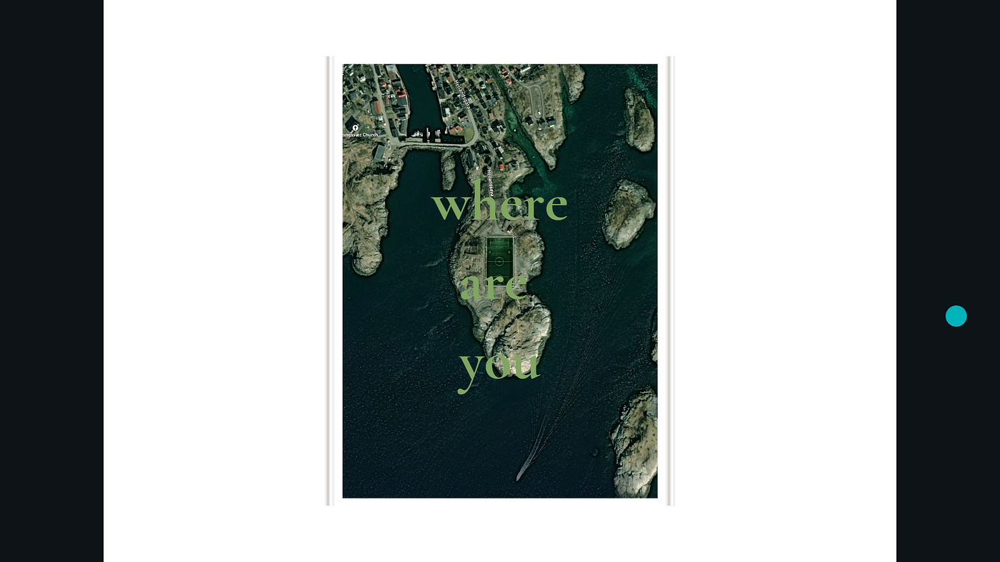

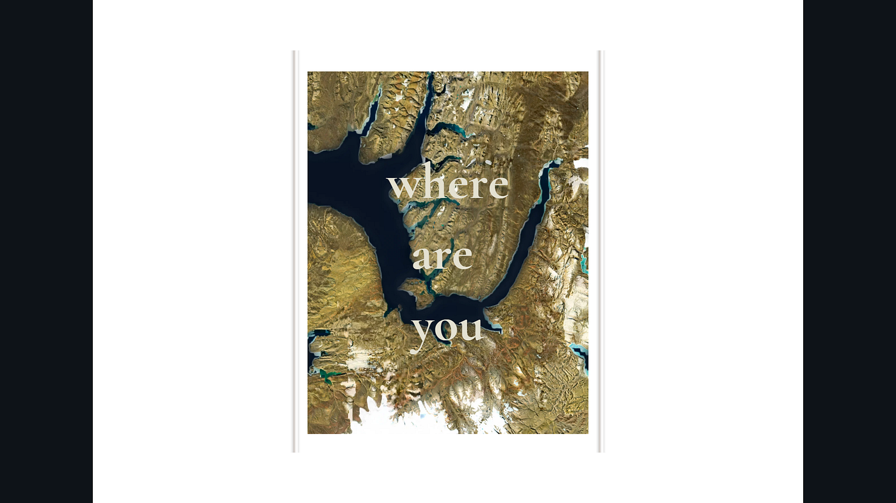

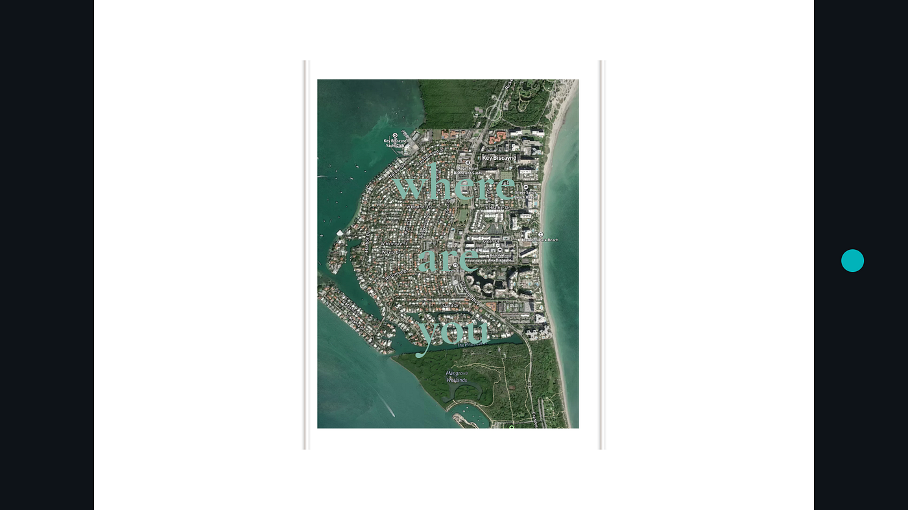

Mapbox studio を使用し、衛星画像を用いたデザインにしました。なにか不思議だな、こんなところがあるんだと、思わせることが出来ればいいなな、という願いを込めています。１個目はサッカーグランドが見えるノルウェーの衛星画像を用いました。せっかくならワールドカップネタを交えたいなと思い作成しました。２個目の衛星画像はエイヤフィヨルズウルといわれるアイスランドの土地です。３つめはフロリダにあるキービズケインと呼ばれる場所です。

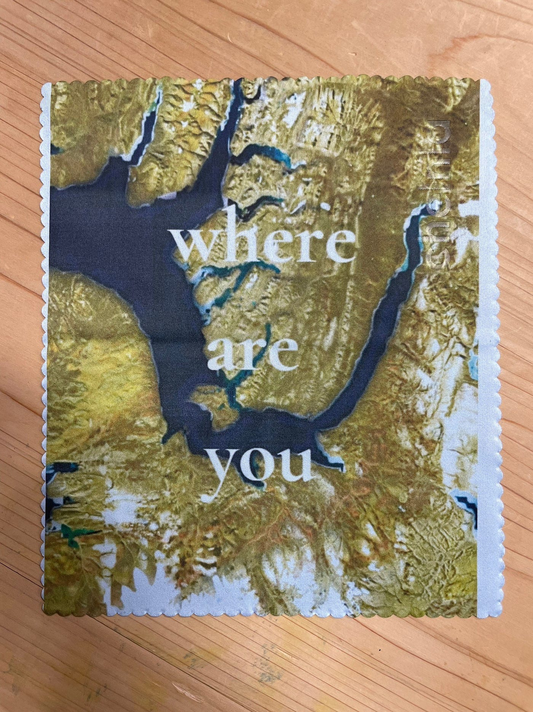

ボツ案；没になったのですが一応載せておきます。

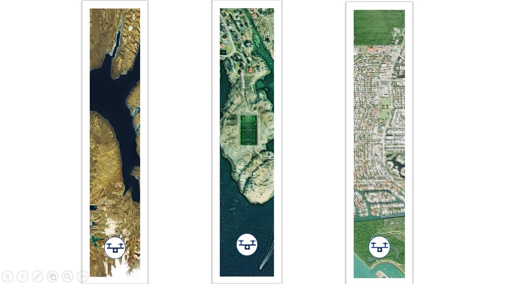

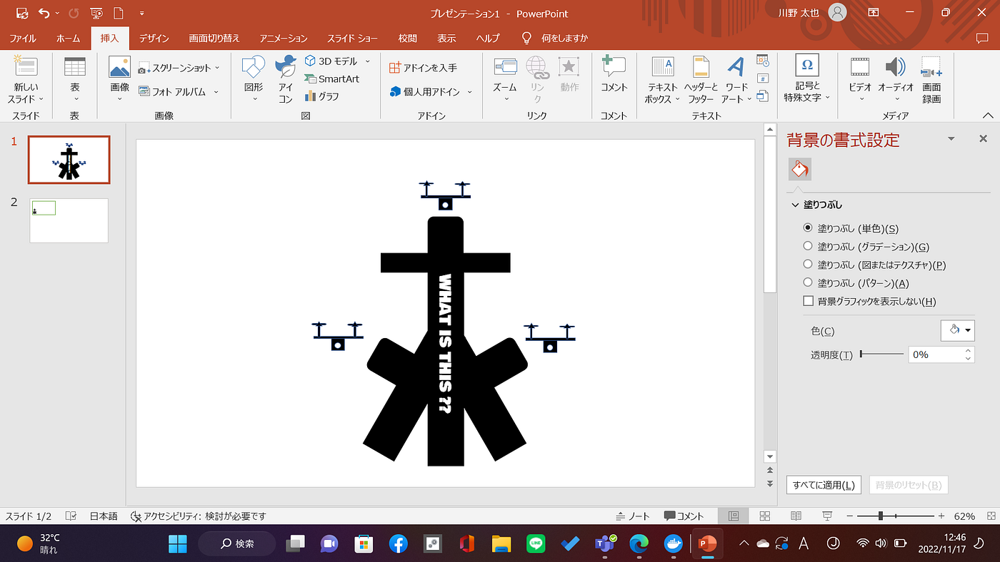

たいゆう

自分は航空画像2個プラス、Mapbox Studioで編集してみた画像の計3つ試作してみました。メガネ拭き自体の色が水色なので、3つ目の画像が一番おしゃれになったと思います。

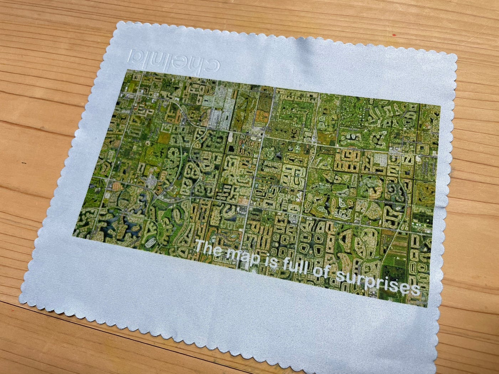

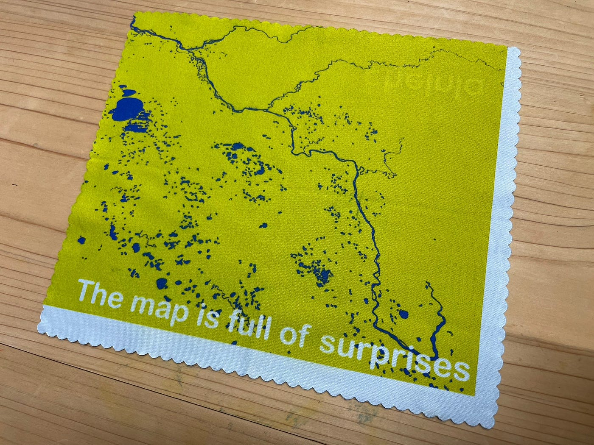

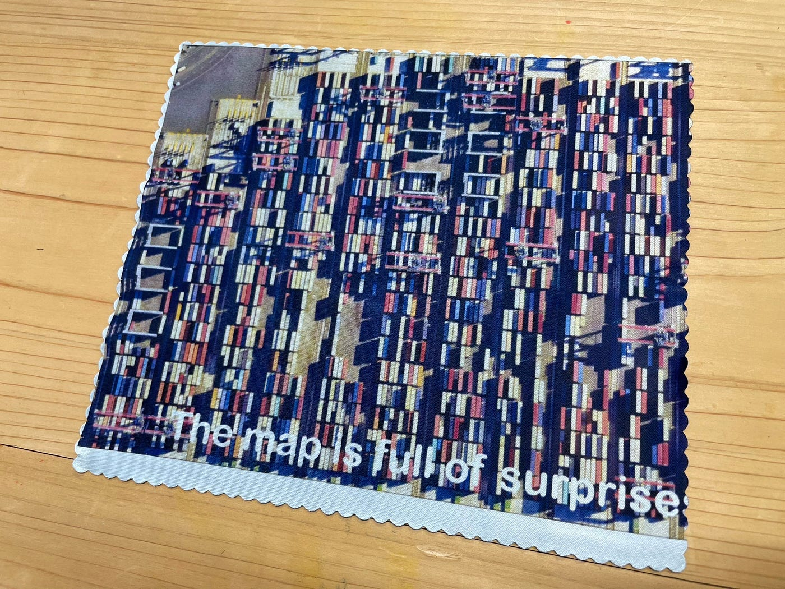

わたる

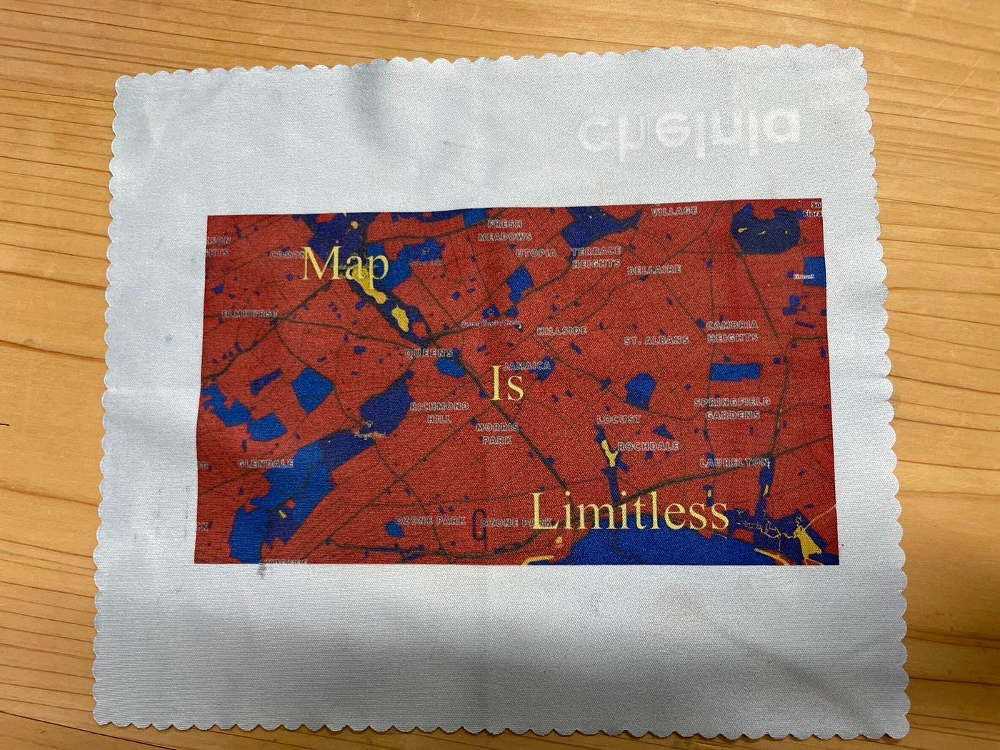

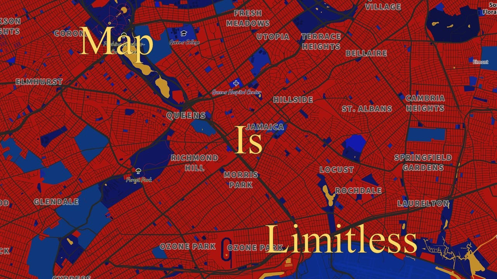

もとやと同じく背景の画像は[Mapbox Studio](https://www.mapbox.com/mapbox-studio)で作成しました。私の好きなキャラクター「スパイダーマン」を地図上の道路や海、緑地の色を変え、表現しました。

多くの人は地図といえばナビゲーションに使ったり、建物がどこにあるのかを見るのに使うものだと考えていると思います。

しかし、この画像のように今や地図は様々なツールを駆使し、自分の好きなものを表現できるようにまでなっているのです。

やり方次第で地図の可能性は無限大に広がる。そういった意味を込めて「Map is Limitless」という言葉を載せました。

まとめ画像とグラレコ

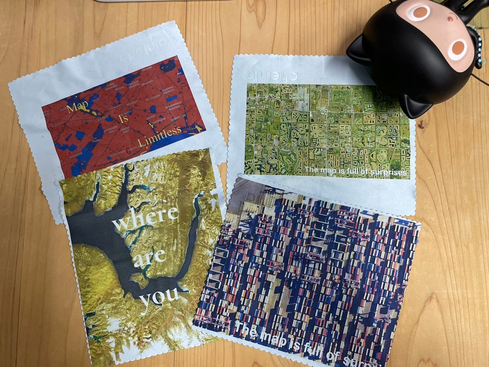

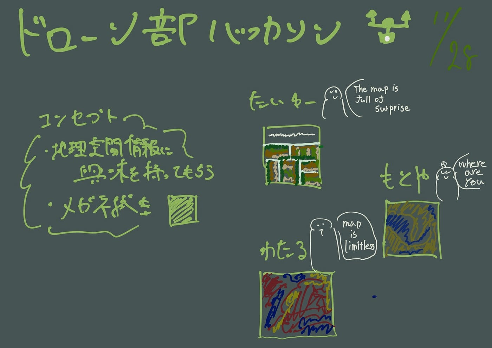
