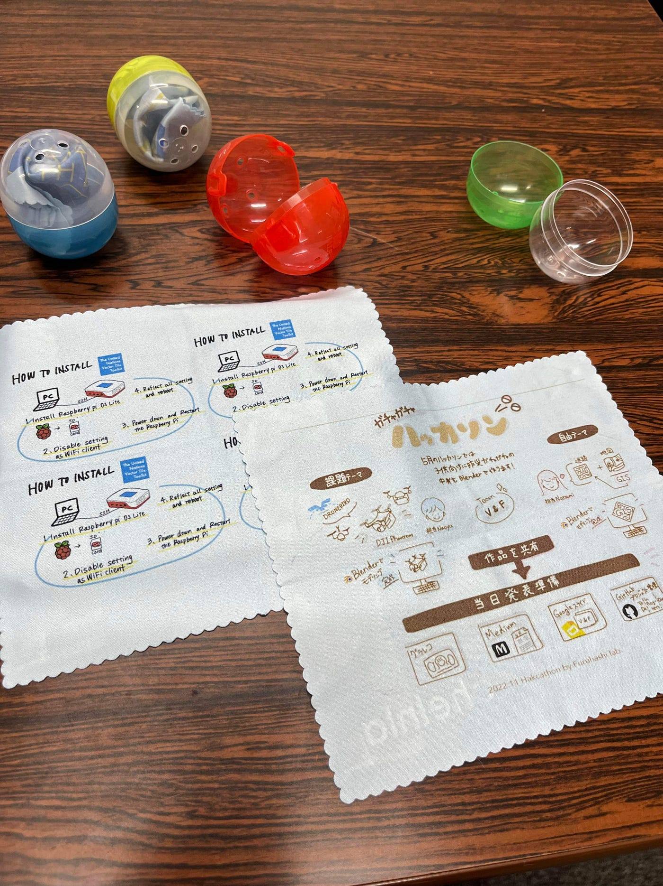
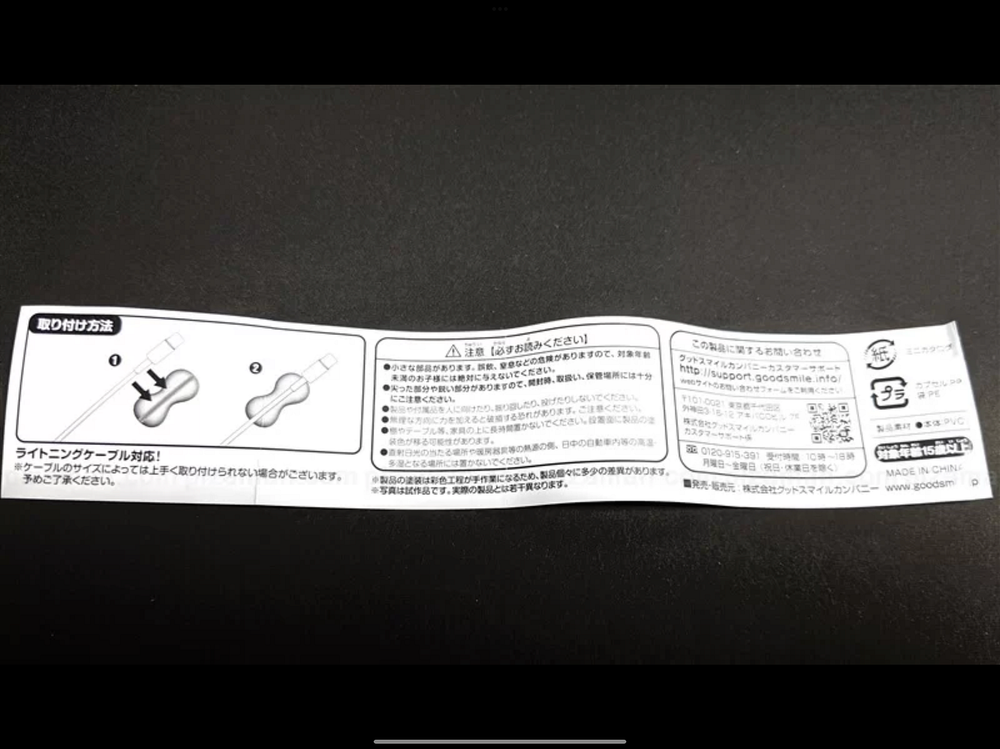
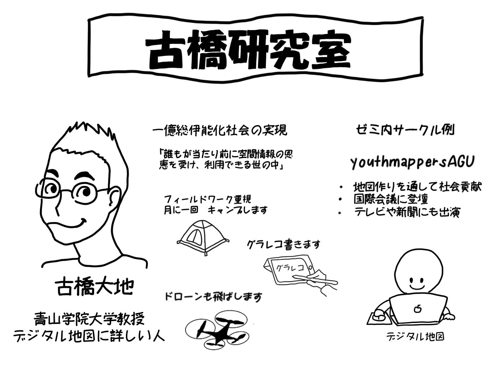

### 11月ハッカソン

こんにちは V&Fのハッカソンをレポートです！

今回のハッカソンはガチャガチャハッカソンと題し、各チームが古橋ゼミに関係するガチャガチャの中身を作るというものでした！

私たちV&Fは「古橋研究ことを知ってもらう」ということをコンセプトに今回のハッカソンに臨みました。そこで一番初めに候補に上がったのがグラレコです。古橋ゼミでは当たり前になっているグラレコですがガチャガチャとの相性も良いのではないかという話になり、グラレコを通じて古橋ゼミのことを知ってもらおうという結論に至りました。

> 作業

まずはグラレコづくりです。今回はUNVTportableに関するグラレコと普段から行っているハッカソンについてのグラレコで作成することに決めました！

そしてグラレコ完成後RICOHのプリンター RI 100でメガネ・iPad拭きに印刷しました！

> 成果物

> 感想

作成してみた感想ですが、やはりグラレコの柔らかな感じや可愛い感じがガチャガチャの中身と相性が良いように感じました。また画像を見ればわかるようにメガネ拭きにプリントするにあたっては淡い色はあまり適していないかもしれないということを発見しました。ラズベリーの実くらい濃い色で作ることがコツかもしれません。

> 発展

作成している最中に思いついたのですがよくガチャガチャに入っている説明用紙の代わりにグラレコ書いた古橋ゼミの紹介を入れるのもいいのではないかと考えました。裏面にはガチャガチャの内容一覧も良いかもしれませんね。

（イメージ図兼グラレコ）

