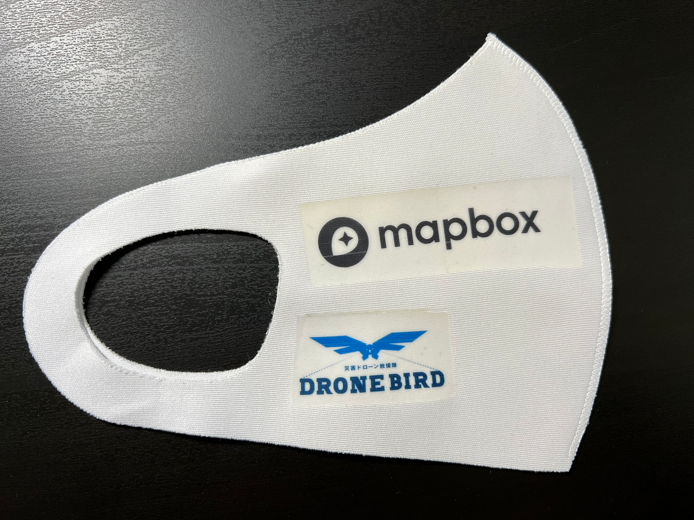
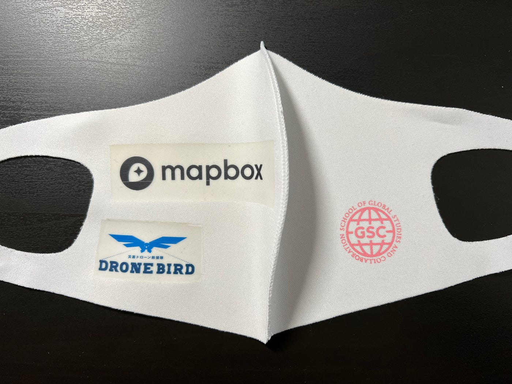
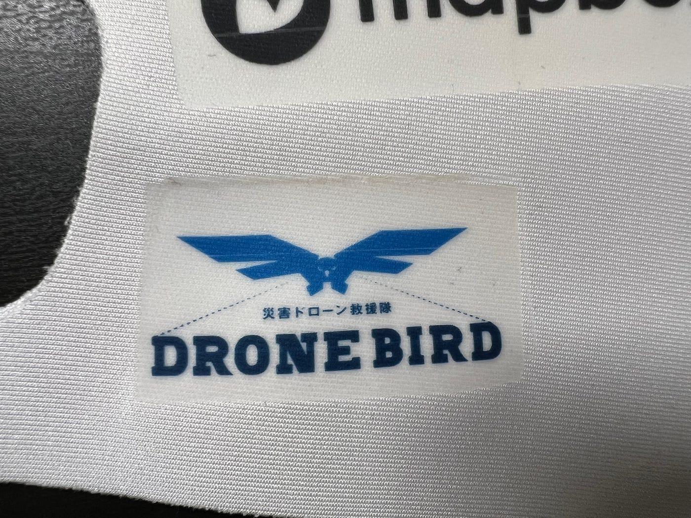
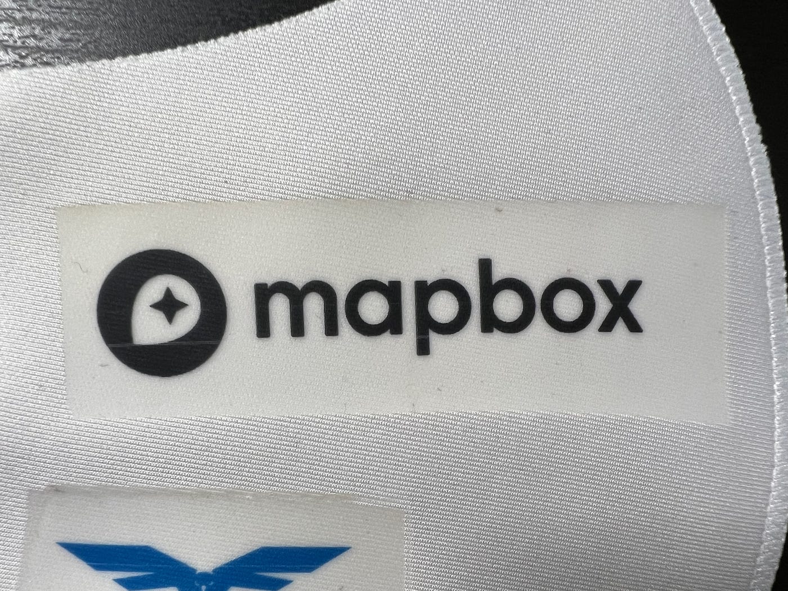
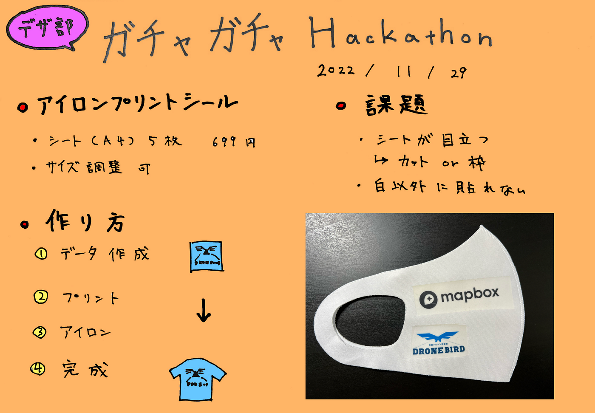

### デザイン部 ガチャガチャハッカソン

こんにちは！

4年の菊池です。

今回は、デザイン部が11月の「ガチャガチャハッカソン」で作成したものについて紹介して行きます！

デザイン部のガチャ案は「公式ロゴアイロンプリントシール」です！

これはアイロンを使って転写することで、布の製品をなんでも公式グッズ化できるというシールです。

作り方は簡単で、専用のアイロンプリントシートにプリンターでロゴを印刷するだけ。Amazonで購入すると、A4のシート5枚で699円。サイズは調節可能なので、カプセルに入れるサイズだとシート1枚で30枚以上作れます。コスパは最強ですね！

[https://amzn.asia/d/deFBRs3](https://amzn.asia/d/deFBRs3)

試しに今回は、DRONE BIRDとMapboxのロゴで作成し、GSCマスクに転写しました。プリント自体は綺麗ですが、やはりシートが目立ちますね。Mapboxのロゴは折り目をつけてから転写しましたが、アイロンでシワが伸びるので影響ありませんでした。比較的大きなシールを折って入れるのも可能です！

課題としては、①シートの目立ち、②白地にしか転写できない、の２つが挙げられます。

①の解決策としては、カットで工夫する方法と枠をつける方法があると思います。カッティングマシーンも使えますが、コストを考えるとデザインを工夫する方向で考えると良さそうです！

②の解決策は、他色用のシートを用意することもできますが、①と同じくデザイン性での解決策がいいかと思います！

作成してみた感想ですが、簡単に量産できるし、シンプルで使い勝手がいいのでかなり良いかなと思いました！

シール単体もガチャになりますし、転写済の製品もガチャになるので用途は多いです。もちろん、マスクに印刷するなら古橋ゼミに導入されている布用プリンターで十分ですが、プリンターを使えないもの（個人の持ち物、厚みのあるもの、使用できない素材のもの）でも転写可能なので合わせると色々と実現できそうです！

