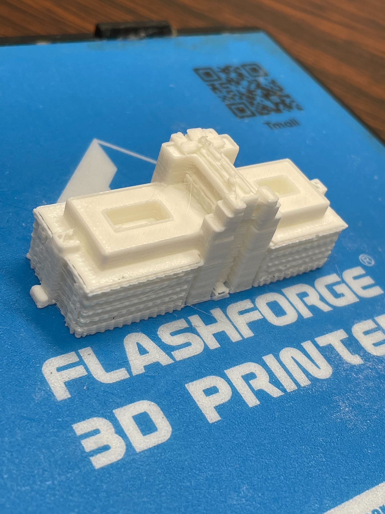
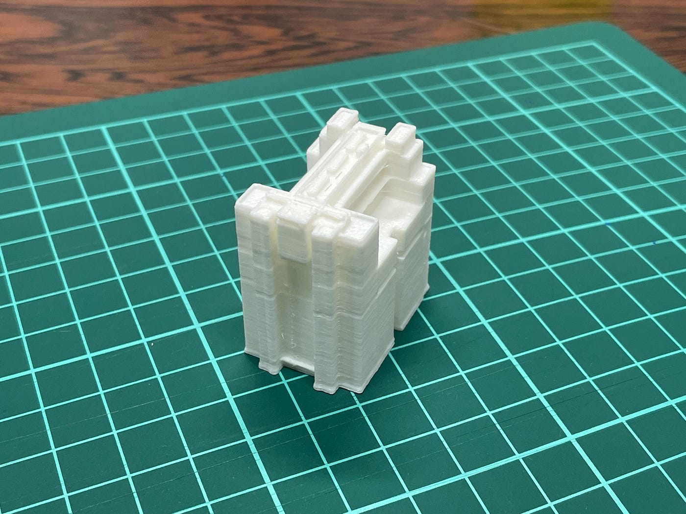
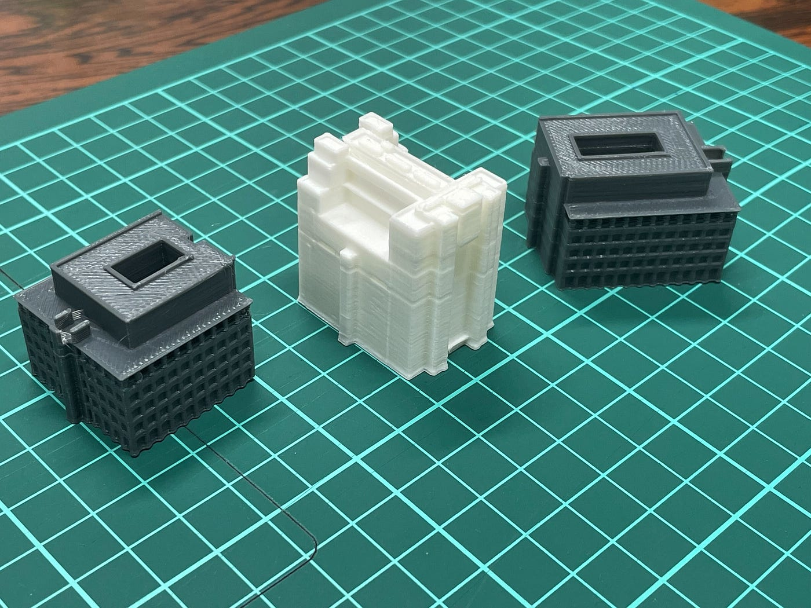
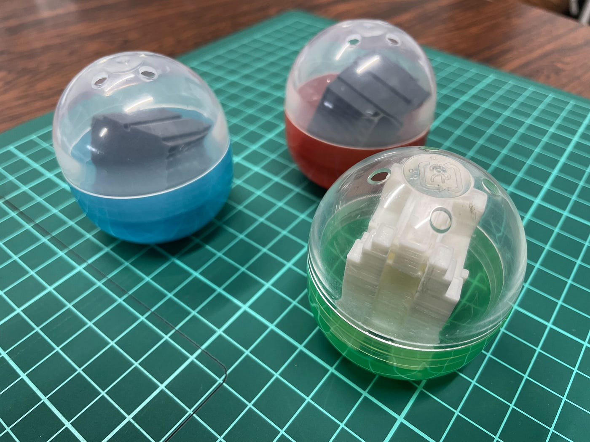
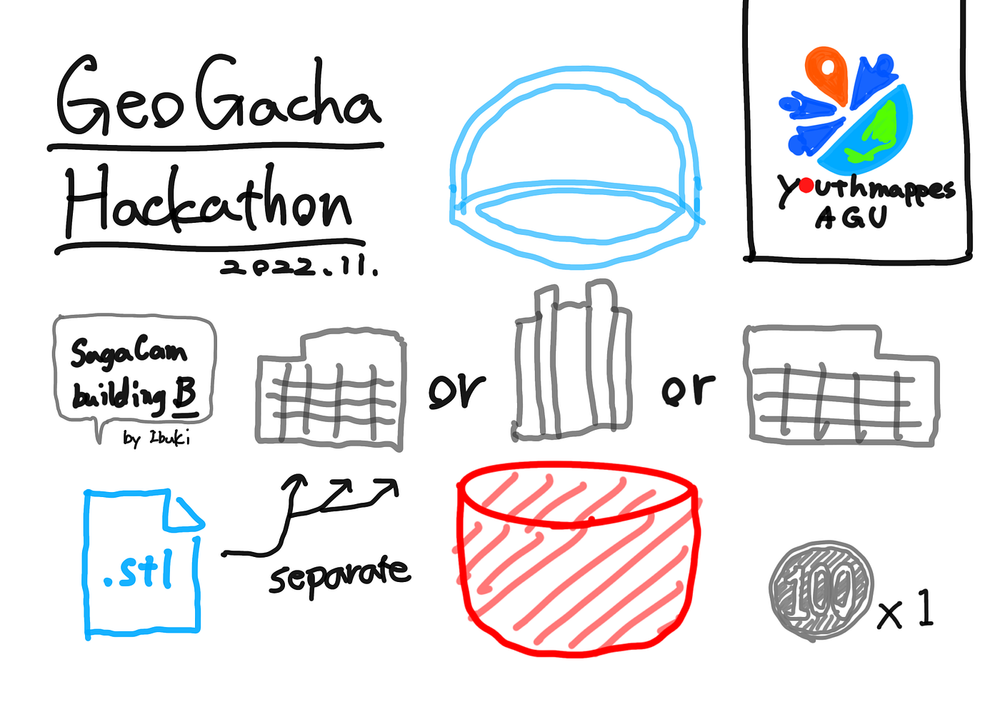

### ジオガチャHackathon — YouthMappersAGU

こんにちは、英語脳から戻りきれていないYouthMappersAGUの鈴木です。日本語が変だったら許してください。(jk

2022年度11月の古橋研ハッカソンについて記事を書かせていただきます。

#### 概要

今回のハッカソンの詳細につきましては、[GitHub](https://github.com/furuhashilab/README/issues/33#issuecomment-1314688797)よりご確認いただけます。中でも重要な部分については、この場をお借りして紹介させていただきます。

・チームの所属人数以上のプロダクトを提案し、プロトタイプを制作

・48mmのカプセルに収まるもの

・量産コストは50円以内（プロトタイプは100円以内で◯）

#### YouthMappersの提案

今回我々は [Ibuki Shibayama](None)がゼミ論により制作していた、相模原キャンパスB棟を左右と中央の三分割にし、カプセルに入れることにしました。以前制作していたプロトタイプは分割のされていない完全体のものでしたが、ぎりぎり48mmのカプセルに収まらないサイズでした。

上の写真をご覧いただくとわかると思いますが、全体的な完成度は良いものの、窓や各フロアの区切りなどの細かな部分はぼやけています。

そこで三分割したそれぞれの部分を48mmカプセルに収まる大きさに拡大し（1.5倍）、それぞれをつなぎ合わせることのできように溝を入れることにしました。各部のstlデータは[こちら](https://github.com/furuhashilab/GeoGachaHackathon_youth_202211)に記載してあります。

今回この３種類がガチャガチャを回したときに出てくる想定ですが、全部揃えるにはかなり鬼畜で難易度が高めになると考え、お情け救済案として中央の建物が揃わなくても左右だけで組み合わさるように設計しました。逆に言えば、中央の建物が出続けてもそれ同士で組み合わせることが可能です笑

こちらが完成したプロトタイプになります。

建物同士を結合させるには、特に建物下部に見られるバリの部分をカッターなどで調整しないと入りませんでした。おそらく、この部分は最終的にどうしても人の手を加えないといけないと感じています。

#### GitHub

[GitHub - furuhashilab/GeoGachaHackathon_youth_202211
Contribute to furuhashilab/GeoGachaHackathon_youth_202211 development by creating an account on GitHub.github.com](https://github.com/furuhashilab/GeoGachaHackathon_youth_202211)

#### グラレコ

