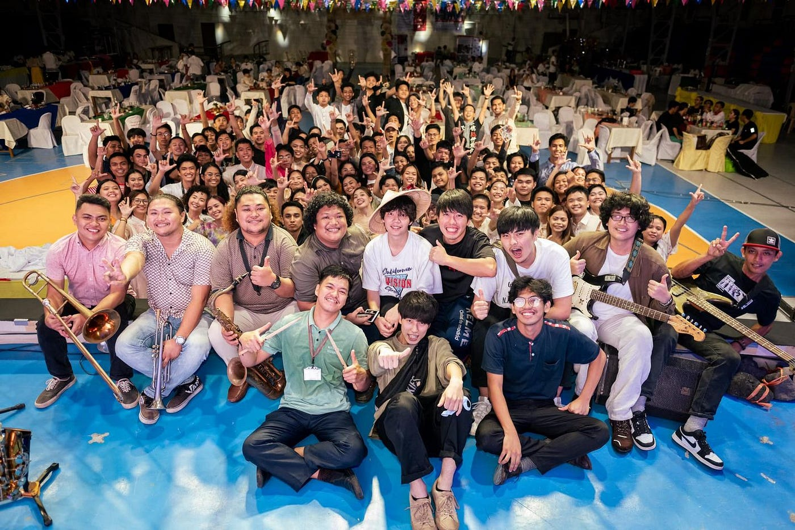

### フィリピン行ってきました

Pista ng Mapa 2022 / SotM Asia 2022 参加レポート by Ibuki Shibayama

こんにちは。4年の柴山です。

2022年11月21日~25日にかけて、フィリピンのレガスピで開催された Pista ng Mapa 2022 / SotM Asia 2022 に、YouthMappers AGU の代表として [Ayako Takahashi](None), [SOTA SUZUKI](None) とともに現地参加・登壇してきました。

[Pista ng Mapa 2022
Pista ng Mapa ( Festival of Maps) is the pioneer and premier free (as to cost and as in freedom) and open conference in…pistangmapa.org](https://pistangmapa.org/2022/?fbclid=IwAR0ibSBoq-sHmSKDY-Vq50-6ESn0Oxm2jo92wjKB0QyI7RLchJAxk5dOnSI)

今回の会場は [Bicol University East Campus](https://www.openstreetmap.org/?mlat=13.14783&mlon=123.72991#map=18/13.14783/123.72991) で、Bicol 大学の学生、[Open Mapping Hub Asia-Pacific](https://m.facebook.com/pages/category/Non-Governmental-Organization--NGO-/openmapping.asiapacific/posts/)、フィリピンの OSM コミュニティ、Meta、Mapbox の関係者が集まりました。

昨年オンライン開催された State of the Map 2021 に登壇しましたが、国際カンファレンスに現地参加するのは今回が初めてで、オフライン特有の雰囲気を感じることができました。

特に同年代の学生たちの明るく活発的な様子を受けて、様々な刺激を得ることができました。今後も Bicol 大学の学生やYouthMappers チャプターとのコラボレーションを行いながら、ここで生まれた関係性を維持していきたいです。

> _**発表 “YouthMappers AGU Activity Report 2022”_**

我々ユースのLT発表では今年度の活動のうち、UNVT ワークショップ、ウクライナ支援マッピング、OSS4SDG ハッカソンの3つを紹介・説明しました。

全日程の4日目の午後ということもあり、現地で知り合えた方々や友達に集まっていただけたので、50~60人以上のオーディエンスの前で発表を行うことができました。

反省点としては、カンペに目を向けすぎるあまり、説明とスライド操作がたびたびずれてしまっていたことと、支援マッピングにおける数量的な実績についての質問に明確に答えられなかったことです。

[高橋メソッド](http://www.rubycolor.org/takahashi/)などを参考にすることでスライドを見ながら（スライドから話すべきことを把握する）発表したり、あらかじめ質問を想定し、それらに答えられるようなデータを用意したりすることで改善できそうです。

> _**Pista ng Mapa 2022 / SotM Asia 2022 を終えて_**

海外で出会った大学生と自己紹介し合ったたり、空間情報に関する互いの活動を語り合ったり、一緒にご飯を食べながらアニメの話をしたり、気が合って友達になったりしたこと、全てが自分にとって初めての経験でした。同じ分野でこれだけの同志がいることを全身で感じつつ、これからの YouthMappers AGU も海外のコミュニティとの関係性を維持していくべきだと思いました。

大学の卒業に伴い、私はもうすぐ YouthMappers AGU からリタイアしてしまいますが、次の世代のメンバーと今回知り合えた海外のコミュニティをつなぐことに注力したいです。

初めてのことに挑戦できて、海外の仲間と知り合えて、いろいろな刺激を受けることができて、本当によかったです。

フィリピンで出会った人たち、同行していただいた先生・先輩方、一緒に発表してくれた [Ayako Takahashi](None)、 [SOTA SUZUKI](None)、本当にありがとうございました！！

> _**発表スライド_**
