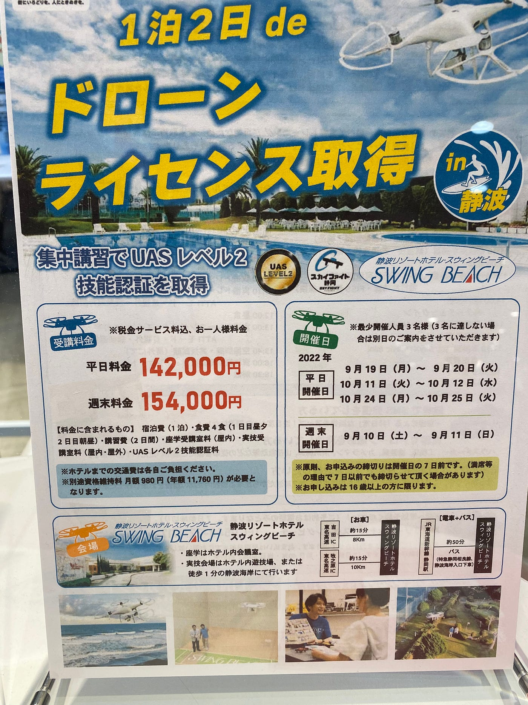
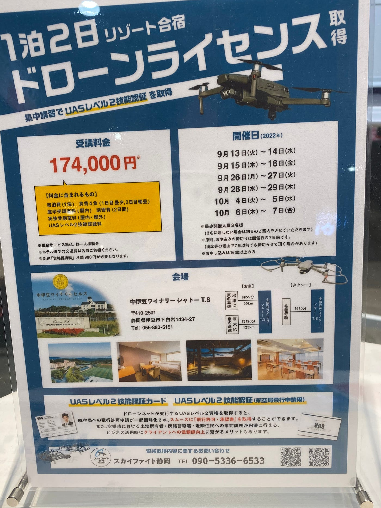
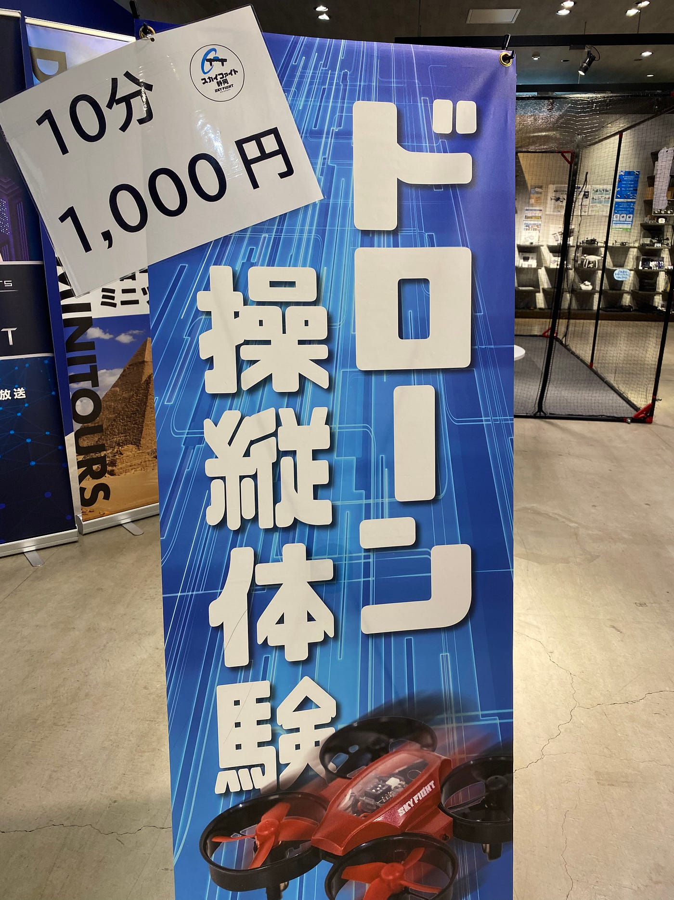
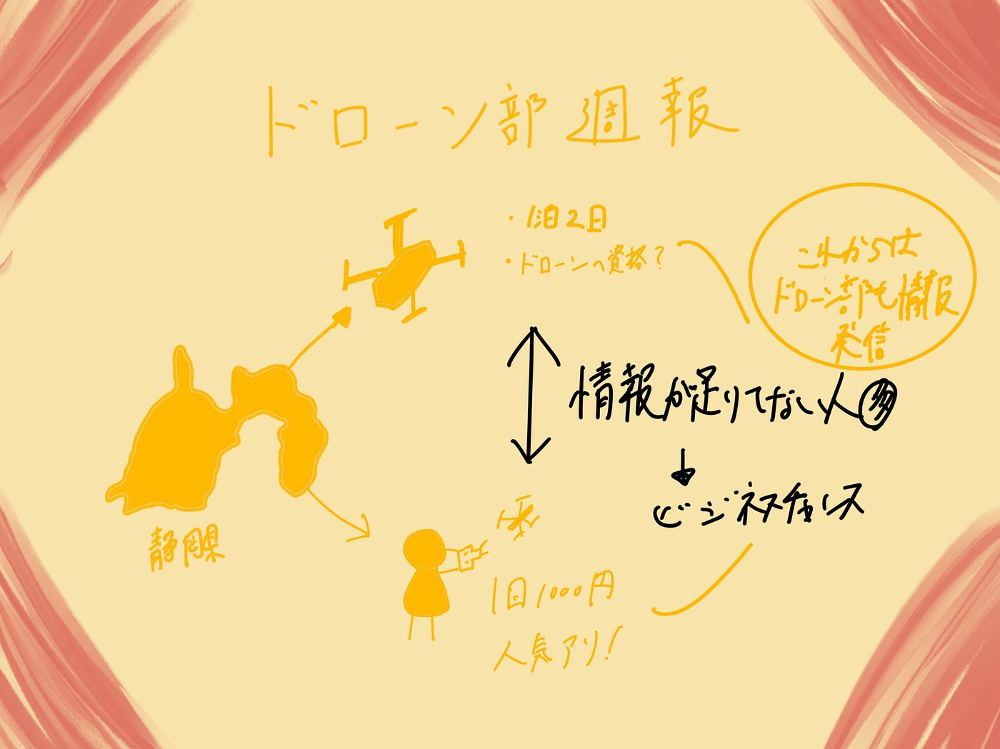

### ドローン教室

こんにちは 3年植松です。

私の地元である静岡県に帰省した際ショッピングモールでドローン教室についての張り紙を見つけました。

気になった点はチラシに書かれている「取得すると航空局への飛行許可申請の一部が簡略化され、スムーズに飛行許可、承認証を取得できる」という点です。この店舗のどこにも国家試験の記載はなく、店主に話を聞いても国家試験の話はなく、ただこの資格を取れば簡単に飛行許可がおりるとだけおっしゃっていました。

この資格を取得することで実際どこまで作業がスムーズに行えるようになるかは分かりませんがドローン検定のように少し必要のない資格なのではないかと個人的に考えています。

またこれがビジネスとして成り立っている以上、お客さまの需要が多いということですが正しいドローンについての知識を広げることも重要であると感じました。

ドローン部の課題かもしれません！

また1000円のドローン操縦体験も人気を集めていました。

実際に飛ばせるのはトイドローンだったので無料でDJI Mavicが飛ばせるドローンバードの防災訓練がどれほどすごいか再確認しました。

