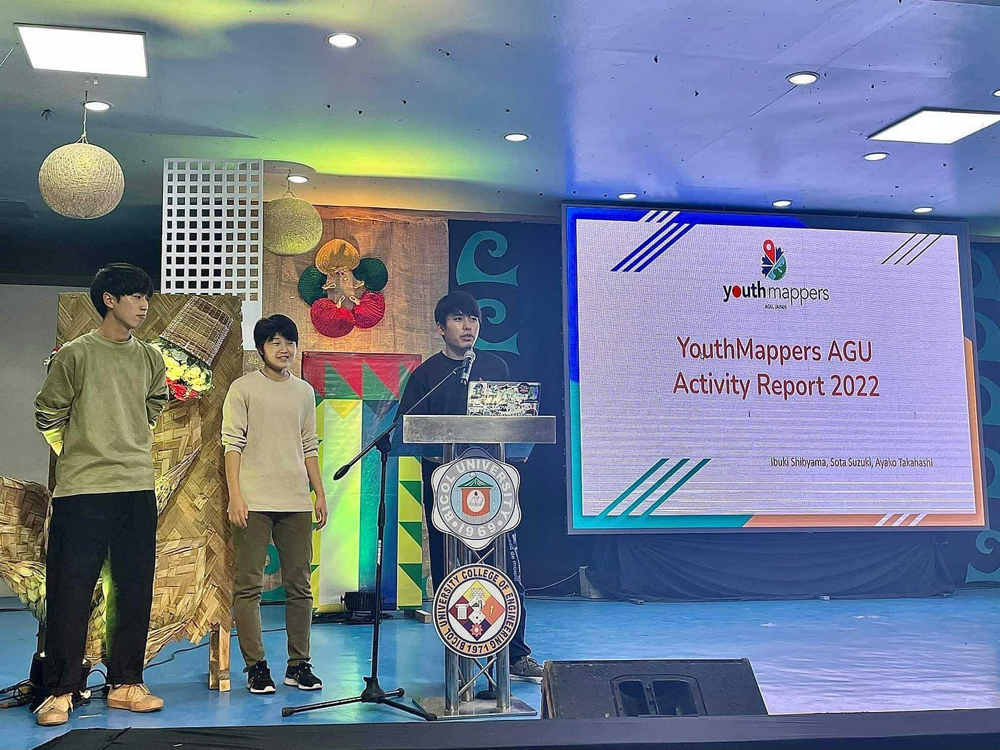
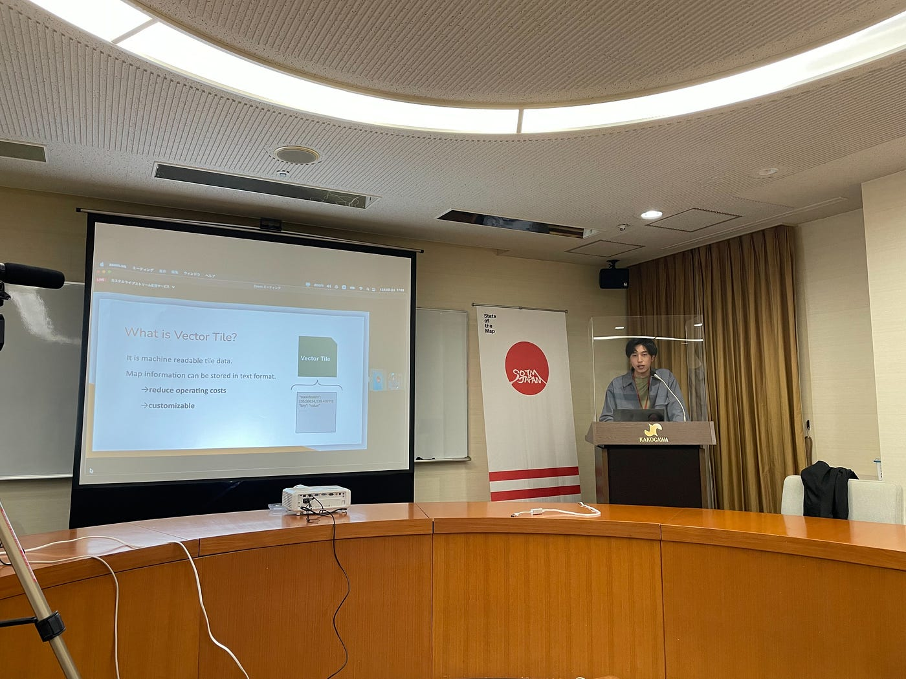
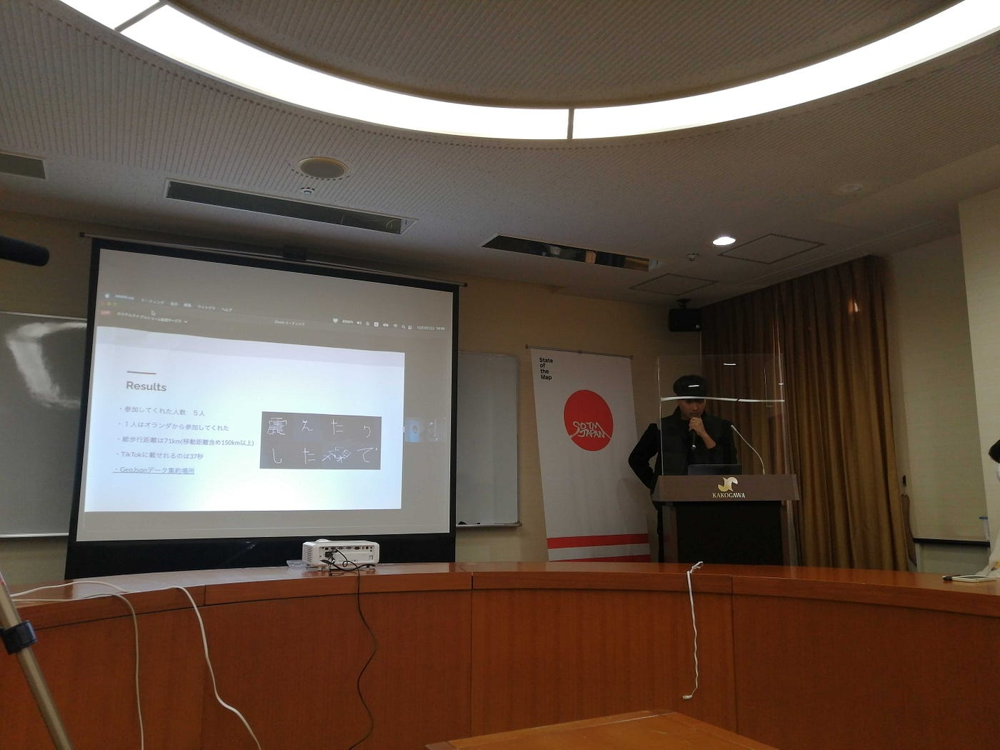

### SotM Asia to SotM Japan

YouthMappers AGU 週報

今回の週報では、SotM Asia、SotM Japan への参加、国連 OSS4SDG ハッカソン Award Ceremony についてお伝えします！

> _**SotM Asia_**

2022年11月21日~25日にかけて、フィリピンのレガスピで開催された Pista ng Mapa 2022 / SotM Asia 2022 に、YouthMappers AGU の代表として [Ibuki Shibayama](None) , [Ayako Takahashi](None) , [SOTA SUZUKI](None) が現地参加・登壇してきました。

[Pista ng Mapa 2022
Pista ng Mapa ( Festival of Maps) is the pioneer and premier free (as to cost and as in freedom) and open conference in…pistangmapa.org](https://pistangmapa.org/2022/?fbclid=IwAR0ibSBoq-sHmSKDY-Vq50-6ESn0Oxm2jo92wjKB0QyI7RLchJAxk5dOnSI)

今回の会場は [Bicol University East Campus](https://www.openstreetmap.org/?mlat=13.14783&mlon=123.72991#map=18/13.14783/123.72991) で、Bicol 大学の学生、[Open Mapping Hub Asia-Pacific](https://m.facebook.com/pages/category/Non-Governmental-Organization--NGO-/openmapping.asiapacific/posts/)、フィリピンの OSM コミュニティ、Meta、Mapbox の関係者が集まりました。

我々ユースはイベントの4日目にLT発表を行いました。”Activity Report 2022” と題し、今年度の活動のうちUNVT ワークショップ、ウクライナ支援マッピング、OSS4SDG ハッカソンの3つを紹介・説明しました。

会場内や交流イベントにて同年代の学生たちの明るく活発的な様子を受けて、様々な刺激を得ることができました。今後も Bicol 大学の学生やYouthMappers チャプターとのコラボレーションを行いながら、ここで生まれた関係性を維持していきたいです。

> _**SotM Japan_**

12月3日には兵庫県加古川市の[加古川商工会議所](https://www.openstreetmap.org/?mlat=34.76444&mlon=134.84003#map=19/34.76444/134.84003)にて開催された State of the Map Japan 2022 に参加、登壇してきました。

[State of the Map Japan 2022
include about.html %}    {% include…stateofthemap.jp](https://stateofthemap.jp/2022/)

SotM Asia の約一週間後の開催となり、フィリピンでの記憶が新しい状態で参加だったため、規模や雰囲気、参加者の属性などさまざまな面での違いを比較できました。

今回は YouthMappers AGU 代表として [Ibuki Shibayama](None) が登壇し SotM Asia の発表内容を共有しました。

また、登壇予定だった [Shogo Hirasawa](None) さんが急遽欠席となってしまったため、その枠を [Kuniharu Higano](None) さんが昨年度のゼミ論の[「GPS Drawingで新宝島を表現」](https://medium.com/furuhashilab/新宝島-ついに完成-46e52894ae4e)を発表しました。

このように飛び入りで自分たちの研究や活動をアピールできることが、公式のイベントに参加する大きなメリットだと感じました。

> _**国連 OSS4SDG ハッカソン Award Ceremony_**

[国連 OSS4SDG ハッカソン](https://ideas.unite.un.org/sdg11/Page/Overview)に YouthMappers チームが10月に提出した[成果物](https://github.com/yuuhayashi/citygml-osm/issues/97#issuecomment-1297159528)が、ファイナリストとして選ばれました！！

全49チームの応募から8チームがファイナリストとして選ばれており、**受賞する4チームは12月7日 **23:00 (JST) **開始の授賞式で発表する**とのことです。授賞式の様子はYouTube でライブ配信されますので是非ご覧ください！

> _**グラレコ_**

作成中です。。。
