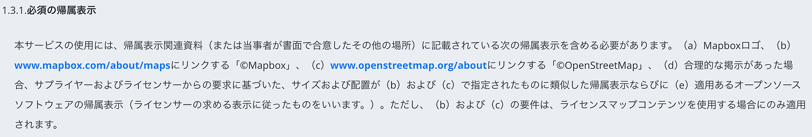
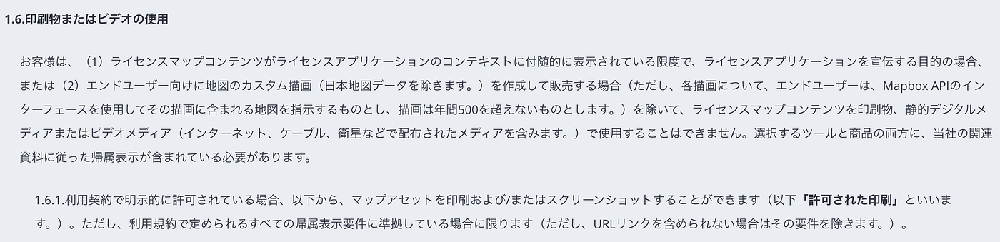
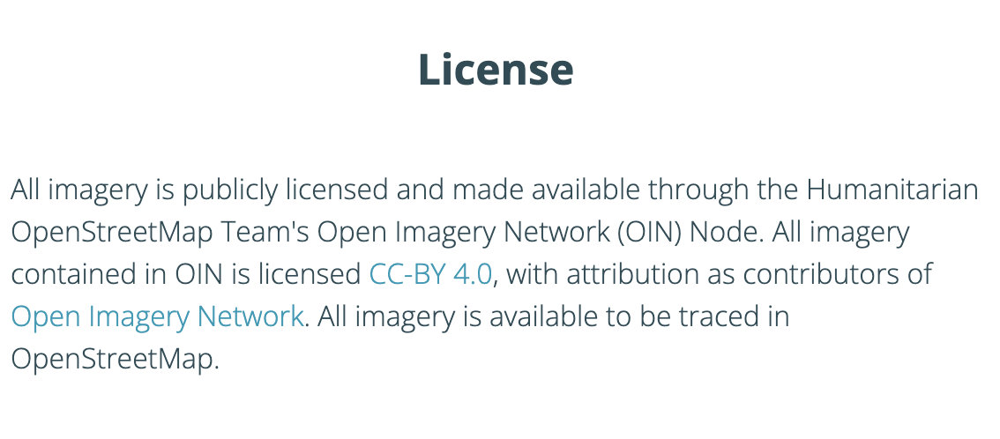
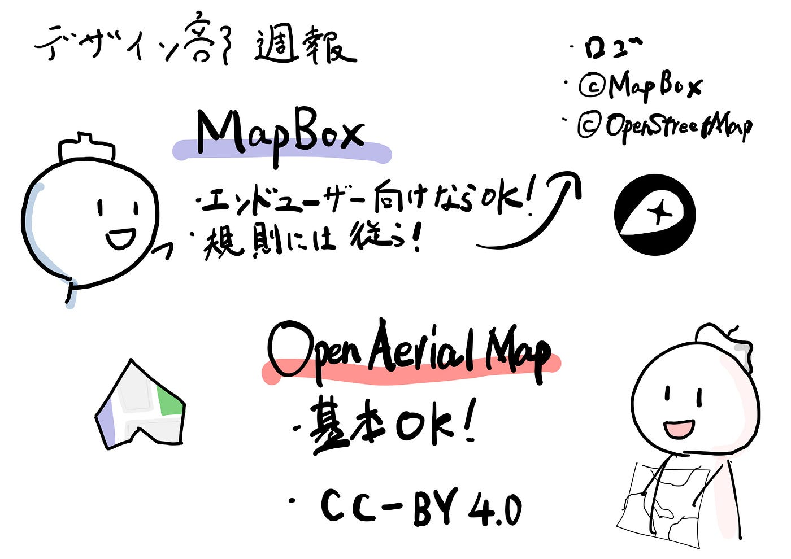

### デザイン部週報

前回のハッカソンにて、ドローン部でライセンスに関しての注意を受けたので、各データ提供社ごとのライセンスに関して情報収集を行いました！

### mapboxについて

1. 3.1.**必須の帰属表示**

本サービスの使用には、帰属表示関連資料（または当事者が書面で合意したその他の場所）に記載されている次の帰属表示を含める必要があります。（a）Mapboxロゴ、（b）**[www.mapbox.com/about/maps**](http://www.mapbox.com/about/maps)にリンクする「©Mapbox」、（c）**[www.openstreetmap.org/about**](http://www.openstreetmap.org/about)にリンクする「©OpenStreetMap」、（d）合理的な掲示があった場合、サプライヤーおよびライセンサーからの要求に基づいた、サイズおよび配置が（b）および（c）で指定されたものに類似した帰属表示ならびに（e）適用あるオープンソースソフトウェアの帰属表示（ライセンサーの求める表示に従ったものをいいます。）。ただし、（b）および（c）の要件は、ライセンスマップコンテンツを使用する場合にのみ適用されます。

**1.6.印刷物またはビデオの使用**

お客様は、（1）ライセンスマップコンテンツがライセンスアプリケーションのコンテキストに付随的に表示されている限度で、ライセンスアプリケーションを宣伝する目的の場合、または（2）**エンドユーザー向け**に地図のカスタム描画（日本地図データを除きます。）を作成して販売する場合（ただし、各描画について、エンドユーザーは、Mapbox APIのインターフェースを使用してその描画に含まれる地図を指示するものとし、描画は年間500を超えないものとします。）を除いて、ライセンスマップコンテンツを印刷物、静的デジタルメディアまたはビデオメディア（インターネット、ケーブル、衛星などで配布されたメディアを含みます。）で使用することはできません。選択するツールと商品の両方に、**当社の関連資料に従った帰属表示**が含まれている必要があります。

[https://www.mapbox.jp/legal/tou](https://www.mapbox.jp/legal/tou)

以上のように書いてあるので、エンドユーザー向けに利用する場合、一定の規則に則れば使用が可能だと解釈できます！

### OpenAerialMapについて

古橋先生の「OpenAerialMapのススメ」

https://medium.com/furuhashilab/openaerialmap%E3%81%AE%E3%82%B9%E3%82%B9%E3%83%A1-528bee8d910

公式ホームページの「License」にて、

[OpenAerialMap
OpenAerialMap (OAM) is a set of tools for searching, sharing, and using openly licensed satellite and unmanned aerial…openaerialmap.org](https://openaerialmap.org/about/)

CC-BY 4.0ということはわかったのですが、attribution as contributors of [Open Imagery Network](https://openimagerynetwork.github.io/)ってどういう意味でしょうか😂

### Google マップとGoogle Earthについて

そもそも、GoogleマップやGoogle Earthのライセンスを確認する際に必要になってくるのがGoogleの利用規約です。

基本的には、Google の[利用規約](https://www.google.com/help/terms_maps.html)に従い、[権利帰属](https://www.google.com/permissions/geoguidelines/attr-guide/)が明確に表示されていれば、用途に応じて、Google マップ、Google Earth、ストリートビューの画像を自由に使用できるとのことです。

今回は特に古橋ゼミ生が知っておく必要があるのは印刷物の使用に関して記載します！

Google マップと Google Earth には、印刷機能または（Earth Studio への）書き出し機能が備わっており、商用目的でなければコンテンツを印刷して拡大する（地図に道順を表示するなど）ことが可能だ。コンテンツを含む印刷物を配布する場合は、ガイドラインを熟読しフェアユースと権利帰属に関する規約に特に留意する必要があります。

[https://www.google.com/intl/ja/permissions/geoguidelines/](https://www.google.com/intl/ja/permissions/geoguidelines/) に使用目的別に使用可否が記載されていますので気になる方はご確認ください。

その他の使用用途も詳細に書かれているためライセンスを確認する際にはその都度読むことを推奨します！

### **OpenStreetMap について**

**クレジット表記の仕方**

OpenStreetMap を使う場所では

- 私たちの著作権表示ページを掲載し、OpenStreetMap にクレジットがあることを示してください。

- データはライセンス要件である Open Database License に基づいて提供されていることを明示してください。

以上2点を守る必要があります。

著作権表示に関しては、データの使用用途によって、その表示要件が異なります。表示要件の詳細は [帰属のガイドライン](https://wiki.osmfoundation.org/wiki/Licence/Attribution_Guidelines)を参照してください。

OSM をデータ形式で配布する場合の必須条件として、直接それぞれのライセンス条項の名前を提示しリンクする必要があります。リンク付与が不可能な媒体の場合は（例：印刷物ほか）、読者に[openstreetmap.org](http://openstreetmap.org/)を読むよう（「OpenStreetMap」という文言を連絡先URLに置換してもよい）、また [opendatacommons.org](http://opendatacommons.org/) を勧める必要があります。

それ以上のデータの利用やクレジット方法についての詳細は[OSMF ライセンスページ](https://osmfoundation.org/Licence)を読む必要があります。

また**、著作権侵害について**

OpenStreetMapの協力者は、著作権者から明確な許諾を得ずに、著作権のある情報源 (例: Google マップや印刷された地図) からデータを持ち込まないよう注意する必要があります。

著作権のある素材がOpenStreetMapのデータベースや本サイトに不正に追加されたと気づいた場合、[却下手順](https://wiki.osmfoundation.org/wiki/Takedown_procedure)を読むか、[オンライン却下のページ](https://dmca.openstreetmap.org/)から直接申し立てを行う必要があります！

