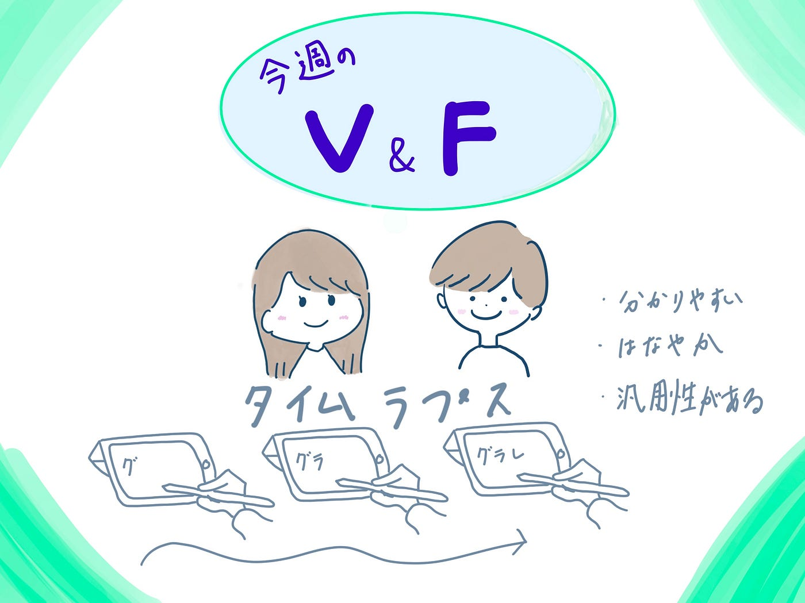

### V&F週報

こんにちは。V&Fです。

ハッカソンが続いたため、普通の週報を書くのはとてもひさしぶりに感じます。

最近のハッカソンから、

グラレコを使った動画をよく作るようになりました。華やかで親しみやすい動画が作れるので、今後もさまざまなところで利用ができそうです。

[https://youtu.be/bzwxgyx6ebI](https://youtu.be/bzwxgyx6ebI)

そのため、VFとしてグラレコのタイムラプスを使った動画の作り方的なものを今後まとめていけたらと思います。

動画を作るときに携帯で撮影することがほとんどなのですが、そのときにスタンド(三脚)がほしいと思いました。

ゼミにありましたっけ？

[https://www.amazon.co.jp/XXZU-%E9%81%A0%E9%9A%94%E6%92%AE%E5%BD%B1%E3%83%AA%E3%83%A2%E3%82%B3%E3%83%B3-3WAY%E9%9B%B2%E5%8F%B0-%E3%83%93%E3%83%87%E3%82%AA%E3%82%AB%E3%83%A1%E3%83%A9-%E3%82%B9%E3%83%9E%E3%83%BC%E3%83%88%E3%83%95%E3%82%A9%E3%83%B3/dp/B09STYB2WD/ref%3Dsr_1_6?__mk_ja_JP=](https://www.amazon.co.jp/XXZU-%E9%81%A0%E9%9A%94%E6%92%AE%E5%BD%B1%E3%83%AA%E3%83%A2%E3%82%B3%E3%83%B3-3WAY%E9%9B%B2%E5%8F%B0-%E3%83%93%E3%83%87%E3%82%AA%E3%82%AB%E3%83%A1%E3%83%A9-%E3%82%B9%E3%83%9E%E3%83%BC%E3%83%88%E3%83%95%E3%82%A9%E3%83%B3/dp/B09STYB2WD/ref%3Dsr_1_6?__mk_ja_JP=)カタカナ&crid=3FVK4UNDQJUKX&keywords=携帯三脚&qid=1670296439&sprefix=携帯%2Caps%2C360&sr=8-6&th=1

＜グラレコ＞

