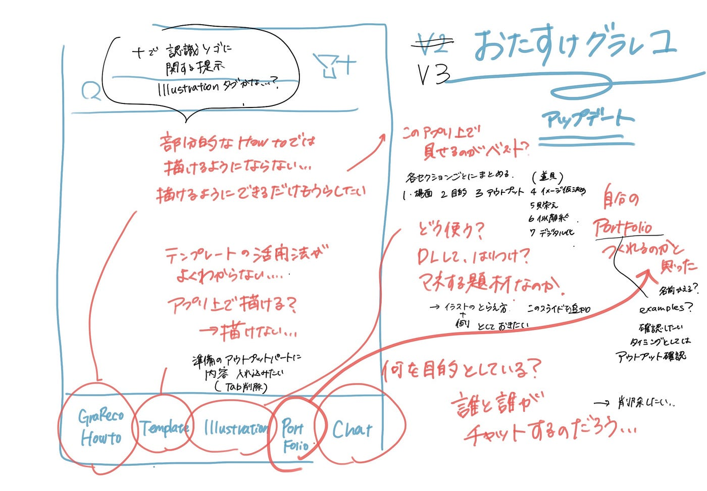

### ゼミ論アドベントカレンダー・おたすけグラレコ進捗

４年安田です。2022年ゼミ論のプロジェクト、進捗報告をします。

こちらの投稿は古橋ゼミのアドベントカレンダーと青山学院GSCのアドベントカレンダーにも投稿されます。

前回の報告は[こちら](https://medium.com/furuhashilab/%E3%82%BC%E3%83%9F%E8%AB%96%E4%B8%AD%E9%96%93%E7%99%BA%E8%A1%A8-%E3%81%8A%E3%81%9F%E3%81%99%E3%81%91%E3%82%B0%E3%83%A9%E3%83%AC%E3%82%B3%E3%82%A2%E3%83%83%E3%83%97%E3%83%87%E3%83%BC%E3%83%88-a95f41dfcc68)

今回は具体的なアップデート内容をまとめました。

### Grareco How toタブに関して

現状
・使う道具
・似顔絵の書き方
・procreateの設定
・メモアプリでのデータ化

追加項目
・場面の設定
・目的のすり合わせ
・アウトプットイメージのすり合わせ
・グラレコ内容仮決め

現状あるセクション情報にならってまとめたものを追加していく予定。

### Templateタブに関して

現状
・アプリ上でグラレコができるような仕様に見える
・アプリ上で、テンプレート画像を活用してグラレコはできない

改善内容
テンプレートタブ内の内容は「Grareco Howtoタブ」のアウトプットイメージのすり合わせに入れ込む

### Illusutrationタブに関して

現状
・使い方がわからない
・DLしてグラレコ内に添付するイメージ？
・地図系のイラストに偏っている

改善内容
・初めにこのタブの利用イメージを伝える
・イラストインプット方法を追加

### Portfolioタブに関して

現状
・自分自身のポートフォリオページが作成できるのかと誤認する
・学生のグラレコが表示されている
・なんの内容だったのか概要のみ表記

改善案
・この内容を見るタイミングとしては、アウトプット内容すり合わせの時。よってその順序に合わせて位置を変更する

・Portfolioという名称を変更する。Exampleなど。

### Chatタブに関して

現状
・誰と誰がチャットするように作られているのか不明

改善案
タブを削除する

### まとめ

GrarecoHowtoのタブを充実させ、ステップごとにタブを分ける

また、イラストレーションのタブで認識齟齬に関する言及を追加。
