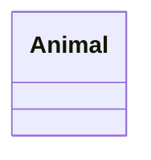
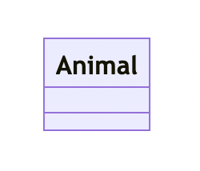
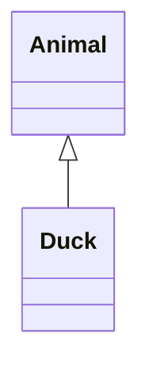
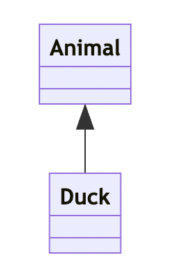
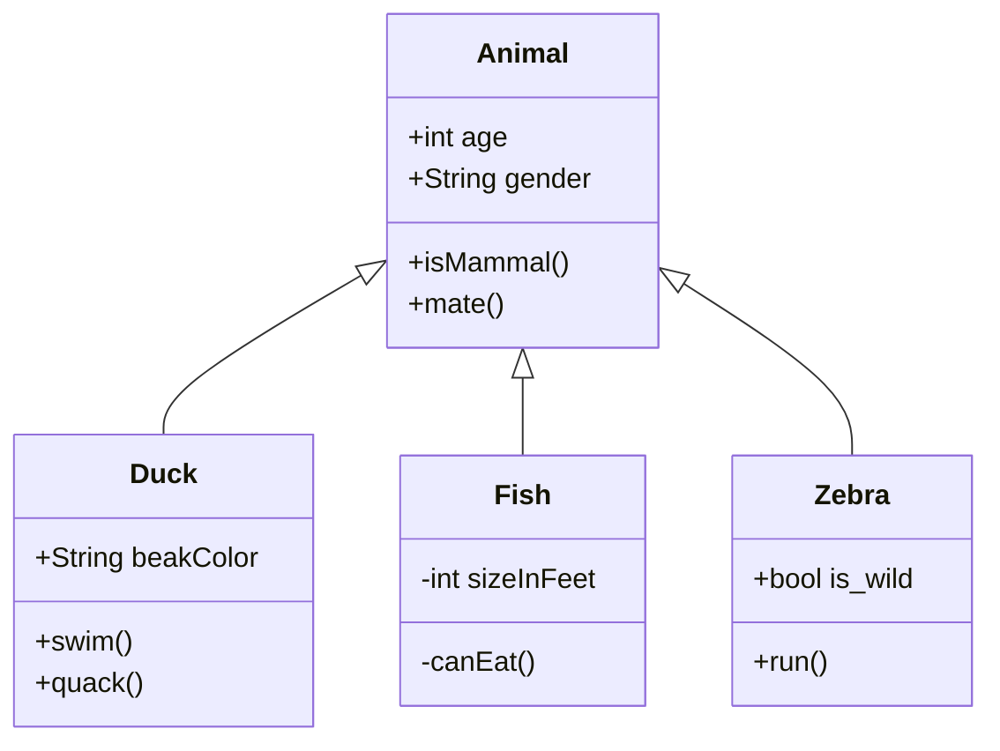
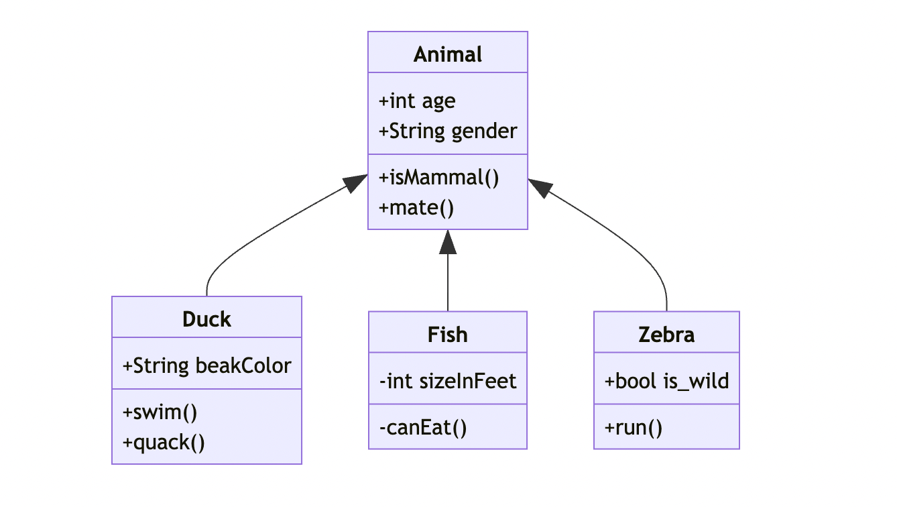

### 12/15 アドベントカレンダー

こんにちは！

古橋ゼミ 4年の菊池です。

今回は、私がゼミ論で扱っているUMLクラス図について解説します。

2022年2月14日、GitHub は JavaScriptベースの作図ツール「Mermaid」を導入し、Markdown ファイルでインラインで図を作成できるようになりました。

Mermaid は Markdown をもとに作成されており、ブラウザ上で動的に図を作成します。フローチャート、UML（統一モデリング言語）、Gitグラフ、ユーザージャーニー図、ガントチャートなど、ソフトウェアプロジェクトでよく使われるさまざまな図をサポートしています。

ここからはUML図（クラス図）について解説していきます！

まずはシンプルなクラス図です。

下には属性や操作の欄が用意されています。

```markdown

```



次に関係性を表示してみましょう。

この矢印も関係性によって変更可能です。

```markdown




最後に、これらを踏まえて幾つかのクラスをまとめてみます。

ポイントは、先行するクラスを上に表示することです。

```markdown

```



以上が Github で UML図を表示する方法です。

非常に簡単で、フローチャートのように使い勝手の良い図も同様に表示することができます。

ぜひ試してみてください！
