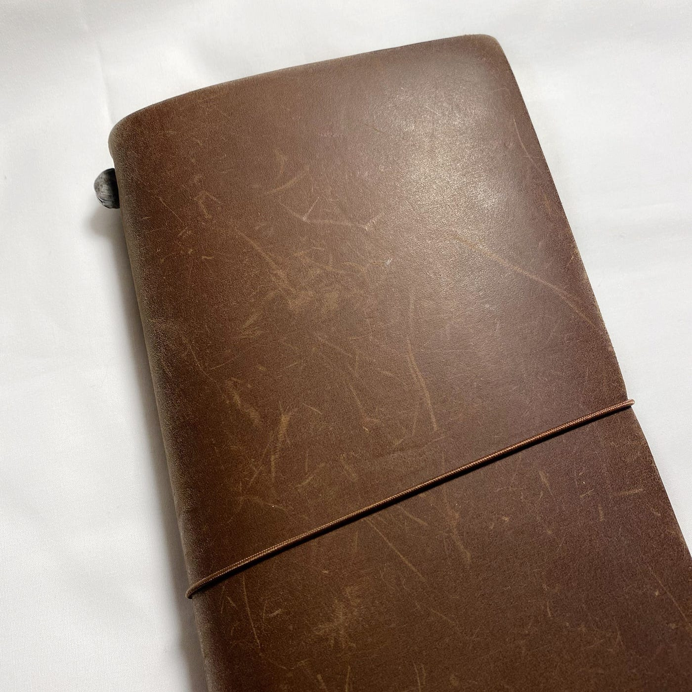
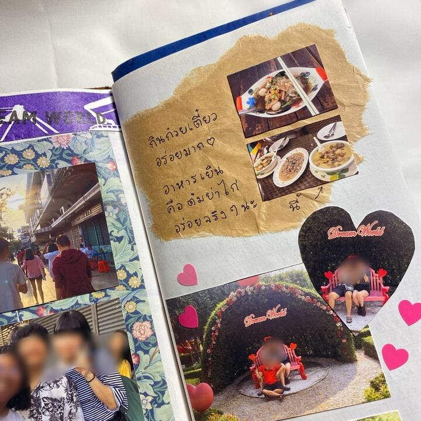
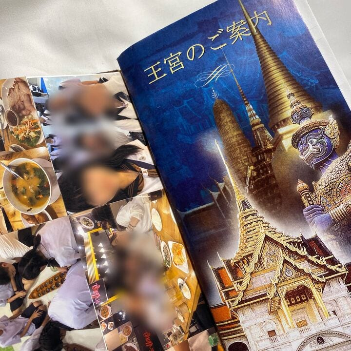
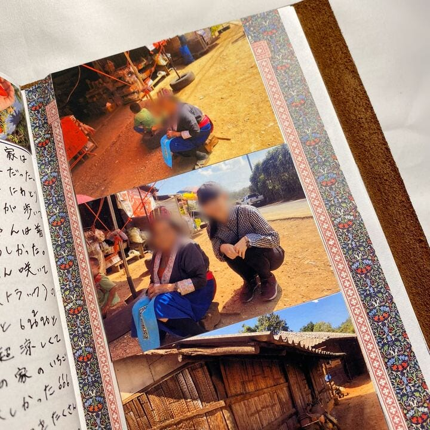
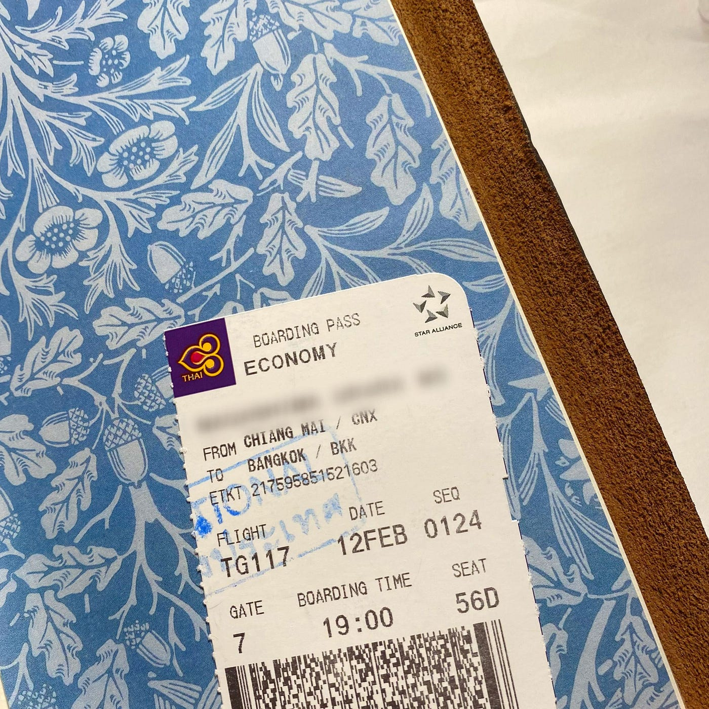

### 12/16留学におすすめのグッズ紹介！

こんにちは！

青学、地球社会共生学部4年のうららです。

アドベントカレンダーの担当日ということで、卒論の進捗でも書こうかと思ったのですが…

来年の1，2月に地球の学生が留学する人も多いようなので、少しでも素敵な旅になりますようにと、私がオススメしたいグッズを紹介したいと思います。

紹介させていただくのは、私が高校でタイ語を学ぶコースに所属しており、その時のタイ現地研修で非常にお世話になったアイテムです！

毎日食べたものの写真を撮影し、料理名を書くのが日課でした。

プライバシー保護のため写真はぼかしています。

### トラベラーズノート

まずはお手数ですが、こちらをご覧ください。

> [トラベラーズノート｜トラベラーズファクトリー オンラインショップ (tfa-onlineshop.com)](https://www.tfa-onlineshop.com/SHOP/108192/list.html)

2006年の3月に誕生したトラベラーズファクトリーが生んだ商品です。

使い込むほどに味と風合いが高まる牛革素材のカバーと、書きやすさにこだわったオリジナルの筆記用紙を使ったシンプルなノートリフィルを売りにしている商品です。

トラベラーズノートという名前から旅にしか使えないの？と思う方もいるかもしれませんが、用途によって（旅のおともや、日常のスケジュール帳など）お好みでサイズや中のリフィルをオリジナルで揃えることができる商品です。

ペンホルダーやリフィルだけでなく、革のお手入れグッズやリペアキットも売っているので、長く愛用することができますよ。

革にもこだわっており、タイの北部チェンマイで作られています。

私が現地研修で行ったのがチェンマイということもあり、非常に運命のように感じました（笑）

お気に入りのマスキングテープなどを見つけて、貼るのがおすすめです。ページが途端におしゃれになりますよ。

今の時代、なんでもスマホ一つでできてしまいますが、写真を印刷したり現地でもらった紙を貼ったり、その日あった出来事を手書きで書くのもひと手間かかって楽しいです。

これから留学する予定の方、毎日の記録を手書きでしたい方、カスタマイズできるオシャレなスケジュール帳を探している方、みなさんにおすすめします♡
