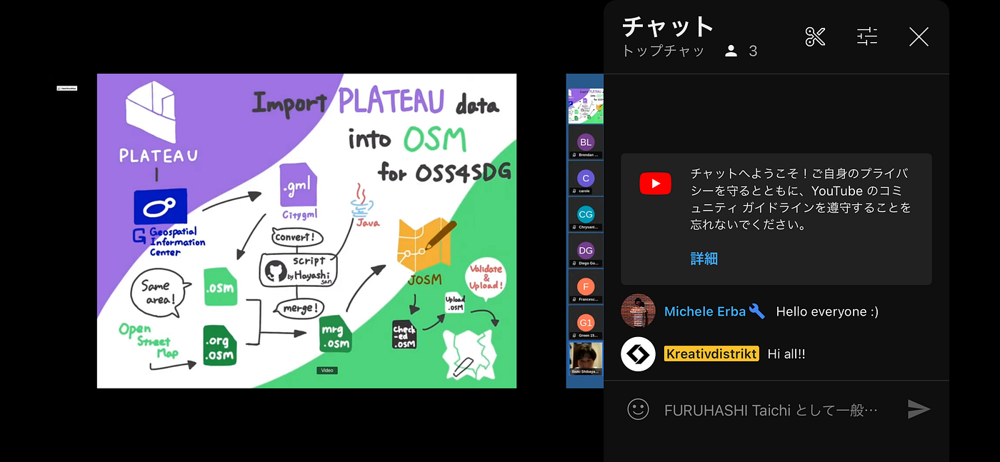
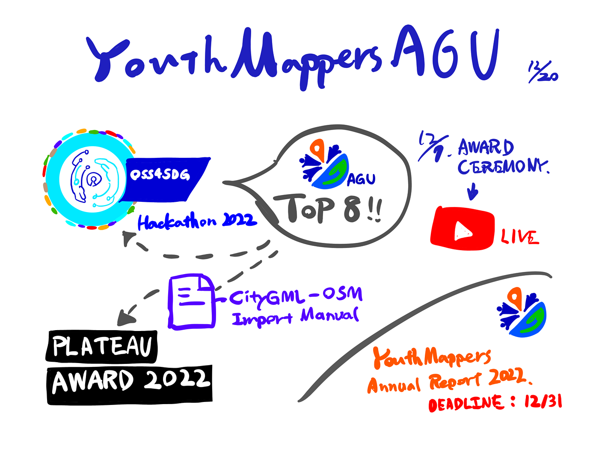

### TOP 8 TEAMS OF OSS4SDG

YouthMappers週報

こんにちは。4年柴山です。

今週の週報では国連主催の OSS4SDGハッカソン授賞式、PLATEAU AWARD 2022 への応募、2022 YouthMappers Annual Chapter Report Form についてお伝えします。

> _**UN-EC OSS4SDG ハッカソン授賞式_**

12月7日、国連主催の [OSS4SDG Hackathon](https://ideas.unite.un.org/sdg11/Page/Overview) の授賞式に、ファイナリストに選出された YouthMappers AGU チーム代表として柴山が出席しました。

[Spigit
Edit descriptionideas.unite.un.org](https://ideas.unite.un.org/sdg11/Page/Overview)

日本時間の23時～オンラインで開始され、ハッカソンに応募した全49チームからファイナリストとして選ばれた8チームの代表が集いました。

1st ~ 3rd Prize, Special Mention の受賞チーム発表の前に、3分間で提出物の説明を行いました。ここでは [NATSUMI HAGA](None) ・ [NAOYA UEMATSU](None) 制作の[グラレコ動画](https://youtu.be/AgHrlQ6PpfQ)を流しながらスピーチしました。

惜しくも4つの賞は逃しましたが、TOP8入賞のファイナリストとして、世界の猛者たちと同じ場所で発表を行うという貴重な体験が得られました。提出まで一緒に頑張ってくれた皆さん、ありがとうございました！お疲れさまでした！

> _**PLATEAU AWARD 2022 への応募_**

そして、OSS4SDG で提出した内容、CityGML データの OSM へのインポート作業の公式マニュアル作成については、[PLATEAU AWARD 2022](https://www.mlit.go.jp/plateau-next/award/#top) へも提出いたしました。

[PLATEAU NEXT | AWARD 2022
国土交通省が主導する、日本全国の3D都市モデルの整備・オープンデータ化プロジェクト「PLATEAU」を活用したサービス・アプリ・コンテンツ作品コンテスト。www.mlit.go.jp](https://www.mlit.go.jp/plateau-next/award/#top)

今回は YouthMappers AGU チームから [NATSUMI HAGA](None) が代表として応募し、12月18日に一次審査のオンライン発表を終えました。

一次審査通過の通知は1月下旬までに来るとのことです！

> _**2022 YouthMappers Annual Chapter Report Form_**

そして、毎年恒例の YouthMappers Annual Chapter Report Form 提出の期限（12月31日）が迫ってきました。

今年もウクライナマッピング支援、SotM Asia、OSS4SDG などさまざまな活動を報告できそうです！

3年生メンバーへの引継ぎも兼ねながら共同で提出作業をする予定です。

> _**グラレコ_**

