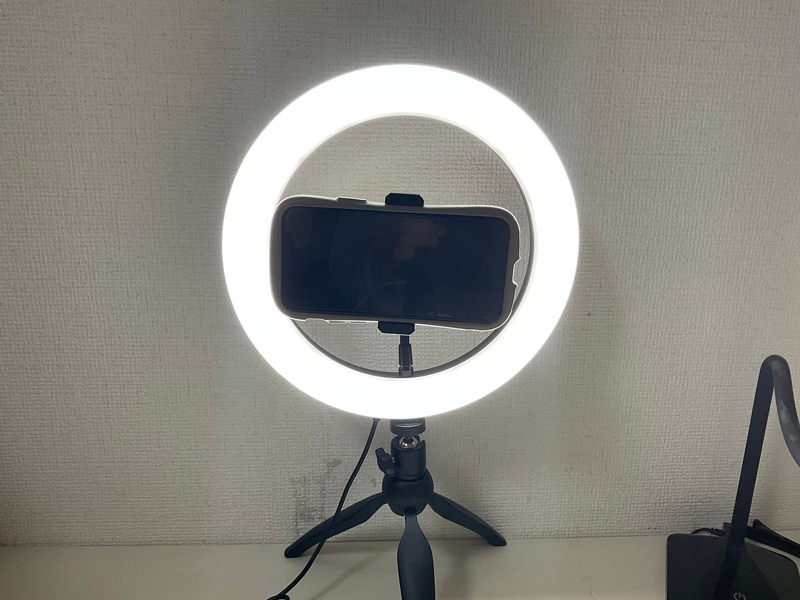
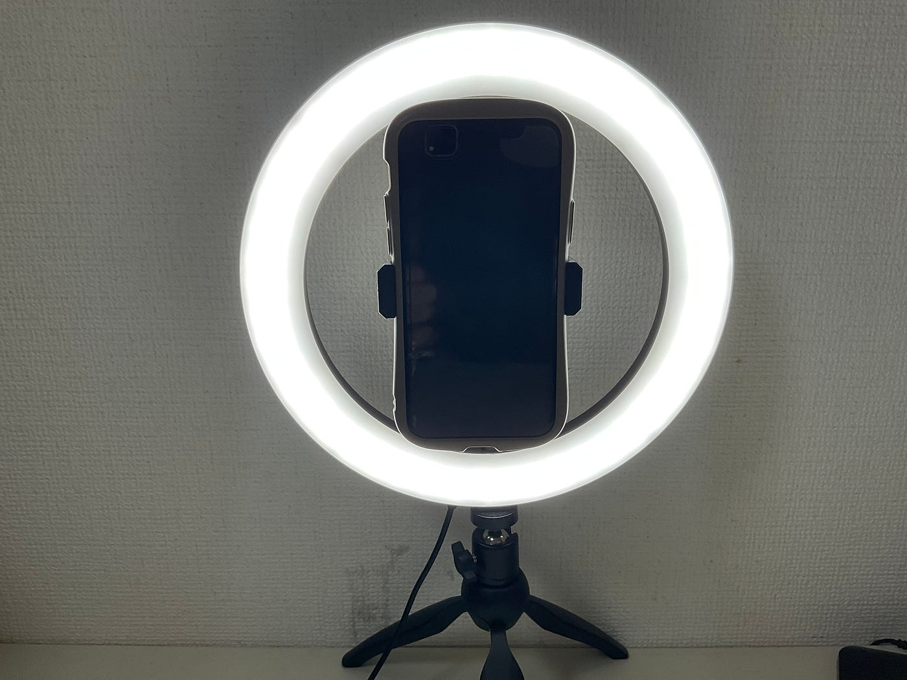
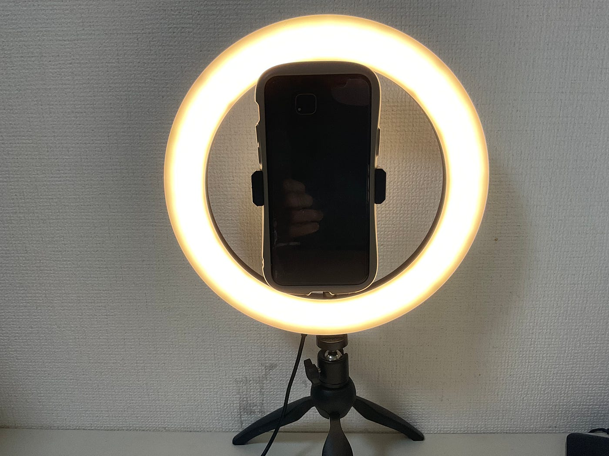
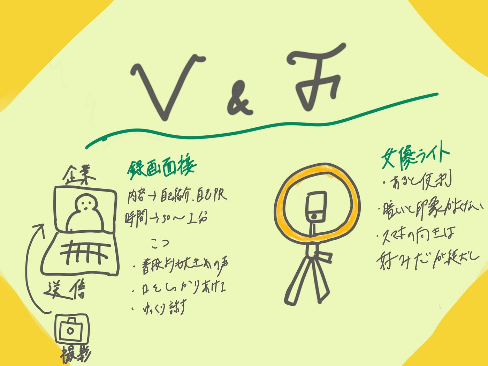

### V&F 週報

こんにちは 3年植松です。今年ももう残りわずかです。ワールドカップの熱が冷めやらない今日この頃ですが年を越したら私たち3年生は就職活動が本格化します。今回はV&Fとしてオンラインでの就職活動になって多く取り入れられるようになってきた録画面接についてと以前買った女優ライトについてまとめていきます。

> 録画面接とは

自分で動画を撮影、録画し企業に送る選考のこと

内容として多いのは自己紹介や自己PRです。基本的に時間制限が設けられており、多くの場合は30秒から1分程度で時々学生時代に頑張ったことを3分語るといものもあります。

> 撮影場所

企業は背景からも人柄や性格を想像するそうなので、周りのものはすべて片づけ、白やベージュの無地の壁を背景にすることが無難です。

> コツ

以下とある企業の人事より

声の大きさ→普段よりも大きめを意識する

話し方→普段より口をしっかり動かすことを意識してはっきり話す 眉毛動かすと良いそうです

話すスピード→普段より少しゆっくり話す（一回で聞き取れるようにするため）

> 照明

動画撮影が慣れていない場合だと思ったより動画が暗く見えることがあります。画面が暗いとせっかく明るい声で話しても暗い印象を与えてしまいます。

インターネットによる最もカメラ写りがよくなるのは自然光で、日中に撮影することがおすすめされています。私的には自然光を遮断し、部屋の明かりと女優ライトの明かりを最大にした方が写りが良いように感じます！

またライトの当て方として、正面やや斜めから当てるようにして、画面に映らないように顔の下に白いハンカチや紙をおいて、照明が反射して顔にあたるようにしておくとさらに表情が明るく映るそうです。やったことないので今度やってみます。

これもまた個人的にですが録画する時企業の指定がなければスマホは縦で撮影した方良いと感じます。

結論オンライン就活をする上で女優ライトは買った方が良いと感じました。あると便利です。

