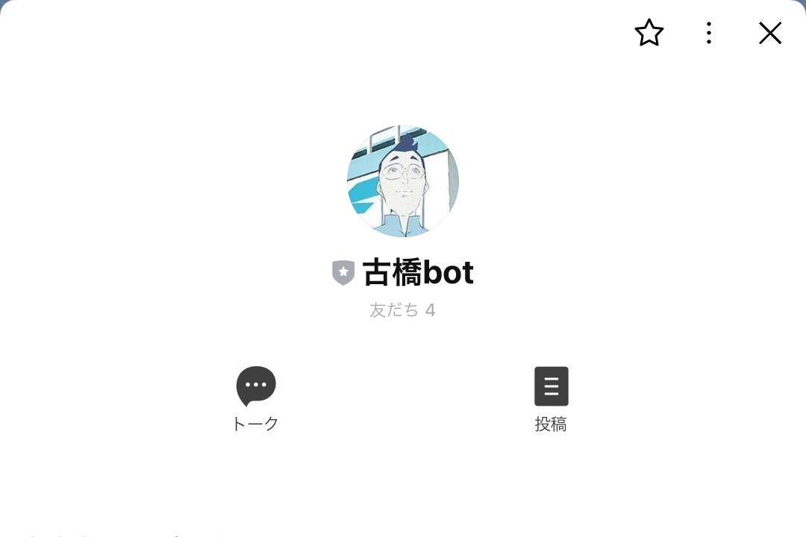
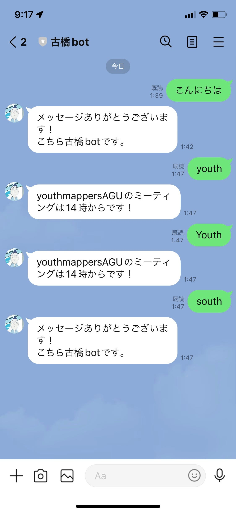
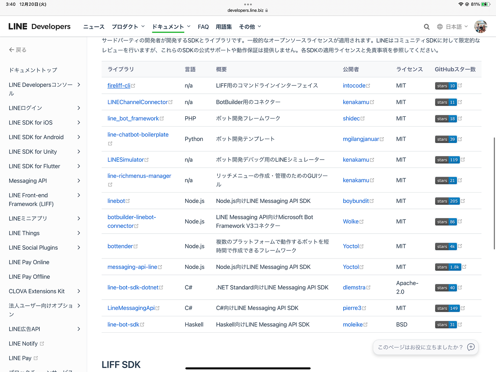

### アドベントカレンダー 古橋bot

こんにちは 3年植松です。

私のゼミ論のテーマはラインで使える古橋botづくりです。

Discordで使われている伊能忠敬ボットはありましたが利用人数が多いラインでは作られてませんでした。

> botを作る意義

・アドクルメンバーはラインのオープンチャットから参加するのでその際にウェルカムメッセージなどを送ることができる

・リマインダー機能

・ゼミ内サークルごとのラインでも古橋ボットがいる→淋しいチャットの活性化

> ラインbotの作り方

今回私はLINE DevelopersのMessageing APIを使用してbotを作ることにしました。

ここから機能を追加していくのですが追加の仕方には3種類あります。

1つ目は事前に特定のキーワードを設定することで、ユーザーが該当キーワードを送信した際にメッセージが自動返信される仕組みです。キーワードを完全に含むメッセージでないと自動返信できない点がデメリットです。

2つ目はAIの応答メッセージを使う作り方です。LINE Developers上にあるAIの条件を自分で細く設定し、ユーザーが受信した内容をし、適切なメッセージを返信します。

３つ目はMessaging APIを使った開発方法です。JavaScriptやPythonなどのプログラミング言語を使って開発していくため、難易度が上がります。しかしMITライセンスで多くのソースコードがGitHub上に格納されているので1から書く必要はありません。

_MIT ライセンス_：ソフトウェアを自由に扱ってよいこと、再頒布時に著作権表示とライセンス表示を含めること、作者や著作権者はいかなる責任も負わないことを定めています。

> これからやること

・表示できるメッセージを増やす

・古橋教授っぽい言葉づかいのbotにしていく

今後進化していくのでぜひ追加お願いします

