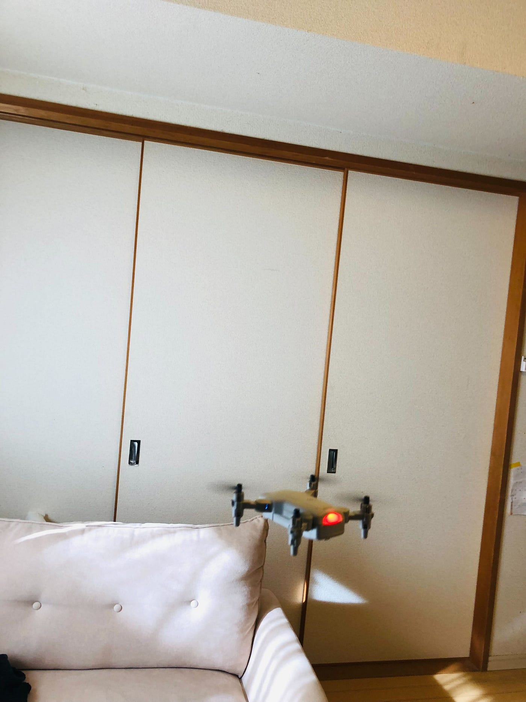
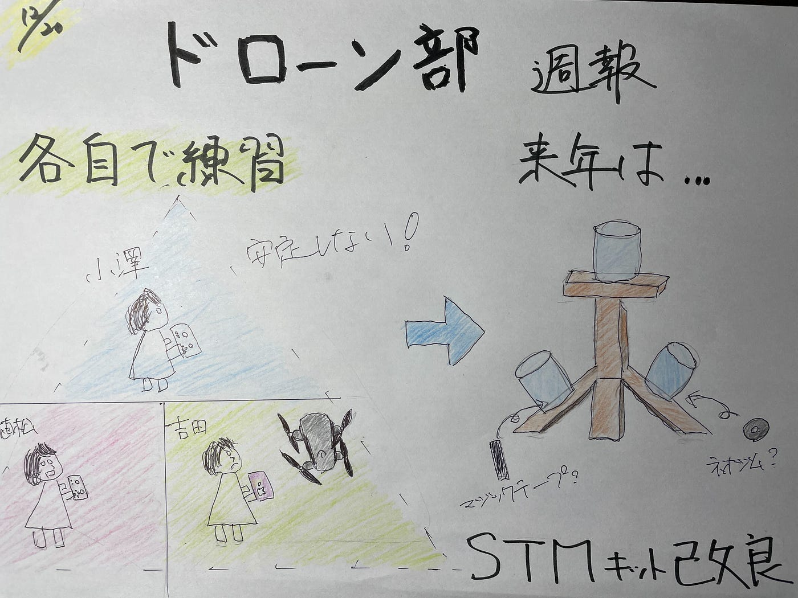

### ドローン部週報

こんにちは！3年の吉田です。

今週は全員で集まれる時間がなかったため各自ドローン操縦練習としました。

久しくドローンを触っていなかったので操縦はかなり難しかったです…

また、トイドローンの映像を撮れるスマホアプリの「4DRC PRO」で操作しながら画面収録を試みましたが、操作が安定せずできませんでした…

やはりSTMを使って定期的な練習が大事だと感じました。

来年はまず、バラバラになっているSTMキットを効率的に組み立てる方法を確立させ、その後訓練をどんどんしていきたいと思います！

STMキット作成にネオジム磁石とマジックテープが欲しいので

こちらの商品・個数でお願いします！

[ほしいもの · Issue #1 · furuhashilab/2022-2023drone
You can't perform that action at this time. You signed in with another tab or window. You signed out in another tab or…github.com](https://github.com/furuhashilab/2022-2023drone/issues/1#issue-1477980376)

グラレコ

