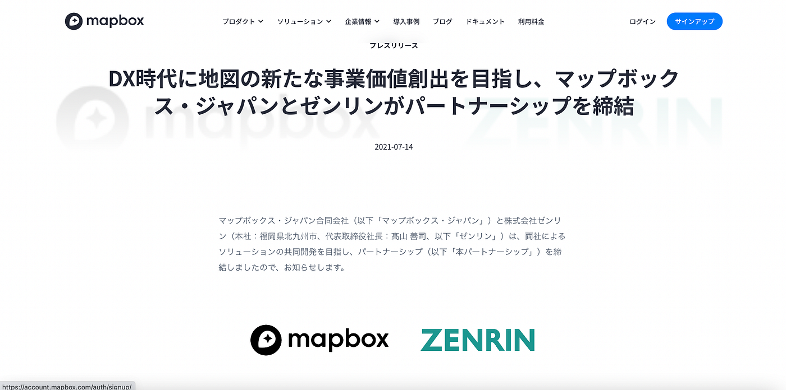
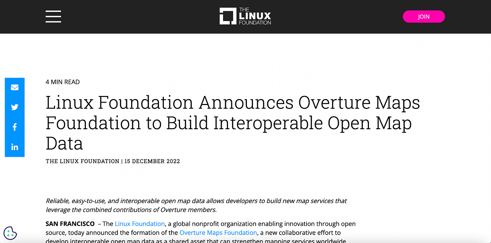

### 12/24 アドベントカレンダー

こんにちは！

4年の菊池です。

今回は、12/15 に発表された**[Overture Maps Foundation**](https://www.linuxfoundation.org/press/linux-foundation-announces-overture-maps-foundation-to-build-interoperable-open-map-data)について解説していきたいと思います。

#### Google Mapsと Open Street Map

古橋ゼミでは当たり前ですが、[Google Maps](https://www.google.co.jp/maps/about/#!/)と[Open Street Map](https://wiki.openstreetmap.org/wiki/Main_Page)をマップデータとして比較すると、両者にはオープン性の観点で決定的な違いがあります。OSMはオープンデータライセンス（[ODbL 1.0 ライセンス](https://opendatacommons.org/licenses/odbl/1-0/)）であり、商用利用を含めかなり自由に使用することができます。一方でGoogle Mapsは使用にあたり多くの制限をかけています。ウェブサイトに搭載する程度であればGoogle Mapsで十分ですが、より発展的にマップデータとしての利用を求めるのであればOSMを使うべきです。

#### Open Street Mapの落とし穴

とはいえ、OSMにも欠点はあります。まずは、データの地域差です。都市部は非常に高精度で更新頻度も高い一方で、地方は数年前から更新されていないこともあります。各国のコミュニティに頼る部分も大きく、活発でない国は商用利用に向かないケースもあります。

例えば、OSMをベースにしている地図開発プラットホームである[Mapbox](https://www.mapbox.jp/)は日本にサービス展開するにあたり、[ゼンリン](https://www.zenrin.co.jp/)と提携することでマップデータの品質を向上させました。

もう一つは、マップデータの品質が保証できない点です。OSMは誰でもマップを編集できますが、一部のユーザーはその権利を悪用し[破壊行為](https://wiki.openstreetmap.org/wiki/JA:%E7%A0%B4%E5%A3%8A%E8%A1%8C%E7%82%BA)を行なっています。実際、[PokémonGO ユーザーがゲーム上で自分に有利な地形をOSMで作るといった問題が起こっています。](https://medium.com/furuhashilab/show-the-niantic-flag-4ab03ed1c3ea)こうした破壊行為がOSM側のチェックを通り抜けてしまうと利用しているサービス全てに影響が出てしまいます。

#### Overture Maps Foundationとは

では、Overture Maps Foundationとは一体何か、何がすごいのか解説していきます。

> The [Linux Foundation](https://www.linuxfoundation.org/), a global nonprofit organization enabling innovation through open source, today announced the formation of the **Overture Maps Foundation**, a new collaborative effort to develop interoperable open map data as a shared asset that can strengthen mapping services worldwide.

> The initiative was founded by Amazon Web Services (AWS), Meta, Microsoft, and TomTom and is open to all communities with a common interest in building open map data.

こちらは[Linux Foundationの記事](https://www.linuxfoundation.org/press/linux-foundation-announces-overture-maps-foundation-to-build-interoperable-open-map-data)から引用していますが、要は「Amazon Web Services (AWS)、Meta、Microsoft、TomTomの4つの企業が、オープンなマップデータを提供するNPOを新たに設立した。」ということです。

注目すべき点は２つあります。1つ目はオープンマップデータを集積するプロジェクトである点です。当団体が作成するデータだけでなく、Open Street Mapをはじめとする世界中のオープンなマップデータを集めてより高精度なデータを作ることで、オープン性を保ちつつ品質向上も達成できるということです。

もう１つは、品質保証プロセスがある点です。OSMと異なり、最終的なデータの改変は誰でもできるわけではないようです。つまり、善良なユーザーはこれまで通りOSMを編集することで間接的に当マップデータに寄与することはできますが、悪意のある破壊は当団体によってブロックされるということです。

#### まとめ

紹介した点以外にも、新しい機能やレイヤーを搭載するようです。いずれにしても、今後当データが世界中で使われ、イノベーションの中心になっていく未来は近いと思います。非常に楽しみです！

最初のデータセットの公開は、2023年前半になる予定です。
