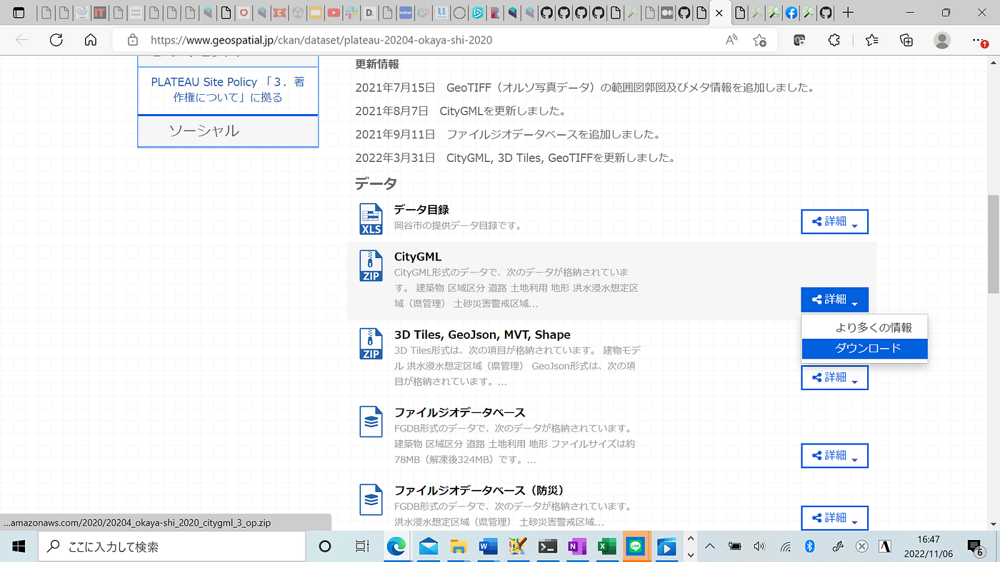
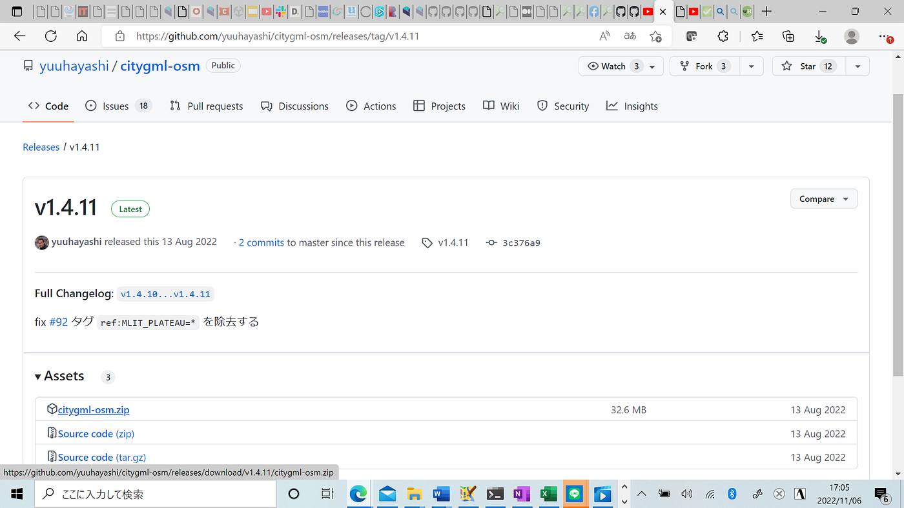
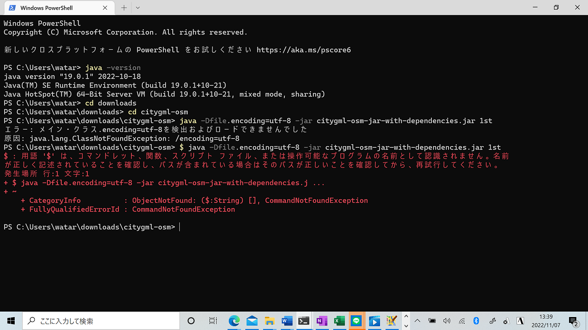
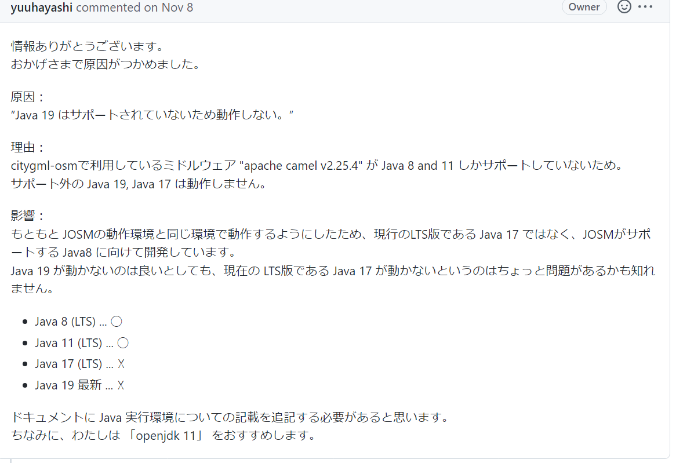

### PLATEAU LOD1建物データをOSMにインポートする際の**留意点**【事前準備編】アドベントカレンダー12/20

こんにちは！3年の吉田航です！

今回はアドベントカレンダー12月20日分として、私が取り組んでいるゼミ論の進捗状況をお伝えします！

私はゼミ論として、国土交通省主導のプロジェクト「[PLATEAU](https://www.mlit.go.jp/plateau/)」内にあるLOD1建物データを、誰でも自由に地図を編集することができるオープンデータの共同作業プロジェクト「[OpenStreetMap](https://www.openstreetmap.org/#map=11/35.7582/139.4323)」にインポートする作業を行っています！

前回の発表は[こちら](https://docs.google.com/presentation/d/1A5Yb1D7qLo6XY12csjGxUPEjJGgAOKIO5YXb4gvhicU/edit?usp=sharing)

今回は「事前準備編」と題し、私が直面した課題とその解決法についてご紹介していきます。

まず、事前準備の作業手順としては

1. 対象地域のCityGMLファイルをPLATEAUの[G空間情報センター](https://www.geospatial.jp/ckan/dataset/plateau)からダウンロードする

2. コンバーター開発者の林さんの[GitHub](https://github.com/yuuhayashi/citygml-osm)から変換スクリプト「citygml-osm」をダウンロードする

3.ターミナル(コマンドプロンプト、Powershell)を起動し、citygml-osmを展開したフォルダに移動して以下のコマンドを入力します。

`$ java -Dfile.encoding=utf-8 -jar citygml-osm-jar-with-dependencies.jar 1st`
`$ java -Dfile.encoding=utf-8 -jar citygml-osm-jar-with-dependencies.jar 2nd`
`$ java -Dfile.encoding=utf-8 -jar citygml-osm-jar-with-dependencies.jar 3rd`

これらのコマンドを入力することで以下の処理がされます。

- 1st: CityGML データを `.osm` 形式に変換し、 `.osm` 形式として保存する

- 2nd: それぞれの `.osm` ファイルのデータ範囲のデータを `osm.org` からダウンロードし、 `.org.osm` 形式として保存する

- 3rd: `.osm` と `.org.osm` を比較・マージすることで `mrg.osm` 形式のファイルを出力し、保存する

といったような作業手順を踏むのですが、この3つ目の作業で問題がおきいてしまいます。

> _**課題_**

1つ目のコマンドである

`$ java -Dfile.encoding=utf-8 -jar citygml-osm-jar-with-dependencies.jar 1st`

が実行されなくなってしまいました。

解決のため、コンバーター開発者の林さんに相談し、林さんの指示に従いながら原因究明に努めました。

すると、1つの原因が浮かび上がりました。

> _**解決_**

上記の通り、citygml-osmで利用されているミドルウェアがJava8、Java11しかサポートしていないため、この作業はJava8、Java11でしか実行されないことが判明しました。

私はこの時最新版のJava19を使用していたためコマンドが実行されなかったのです。(Java8をインストールしたら正常に実行されました！)

#### なので今後この作業をする方は必ず**Java8**か**Java11**をインストールしてから作業するようにしてください！

> _**今後の作業_**

長い間コマンド実行されない問題で作業が進まなかった分、今後は急ピッチでOSMへのインポート作業を進めていきます！

まずは、東村山市から作業を行っていこうと考えています！

理由は、Project PLATEAUに参加している東京都内の都市の中で比較的都市データの整備が未だ進んでいないためです。

その後のインポートする地域の優先順位はhttps://wiki.openstreetmap.org/wiki/JA:MLIT_PLATEAU/imports_list

にあるこちらのリストを参考にしていきます。

今のところ順番は東村山市→新座市→毛呂山町→鎌田市→岡谷市、伊那市、茅野市で考えています！
