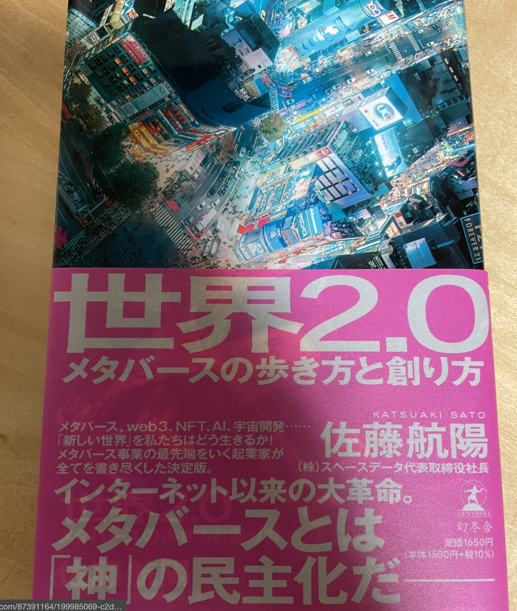
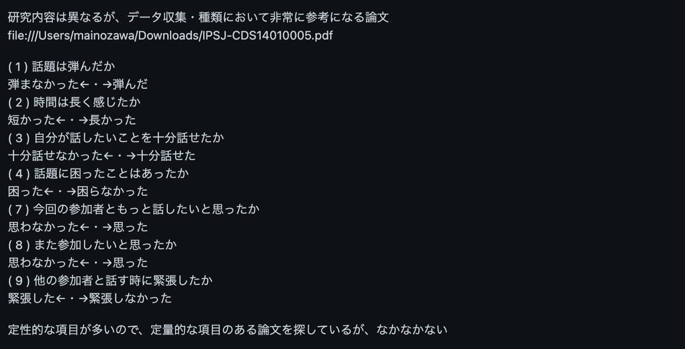

### 仮想空間におけるコミュニケーショ変化について【12/23 アドベントカレンダー】

こんにちは、3年の小澤です🎄

今回のメディウムでは、自分が取り組んでいるゼミ論の進捗状況について記載させていただきます！

現在は、前回の中間発表で先生に指摘された点や、アドバイス貰ったことを中心に行っています。

### 1.本の評論

現在、「世界2.0 メタバースの歩き方と創り方」という書籍の評論をしています。[https://github.com/furuhashilab/2022gsc_TaiyuOzawa/issues/2](https://github.com/furuhashilab/2022gsc_TaiyuOzawa/issues/2)

特に研究において重要だと思った点は、

「世界とは、視認できるビジュアルとしての「視空間」と社会的な機能と役割を持つ「生態系」が融合したものです。そして、人間の目に映る視空間を因数分解すると、さらに「人間（アバター）」と「景色（フィールド）の2つに分けられます。
人間に対して→あの人はちょっと歩き方おかしいな、少し表情が曇っているな、などという、細かい変化まで、敏感に認識して差異を理解できる。
背景に対して→人間に対してと比べて、鈍感。（例 川の流れ方、太陽の光の反射の仕方、虫の動きがちょっとくらいおかしくても、人間はほとんど気づかない）
自分の存在に関わる、もしくは社会生活に関わる情報は鮮明に覚えている。」

という、アバターと背景の重要度の違いと、

「Fortniteでは、デジタルスキンの売上が毎年5000億円
「Roblox」では2割のユーザーが毎日スキンを変えている→現実の習慣がゲームでも起こり始めている
米津玄師がFortniteでバーチャルライブを開催
「ゲームはゴールである」という流れは終わる。」

という、この分野においてはゲームがとても先行しているという点です。

### 2.参考になる論文探し

特にデータ項目の参考になるような論文探しを行っています。
[https://github.com/furuhashilab/2022gsc_TaiyuOzawa/issues/3](https://github.com/furuhashilab/2022gsc_TaiyuOzawa/issues/3)

探した中で最も参考になると思った論文は、以下のものですfile:///Users/mainozawa/Downloads/IPSJ-CDS14010005.pdf

研究内容は完全に異なるのですが、
( 1 ) 話題は弾んだか
弾まなかった←・→弾んだ
( 2 ) 時間は長く感じたか
短かった←・→長かった
( 3 ) 自分が話したいことを十分話せたか
十分話せなかった←・→十分話せた
( 4 ) 話題に困ったことはあったか
困った←・→困らなかった

などといった、被験者の感情をもとにデータを集めることも重要だと気づきました。一方でどれも定性的な項目で、定量的な項目のある論文が全くありません。

もう少し探す論文テーマの幅を広げて、参考になるような論文を見つけられるようにします！
