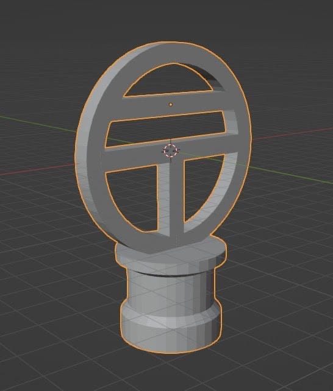
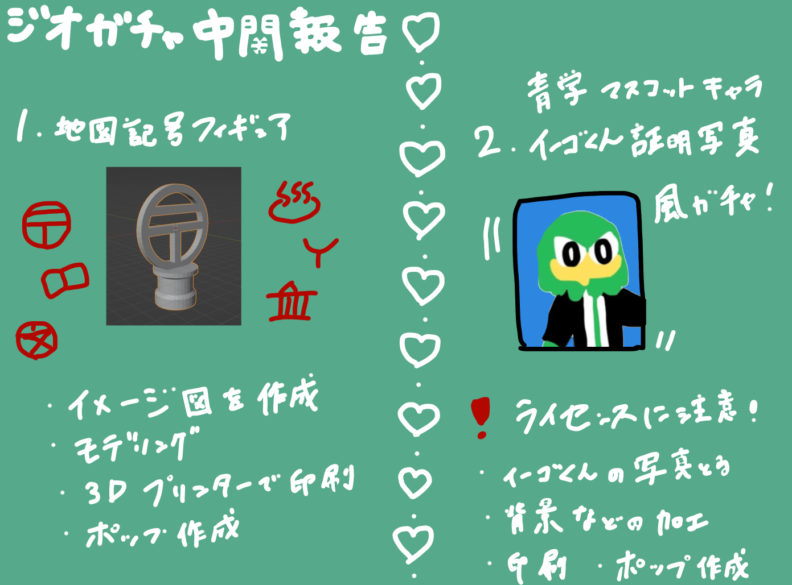

### 12/25 ジオガチャ進捗報告

**こんにちは！**

12/25アドベントカレンダー担当のうららです。

私は卒論でジオガチャ開発を行っています。

### 1.ジオガチャ進捗状況

私は現在２つのガチャガチャを同時に進行しています。

一つめは「地図記号フィギュアガチャガチャ(名称未定)」

地図記号をモデリング後、3Dプリンターで印刷し、色を塗るという作業工程です。ガチャガチャの機械に挿し込むポップ作成も行います。全て終了後は自宅の3Dプリンターをフル稼働、大量生産し今後の古橋ゼミ活動(オープンキャンパスなど)で使用できるよう製品化します。

こちらは地図記号一覧から私が作成したい地図記号を選定済みで、3DCGアニメーション作成アプリBlenderにてモデリング中です。

二つめは「青山学院大学マスコットキャラクター イーゴくん証明写真風ガチャガチャ(名称未定)」です。

こちらは青山学院大学のマスコットキャラクターであるイーゴくんを撮影し、背景投下後に証明写真の背景を追加、その後にシール用紙にプリントし切り取るという作業工程です。ガチャガチャ機械に差し込むポップ作成も行います。

こちらについては現在の箱根駅伝仕様のイーゴくんが撮影できておらず、年末か年始に青山キャンパスに行く予定です。

### 2.地図記号ガチャ

過去のガチャガチャで地図記号アクリルキーホルダーという製品がありましたが、アクリルに印刷という方法のため線と線が離れていても問題ありません。しかし今回はフィギュアのため、線と線が離れている表現が難しいため、なるべく繋がっている表現が可能な記号を選ぶようにしています。Blenderのモデリングは順調に進んでおり、あとは全てモデリングを終わらせ、印刷する作業です。

郵便局地図記号のフィギュア例:

### 3.イーゴくんガチャ

青学のイーゴくんは学校の”公式”マスコットキャラクターのため著作権に厳しいです。まず、イーゴくんのライセンスはどこにあるのか青学の地球社会共生学部の学生課にて確認しました。結果は青山キャンパスの本部でイーゴくんを管理しているとのことだったため、相模原キャンパスと青山キャンパスの学生課の方が連携をとっていただき、卒業論文で使用していいという結果になりました。

使用する上での条件は、

・卒業論文でのガチャガチャ作成のみに使用しプロダクト化と配布はしない(オープンキャンパスで配布などはしない)

・商用利用はしない

でした。

古橋先生からご指摘(ご確認)を頂いたのですが、古橋ゼミのライセンスはCC by 4.0を適用しているため、このようなライセンスのものを卒論にすることは否定はしないが評価もされない(おまけ扱いになるよ)とのことでした。

私はガチャガチャをこれのみにしていないため、幸い大丈夫ですが、もし今後卒論やゼミ論などでライセンスの狭いものを使用する際には注意が必要です。後輩や未来のゼミ生はお気をつけください。

### 4.謝辞

学生課の皆様、ご協力下さり、ありがとうございました。

### 5.Githubリポジトリ

[https://github.com/furuhashilab/2022gsc_UraraNagashima](https://github.com/furuhashilab/2022gsc_UraraNagashima)

### 6.グラレコ

