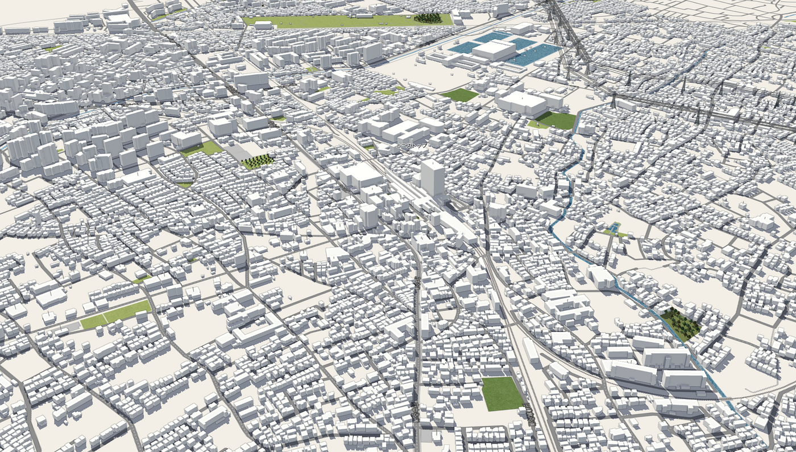
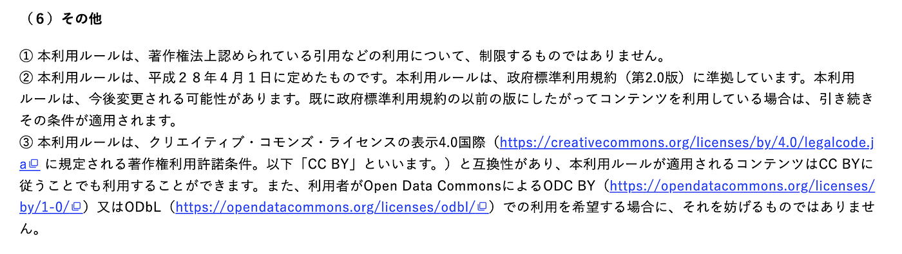
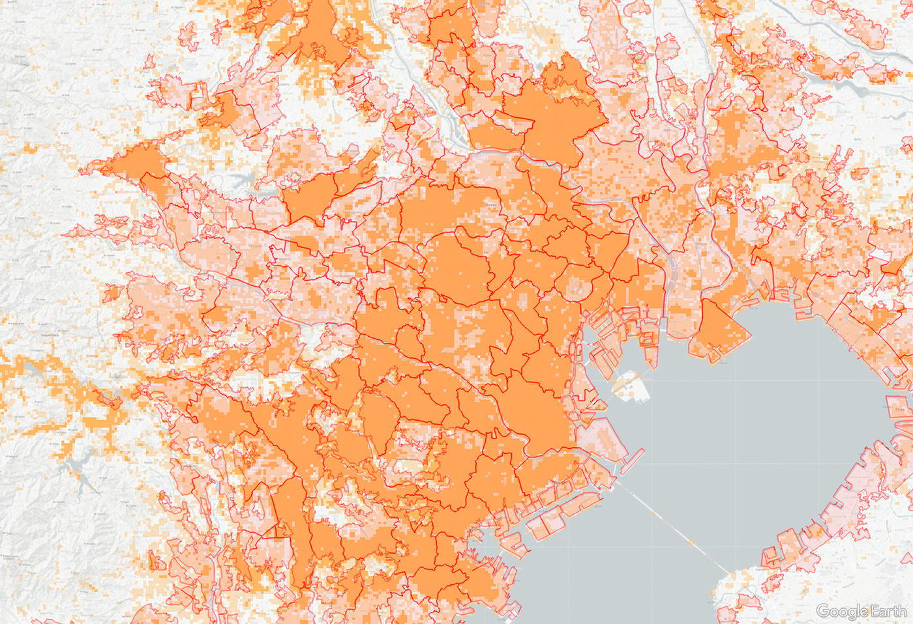
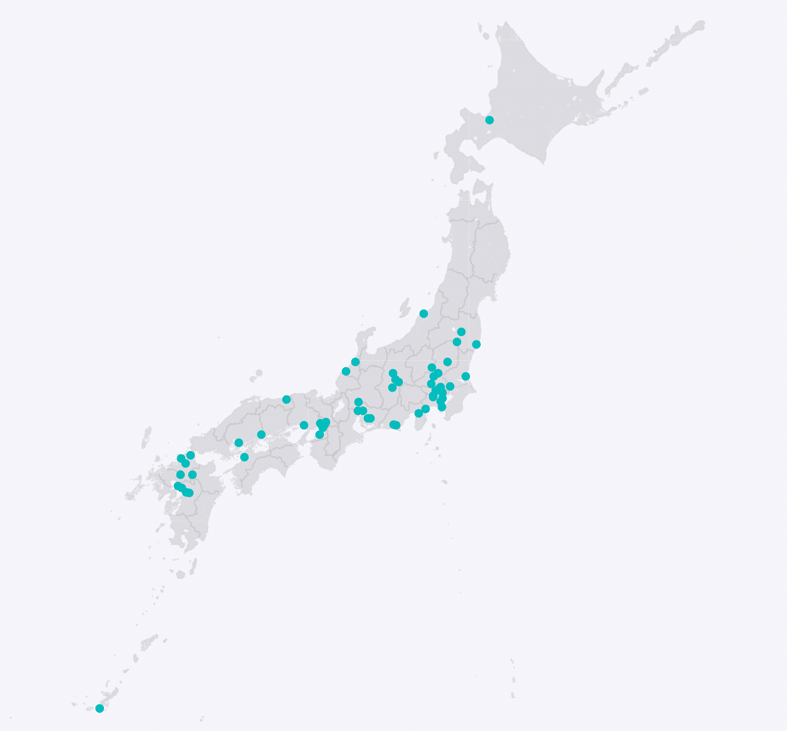
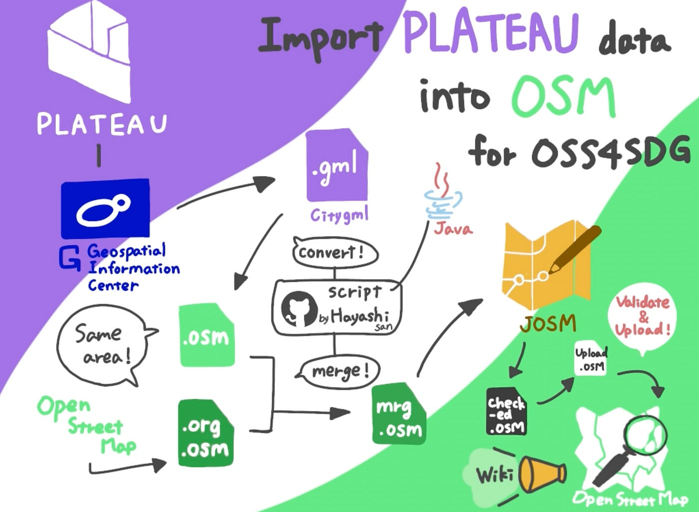
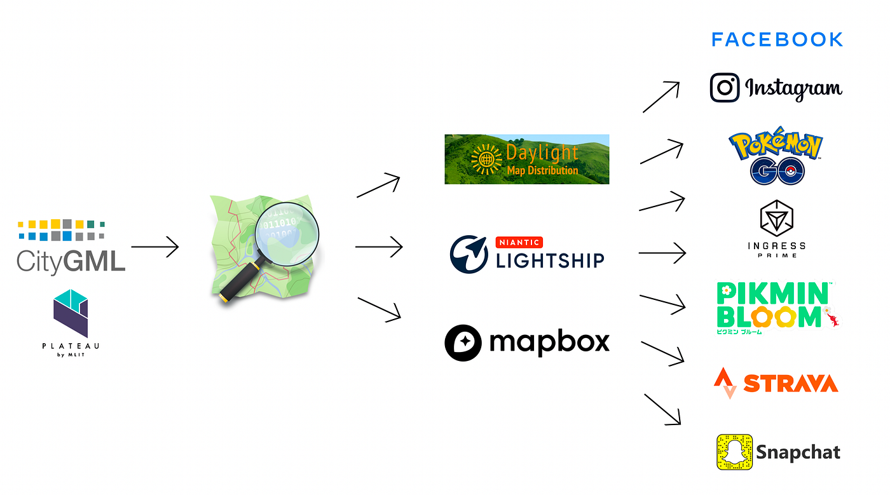
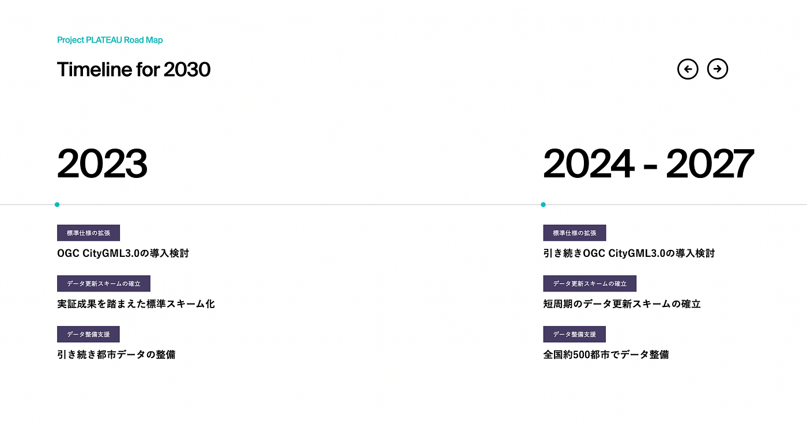

### 3D都市モデルPLATEAUをスケールする方法

世の中はギブアンドテイクがうまくいく。

デジタルツインというキーワードと共に国土交通省都市局が進めている**[3D都市モデルProject PLATEAU**](https://www.mlit.go.jp/plateau/)利活用検討の場「**[3D都市モデルの整備・活用促進に関する検討分科会**](https://www.mlit.go.jp/scpf/archives/index.html#archives02)」の[座長](https://www.mlit.go.jp/scpf/archives/docs/bunkakai_tyukan09.pdf)としてこの２年間、どうやって[PLATEAU](https://www.mlit.go.jp/plateau/)を社会に定着させていくか、関係する多様な方々と議論と検討を重ねてきました。

ここでは、その途中経過として[PLATEAU](https://www.mlit.go.jp/plateau/)がより社会に広がっていくための個人的な道筋案を記してみます。

### **# オープンデータの醍醐味は再配布によるスケールである**

**PLATEAUデータはオープンデータ**です（図2）。商用利用も含めて自由に二次利用できるだけでなく、再配布することもできます。[G空間情報センターから直接ダウンロード](https://www.geospatial.jp/ckan/dataset/plateau)するだけでは利便性が高くないですので、徐々に多様なPLATEAUデータの提供ルートを拡充していくことが重要なアプローチです。2022年12月には**PLATEAU SDK**として **[Unity**](https://github.com/Synesthesias/PLATEAU-SDK-for-Unity) と **[Unreal**](https://github.com/Synesthesias/PLATEAU-SDK-for-Unreal) それぞれに最適化された**[SDKが発表**](https://twitter.com/ProjectPlateau/status/1605850633331957760)されましたが、これは主にゲームクラスターやCGクラスターへのPLATEAUデータの普及にとって大きな一歩となるでしょう。（Unity版のほうがGitHubリポジトリのStar数が多いのが意外。ほぼ同数になるかと思ってました）

[GitHub - Synesthesias/PLATEAU-SDK-for-Unity: PLATEAUのUnity向けSDK本体です。
You can't perform that action at this time. You signed in with another tab or window. You signed out in another tab or…github.com](https://github.com/Synesthesias/PLATEAU-SDK-for-Unity)

[GitHub - Synesthesias/PLATEAU-SDK-for-Unreal: PLATEAU SDK for Unreal
You can't perform that action at this time. You signed in with another tab or window. You signed out in another tab or…github.com](https://github.com/Synesthesias/PLATEAU-SDK-for-Unreal)

2023年はPLATEAUとコラボした様々なゲームがローンチラッシュかもしれません。それもこれも、PLATEAUが商用利用可能なオープンデータだからとも言えます。非営利のみに限定されていたらモチベーションそこまで上がらないですよね。

そして、さらにオープンデータの良さを活用してPLATEAUデータを普及させるには、もっと多様なクラスタに刺さるアプローチも重要です。

そのひとつとして提案したいのが [OpenStreetMap](https://www.openstreetmap.org/) を媒体としたPLATEAUデータの流通です。

### **# OpenStreetMap と PLATEAU は相性が良い**

図3は、東京中心部の[OpenStreetMap](https://www.openstreetmap.org/)建物密度と人口集中地区（DID）を重ねた2022年12月現在の状況です。

様々な意見があるかと思いますが、誰でも自由に使えるデジタル地図データ [OpenStreetMap](https://www.openstreetmap.org/) は2004年から延べ1,000万ユーザに及ぶ地図入力ボランティアの力によって様々な地物の情報をクラウドソーシング手法で構築してきました。非常に充実したエリアもあれば、まだまだ整備が必要な地域も沢山あります。とくにその整備状況の指標として建物データの充実度はOSMデータの品質を比較する上で有効です。

そのような視点で図3の**OSM建物密度の高い（＝濃いオレンジ色）**を見ると、**赤い枠で囲まれた人口集中地区（DID）エリア**と整合性が高いエリアもあるものの、東京23区や川崎・横浜市の中心部以外の**いわゆる首都圏郊外**は、OSM建物データがまだまだ未整備である地域が目に付きます。

一方で、PLATEAUは2021年3月のデータ公開から最初の1年で[全国56都市](https://www.mlit.go.jp/plateau/open-data/)、2022年度中には全国100都市を超える地域の三次元建物を含めたデータセットが順次公開される形で、OSM建物未整備エリアのいくつかはPLATEAUデータが先行している地域もあります。

つまり、お互いがまだまだ網羅性を獲得できていないOSMとPLATEAUは相互補完することで、三次元建物データを面的に展開することができる、非常に相性が良いデータセットであると言えます。

### # CityGML → OSM 変換ツールは既存のOSMデータとの整合性までチェックしてくれる

すでに早い段階からPLATEAUのCityGMLデータ建物LOD1をOSM-XMLデータに変換するコンバーター **[citygml-osm**](https://github.com/yuuhayashi/citygml-osm) を OSM Foundation Japan の[yuuhayashi](https://github.com/yuuhayashi)氏が作成してくれています。**このコンバーターのすごいところは、単なるCityGML→OSM-XMLへの変換のみならず、既存のOSM建物データと比較して、OSMに未入力の建物だけを自動抽出してくれるところ**です。もちろんある程度人間が取捨選択をしていく作業が発生するわけですが、実際に動作テストしてみると、想像以上に丁寧に今までOSMに入力してきてくれた多くの貢献者の方々の想いを裏切らないように、JOSMの妥当性検証機能をフル活用してOSMとPLATEAUの豊かなセマンティックデータを融合できるように工夫されています。

[GitHub - yuuhayashi/citygml-osm: CityGMLデータをOSMデータに変換する
You can't perform that action at this time. You signed in with another tab or window. You signed out in another tab or…github.com](https://github.com/yuuhayashi/citygml-osm)

コンバート作業の工程は、青学・古橋研究室の学生たちがグラレコにまとめてくれました。作業手順書はOSM Foundation Japanの [nyampire](https://qiita.com/nyampire)氏が作成した[ドラフト](https://qiita.com/nyampire/items/1c10afdd36750c87154d)をベースに学生たちが動作確認を反映させて**[日本語](https://wiki.openstreetmap.org/wiki/JA:MLIT_PLATEAU/imports_manual)と[英語の手順書**](https://wiki.openstreetmap.org/wiki/MLIT_PLATEAU)へと完成版を流し込み作業中です。（正月休み中には完成するか？？？）

その他、PLATEAUデータのOSMインポートに関わる様々な情報は[このOSM Wikiページ](https://wiki.openstreetmap.org/wiki/JA:MLIT_PLATEAU)に集約されています。2023年にはインポート作業を行う有志が集まって、実験段階からいよいよ本格インポートの段階に移行すると予測されます。

[JA:MLIT PLATEAU/imports outline
MLIT Plateau building footprint import is an import of building footprint data set which distributed by Plateau…wiki.openstreetmap.org](https://wiki.openstreetmap.org/wiki/JA:MLIT_PLATEAU/imports_outline)

### # OSMにインポートすることのメリットは？

PLATEAUデータのOSMへのインポートは手段であって目的ではありません。もちろんOSMで十分にマッピングできていなかったエリアのデータ粒度を拡充することは一つの目的ですが、本当の目的はOSMを二次利用している様々なウェブ地図プラットフォームにPLATEAUデータを流し込むことによって、データの流通をスケールさせることです。

例えば[Meta](https://about.meta.com/ja/)が展開している[Daylight Map Destribution](https://daylightmap.org/)はOSMデータを元にMeta独自の品質チェックが行われた上でより使いやすいオープンデータとして再配布されています。もちろんMetaはFacebookやInstagramなどのSNSで地図サービスを展開しているため、この[Daylight Map Destribution](https://daylightmap.org/)データが[自社のサービスでも使われています](https://www.facebook.com/maps/attribution_terms)。

同様に[Niantic](https://nianticlabs.com/?hl=ja)であれば[Lightship](https://lightship.dev/)プラットフォームからOSMデータが再配布され、PokémonGOやINGRESS、Pikmin bloomなどの位置情報ゲームで活用されるように、OSMデータを商用利用している各ウェブ地図プラットフォームにPLATEAUデータが流れ込むことで、PLATEAUデータの流通量が指数関数的にスケールしていくことが期待されます。

このように、OSMは社会に定着させたいオープンな地図データの流通を加速しスケールする起爆剤として利活用する未来が見えてくるのです。合わせて、OSMにすでに実装されている[Data editing API](https://wiki.openstreetmap.org/wiki/API)や[Overpass API](https://wiki.openstreetmap.org/wiki/Overpass_API)などの各種APIsは、すでに多くのOSM/FOSS4Gエンジニアが使い慣れていることから、新たな技術習得の必要なく展開することも可能です。

### # まずは全国500都市を整備、話はそれからだ

[PLATEAU のロードマップ](https://www.mlit.go.jp/plateau/about/index.html#roadmap)では 2027年までに全国500都市でのデータ整備を目標としています。まずは一歩一歩データの利活用を広げつつ、オープンデータとしてのスケールの可能性を信じて、地道にその種を大地に蒔くのが2022年から2023年にかけて我々がやるべき仕事ではないでしょうか。

さあ、OSMとPLATEAUで、世の中を変えてみませんか？

**この試みは新しい世界を創る。
Map the New World !!**

_このブログは2022年の[Project PLATEAUアドベントカレンダー](https://qiita.com/advent-calendar/2022/plateau)、[古橋研究室アドベントカレンダー](https://qiita.com/advent-calendar/2022/furuhashilab)、[青山学院大学地球社会共生学部アドベントカレンダー](https://adventar.org/calendars/7896)、[OpenStreetMapアドベントカレンダー](https://qiita.com/advent-calendar/2022/osmjp)として執筆しました。予定より大幅に遅れての投稿です…orz_
