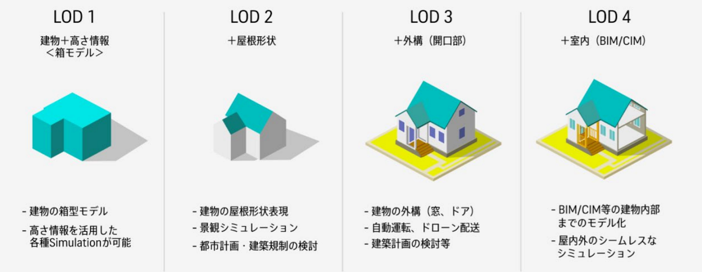
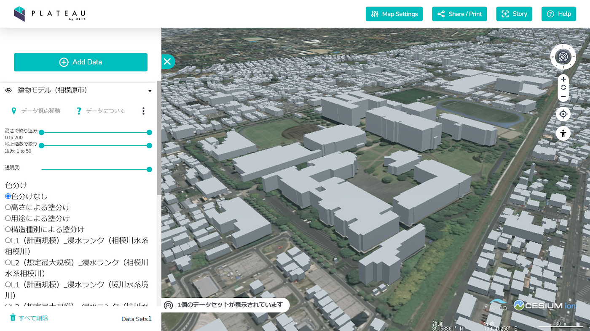
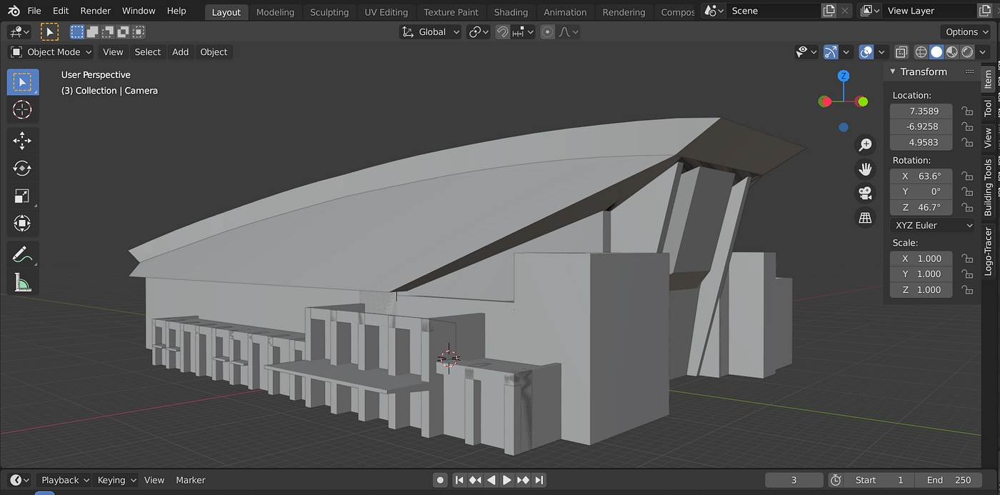
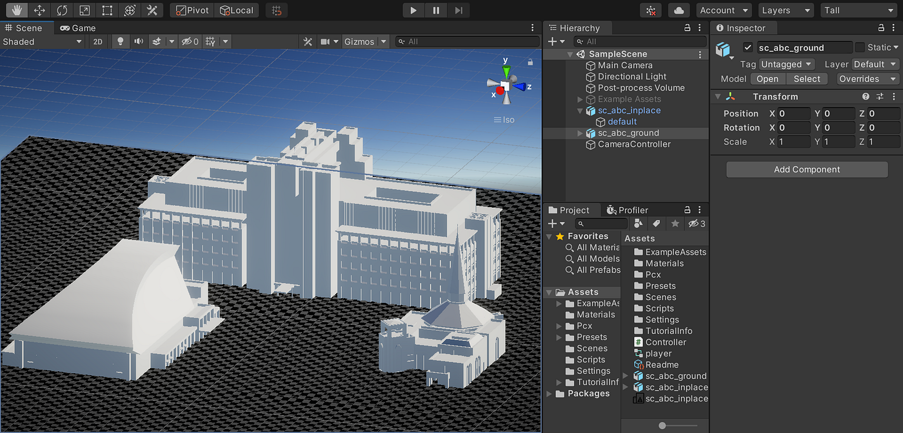

### 3Dさがきゃん御三家公開

相模原キャンパスの3D都市モデル制作とオープンデータとしての利用

こんにちは。[柴山](https://github.com/ibuki76)です。
12/21のアドベントカレンダー記事をお送りします。

> _**Introduction_**

私は昨年度より、**[ゼミ論研究・卒論研究として相模原キャンパスの3D都市モデル制作とオープンデータ化**](https://github.com/furuhashilab/2021gsc_IbukiShibayama)を行っています。

[GitHub - furuhashilab/2022gsc_IbukiShibayama: 2022年度古橋卒論用レポジトリ
2022年度古橋卒論用レポジトリ. Contribute to furuhashilab/2022gsc_IbukiShibayama development by creating an account on GitHub.github.com](https://github.com/furuhashilab/2022gsc_IbukiShibayama)

国土交通省による3D都市モデルのプロジェクトである **[PLATEAU**](https://www.mlit.go.jp/plateau/) において、高精度な3D建物モデルの整備が進む都心エリアとその他の地域の整備状況の格差に注目し、市民参加型で進められるような整備方法を試験的に実践してきました。

PLATEAUの整備フローをもとに、青山学院大学相模原キャンパスの**[点群データ](https://club.informatix.co.jp/?p=1125#:~:text=%E7%9B%AE%E6%AC%A1-,%E7%82%B9%E7%BE%A4%E3%81%A8%E3%81%AF,-%E7%82%B9%E7%BE%A4%EF%BC%88%E3%81%A6%E3%82%93%E3%81%90)・[CloudCompare](https://www.danielgm.net/cc/)・[Blender](https://www.blender.org/) **を用いた3D建物モデルのモデリング作業を行い、STL、OBJ などの形式で **[GitHub**](https://github.com/furuhashilab/2022gsc_IbukiShibayama/tree/main/tmp) や **[Sketchfab**](https://sketchfab.com/ibukilego) などでオープンデータとして公開してきました。

Sketchfabで公開しているC棟ウェスレーチャペルの3Dモデル (CC BY 4.0)

> _**進捗_**

2022年11月までの段階で、C棟ウェスレーチャペル、B棟のLOD2~3相当のモデルが完成していました。

[卒論2022中間発表 by 柴山
2022年度卒論の中間発表です。medium.com](https://medium.com/furuhashilab/%E5%8D%92%E8%AB%962022%E4%B8%AD%E9%96%93%E7%99%BA%E8%A1%A8-by-%E6%9F%B4%E5%B1%B1-8c92c4b1a29b)

そして12月、新たにA棟アリーナのLOD2~3相当モデルが完成しました！

Sketchfabで公開しているA棟アリーナの3Dモデル (CC BY 4.0)

GitHubでは**[A棟単体**](https://github.com/furuhashilab/2022gsc_IbukiShibayama/blob/77de7741a058acb7dc70406806690ac8bc918f34/tmp/sc_a.stl)、実際の位置関係を再現した**[A棟・B棟・C棟セット**](https://github.com/furuhashilab/2022gsc_IbukiShibayama/blob/77de7741a058acb7dc70406806690ac8bc918f34/tmp/sc_abc_inplace.stl)のSTLファイルを公開しています。

[2022gsc_IbukiShibayama/sc_a.stl at main · furuhashilab/2022gsc_IbukiShibayama
You can't perform that action at this time. You signed in with another tab or window. You signed out in another tab or…github.com](https://github.com/furuhashilab/2022gsc_IbukiShibayama/blob/main/tmp/sc_a.stl)

これらの棟はさがきゃんの中でも特徴的で美しく、ランドマーク的な存在だと個人的に感じていたので、タイトルにて御三家と呼ばせていただきました笑

そして現在、ゲームエンジン **[Unity**](https://unity.com/ja) を使った **”VRさがきゃん(仮)”** の制作をモデリングと同時並行で行っています！

アドベントカレンダーまでにデモ映像を作りたかったのですが、間に合いませんでした。。

> _**課題と方針_**

いちばんの課題はモデリングの進捗遅れ・効率の悪さです。毎日は作業していなかったとはいえ、1年間でキャンパスの17の建物のうち3つのみが完成しました。

作業が長期化したいちばんの要因は、Blender でのモデリング時に、いかに立体を形成すべきか判断に迷うことが多々あった点です。

完成させた3つの建物は他に比べて構造が複雑だったため、あえて優先して作業してきました。他の棟の構造は少し単純になるので、点群のメッシュ化ツールや等高線生成ツールを利用してモデリングのサポートにならないか試していきたいです。

最低でも御三家以外の建物のLOD2のモデルは最終発表までに完成させる予定です。

> _**グラレコ_**

制作中。。。
