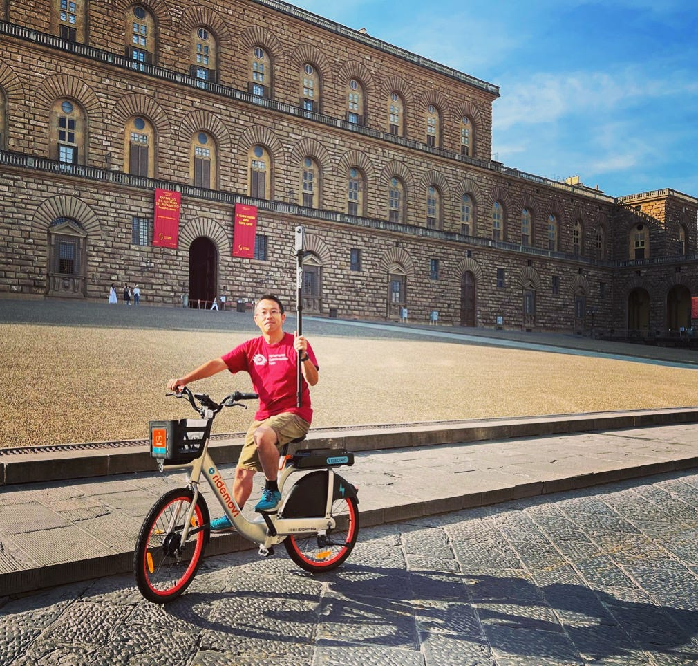
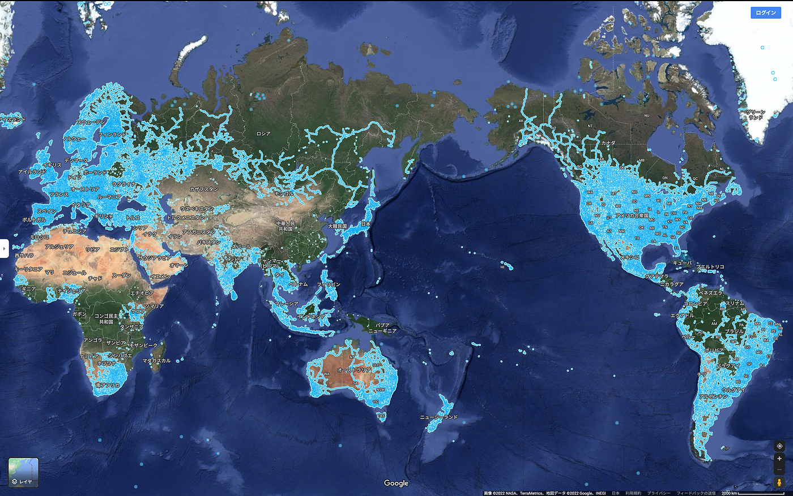
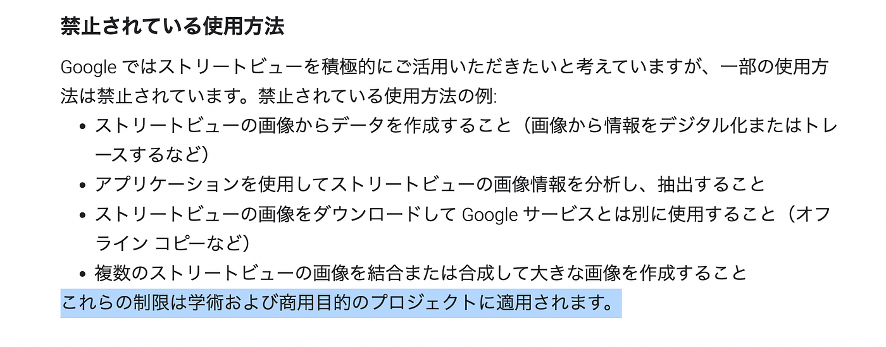
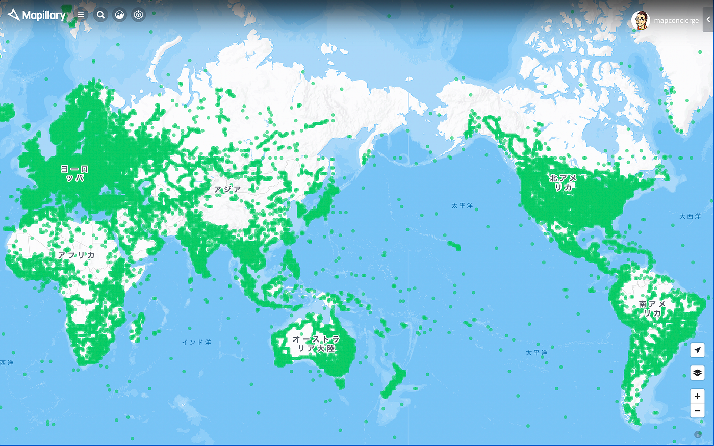
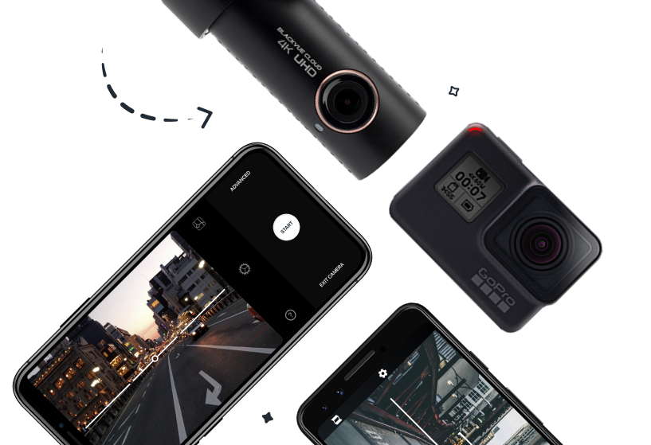
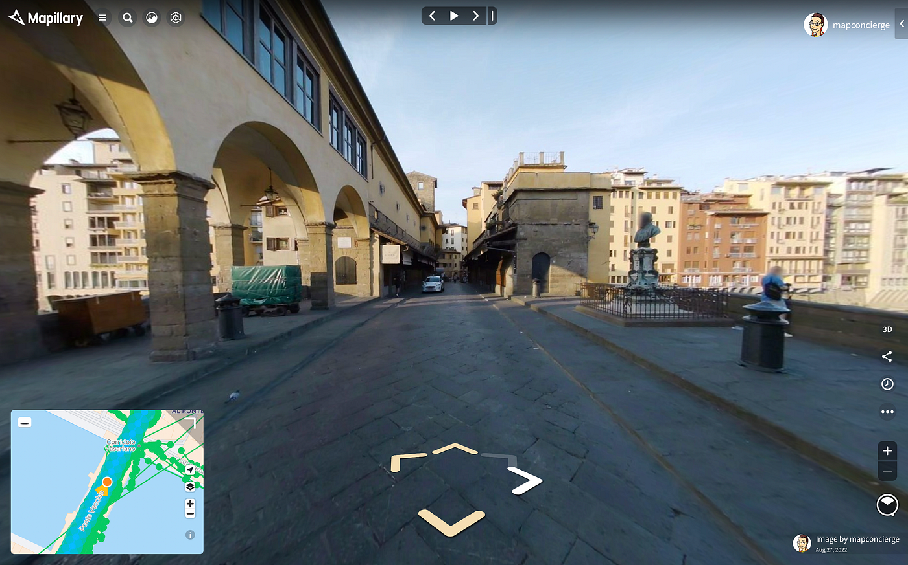
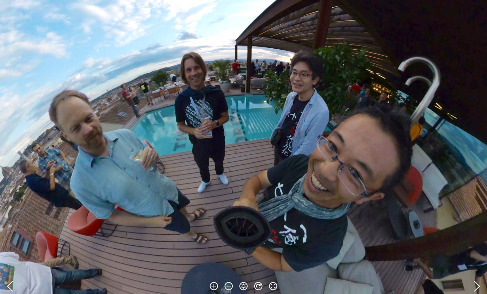
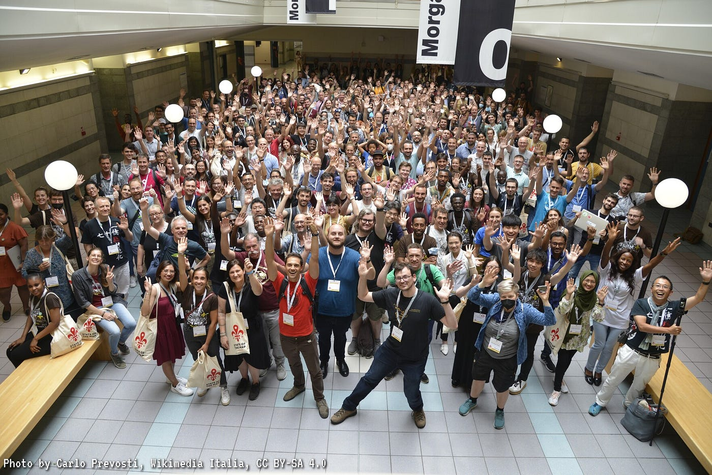

### THETA Xの2/10FPSモードを極めし者がMapillaryを制する。

2023年、360ストリートビューを手軽に撮るカメラは **[RICOH THETA X](https://theta360.com/ja/about/theta/x.html) が断然オススメだ！**

### # 意外と自由に使えないGoogle Street View

ストリートビューといえばGoogle。

2007年にこの世に登場した[Google Street View](https://www.google.com/streetview/)は、世界中の人間目線での都市の様子を詳細に記録し共有することで、我々は自宅にいながらに世界中の人々の暮らしや風光明媚な景観を疑似体験することができるようになる世の中をつくりました。

最初の数年間は[プライバシーに関わる問題](https://ja.wikipedia.org/wiki/Google_%E3%82%B9%E3%83%88%E3%83%AA%E3%83%BC%E3%83%88%E3%83%93%E3%83%A5%E3%83%BC#%E3%83%97%E3%83%A9%E3%82%A4%E3%83%90%E3%82%B7%E3%83%BC%E5%95%8F%E9%A1%8C)など様々な課題はありましたが、それぞれの国に合わせた最適化を地道に行ってきた成果として、すでに現代社会の情報インフラのひとつとなったといって良いでしょう。最近では[GeoGuessr](https://www.geoguessr.com/)のような[OSINT](https://ja.wikipedia.org/wiki/%E3%82%AA%E3%83%BC%E3%83%97%E3%83%B3%E3%83%BB%E3%82%BD%E3%83%BC%E3%82%B9%E3%83%BB%E3%82%A4%E3%83%B3%E3%83%86%E3%83%AA%E3%82%B8%E3%82%A7%E3%83%B3%E3%82%B9)/GEOINT訓練ツールともいうべき人類の空間認知能力向上にも貢献しています。

そんな[Google Street View](https://www.google.com/streetview/)ですが、Googleが独自に収集しているデータなので自由に使えるのかというとなかなか[利用条件](https://www.google.com/intl/ja_ALL/permissions/geoguidelines/)は厳しいものがあります。特に撮影された画像の二次利用などは**[商用利用だけではなく、学術目的でも禁止**](https://www.google.com/intl/ja_ALL/permissions/geoguidelines/)されています。要はGoogle Maps API 経由で閲覧前提の利用のみがGoogle Street View の限界です。

### # ストリートビューの民主化が必要

では、Google Street View のような**いわゆるストリートビューデータ**（ **[“Street View” はGoogleの商標**](https://trademarks.justia.com/856/42/street-85642898.html)なので正確には **Street Level Imagery** と呼ぶのが一般的）を誰でも自由に使えるオープンデータとして公開することはできるのか？

そんなことを実現したのが[Meta](https://about.meta.com/ja/)が展開する**[Mapillary**](https://www.mapillary.com/)と[Grab](https://www.grab.com/)が展開する**[KartaView**](https://kartaview.org/)の２大プラットフォームです。ここでは特に360°カメラに対応している[Mapillary](https://www.mapillary.com/)に注目して話をすすめましょう。

Google Street Viewと大きく違うのは、クラウドソーシングメインのデータ収集方法と、収集したデータがオープンデータである[CC BY-SA 4.0](https://help.mapillary.com/hc/en-us/articles/115001770409-Licenses)と[OpenStreetMapのデータ整備に利用可能（ODbL）](https://www.mapillary.com/terms?locale=ja_JP)のデュアルライセンスであるということ。そして、Google Street View では未整備の国、例えばドイツやパキスタン、アフリカの国々などでもMapillaryデータは整備が進んでいる網羅性、最後にデータ収集者が自分の好きなタイミングで撮影できることから時系列分析が容易である点もGoogle Street Viewとは異なるメリットと言えるでしょう。

このように市民が自らストリートビューのデータを収集・公開し、世界中にオープンデータとして普及させる**ストリートビューの民主化**がまさに今進められています。

### # Mapillaryの撮影はスマホ or 360°カメラ

実際に自分でストリートビューデータを撮影しMapillaryへ投稿したいと思ったならば、一番手軽なのは**[スマホ用Mapillaryアプリ**](https://www.mapillary.com/mobile-apps?locale=ja_JP)を使う方法でしょう。アプリをインストール後、サインアップして写真を撮影すれば、すぐにアプリからアップロードができます。数時間後には顔やナンバープレートのぼかし処理が行われて公開されます。但し、最近のスマホはかなり広角寄りの撮影が可能になったとはいえ、360°撮影を行うことはできません。

そこで、次の選択肢として出てくるのがGPS内蔵タイプの360°カメラです。

360°カメラといえば、[RICOHのTHETAシリーズ](https://theta360.com/ja/)や[Insta360シリーズ](https://www.insta360.com/jp/)などが有名ですが、実は**GPS内臓の360°カメラ**というと選択肢はそう多くはありません。特に一般コンシューマ向けの10万円前後で購入できるものは、現実的には[GoPro MAX](https://gopro.com/ja/jp/shop/cameras/max/CHDHZ-202-master.html)の一択だった時代があります。

ただ、実際に使ってみると、GoPro MAXも必ずしも完璧なデバイスではありません。例えば、**1)GPS測位状況は本体内蔵モニターからはわかりにくいし（毎度画面を縦方向に２回スワイプしないと確認できない）**、**2)USB給電/充電時にはバッテリーカバーを開けなければならない**し、そうすると防水・耐塵性がなくなるだけでなく、ケーブル接続部が物理的に無防備となるのでフィールドワーク時に破損するリスクも高くなります（USB-Cの直角ケーブルもコネクタの向きが縦方向ではないため使いにくい…）。また、**3)タイムラプスモードでの360°撮影では解像度は静止画としても5.6K解像度**であり、４台以上の複数カメラによるスティッチングで得られるようなギガピクセルパノラマの高解像度360°画像と比べるとその解像度はいま一歩物足りない感もあります。最後に**4)タイムラプスモードの撮影インターバルは最短で2秒のため、歩いて撮影するには良いのですが、自転車以上の時速20km/hを超えるようなモビリティで撮影すると、撮影間隔が離れすぎて連続したフレームを用いたフォトグラメトリの処理が不完全**になります。

GoPro MAXはそういう意味で、コストパフォーマンスは良いのですが、必ずしもMapillary撮影用デバイスとしては個人的には70点という評価でした。

### # 2022年に満を持して登場したGPS付き360°カメラ THETA X

360°カメラの老舗としても存在感のある RICOH THETAシリーズも、Mapillaryスマホアプリで外部カメラとしてWi-Fi接続したり、THETA用のスマホアプリからスマホ本体のGPS情報をメタデータとして取り込む手法を用いることで、位置情報のついたMapillaryデータを撮影することは不可能ではありませんでしたが、いかんせんTHETA本体にGPSがついていないことから、カメラ単独でMapillary撮影に挑むことはできず、事前準備と撮影手順、撮影後のデータ転送プロセスの手間が多いデメリットが上回ってしまい、普段遣いのデバイスとは言えませんでした。

この点でGPSが内蔵されたGoPro MAXのように単独カメラを持ち歩くだけでの撮影手法が使えず、Mapillary活動（いわゆるマピる）にオススメの360°カメラといえばGoPro MAXと答えるのが2021年までの常識でした。

そして2022年、古橋個人的にも何度もRICOHチームにアピールし、おそらく多くのユーザーからもリクエストの強かったであろうGPS内蔵型THETAシリーズ「**[THETA X**](https://theta360.com/ja/about/theta/x.html)」が世に出たのです！！

**これが想像を超えて文句なしの出来栄え！
個人的には95点とほぼ満点の完成度だと自信を持ってオススメできます！**

詳しくは**[RICOH THETA Lab.のインタビュー記事**](https://www.thetalab.ricoh/article/12740/)を読んでいただきつつも、おすすめポイントを10点列挙してみます。

[RICOH THETA X 内蔵GPS機能のポテンシャル～青山学院大学 古橋教授インタビュー | RICOH THETA Lab.
RICOH THETA Xは、RICOH THETAシリーズとして初めて、 本体内蔵のGPS機能が搭載されたモデルです。 これまでのTHETAでは、スマートフォンのTHETAアプリを経由して取得していた位置情報を、THETA…www.thetalab.ricoh](https://www.thetalab.ricoh/article/12740/)

- QZSS対応のGPS/GNSS内蔵＆A-GPSでいつでも即座にウォームスタート！

- GPS/GNSS測位状況はホーム画面でいつでも確認可能。

- スティッチ済み画像/動画は[Equirectangular投影](https://en.wikipedia.org/wiki/Equirectangular_projection)がデフォルト！

- 念願のMicroSDカード記録でPCへのコピーもラクラク！

- 取り外し可能バッテリーで連続使用ストレス解消。

- 蓋を開けずにUSB-C給電/充電可能。排熱性能が高くて給電しながらの撮影もかなり安定！（夏期の猛暑時以外で高熱シャットダウン発生せず）

- GPS/GNSSを用いた正確な**[時刻設定プラグイン Time Adjuster via GNSS**](https://pluginstore.theta360.com/plugins/skunkworks.gnsstimeadjuster/)がサイコー！

- Bluetoothイヤホンで、シャッター音を遠隔確認可能！

- 静止画解像度が11K、動画解像度が8Kと高画質。しかも動画撮影に 8K 2/10FPSモードあり。

- 位置情報のメタデータは静止画[Exif形式](https://ja.wikipedia.org/wiki/Exchangeable_image_file_format)、動画[CAMM形式](https://developers.google.com/streetview/publish/camm-spec)と汎用性高い！

今までTHETAを使ったことある方ならば、これらの特徴がすべて実装されたTHETA Xの完成度に驚くのではないかなと思います。逆に欠点を挙げるのであれば、GoPro MAXと比較すると値段が12万円を超える高価格帯であることと、静止画11Kインターバル撮影の最短時間が6秒ということくらいです（静止画がRAWモードで撮影できないとかありますが、ストリートビュー撮影ではあまり重要ではありませんので割愛）。前者はこれだけの機能を持っていれば納得の値段ですし、特に後者は動画8K撮影の2/10FPSモードである程度解決しますので、まあ一言でいえば「**文句なし！！！**」とも言えます。

### **# Google Street View が普及させたCAMMメタデータ形式を採用**

Mapillary撮影時のTHETA Xオススメ設定は、なんといっても**動画8K撮影の2/10FPSモード**です（[2022年7月20日公開のファームウェア v1.20.0以降に更新が必要](https://support.theta360.com/ja/download/firmware/x/)）。自転車ならば2FPSモード、バイクや車であれば10FPSモードにすると、高速移動時でも効率よく360°ストリートビューデータを収集してくれます。もちろん5.7Kに解像度を落とせば30FPSでも撮影できますが、Mapillaryデータとしてはフレーム数が多すぎてデータ容量の効率が落ちてしまいます。それよりは最高画質8Kの2/10FPSが断然良いです。

そして、動画撮影時の位置情報メタデータはGoogle Street View が普及させた**[CAMMメタデータ形式**](https://developers.google.com/streetview/publish/camm-spec)が採用されているので、Mapillaryのデータアップロードツール**[mapillary_tools**](https://github.com/mapillary/mapillary_tools)でCAMMメタデータを読み込むことができます。

[Camera Motion Metadata Spec | Street View Publish API | Google Developers
This standard is supported in the Street View Publish API. This page describes a specification that allows MP4 files to…developers.google.com](https://developers.google.com/streetview/publish/camm-spec)

とはいえ、実は[mapillary_tools](https://github.com/mapillary/mapillary_tools)のCAMMメタデータ読み込み機能にはいくつかのバグがあったので、**[2022年10月4日にリリースしたv.0.9.3以降のmapillary_tools**](https://github.com/mapillary/mapillary_tools/releases)でないと正しく扱えませんのでご注意ください。[筆者がイタリア・フィレンツェでバグだし貢献](https://github.com/mapillary/mapillary_tools/issues/536)しました！

[RICOH THETA X 1.20.0 8K/2FPS video mode can't upload to mapillary · Issue #536 ·…
Basic information Release version: 0.9.1 System: macOS 12.0.1 Capture Device: Ricoh THETA X 1.20.0 Steps to reproduce…github.com](https://github.com/mapillary/mapillary_tools/issues/536)

### # mapillary_tools を使ってTHETA Xの360°パノラマ動画を公開してみる

mapillary_toolsもいくつかの方法でmp4動画ファイルからMapillaryにアップロードできますが、2022年12月現在での確実な処理手順は_**mapillary_tools video_process_** コマンドで動画からフレームごとのjpg画像変換を行い、その後で _**mapillary_tools upload_** コマンドを用いたアップロードと二段階に分けたほうがよいです。

特に動画フレームをjpg画像変換した結果、jpgファイルにはExifメタデータとして撮影場所の緯度経度情報が書き込まれるのかと思っていましたが、そうではなく、緯度経度情報は**mapillary_image_description.json**というMapillary投稿用のメタデータJSONファイルに出力されますので、アップロード時にそのJSONファイルをきちんと指定してあげる必要があります。

以下に、**[mapillary_tools インストール方法からデータ処理方法の詳細をメモ**](https://github.com/furuhashilab/mapping/issues/71)してありますので参考にしてください。

[2022-08-27 THETA X 動画 2FPSモード + CAMM での Mapillary 撮影とデータアップロード MEMO · Issue #71 ·…
mapilary_tools を用いて複数mp4ファイルをまとめて変換処理する作業ログ 関連情報 mapillary_tools v0.9.5 を使用…github.com](https://github.com/furuhashilab/mapping/issues/71)

### # 慣れればシェルスクリプトで一発処理！この便利さはもう後戻りできない！！

[THETA X](https://theta360.com/ja/about/theta/x.html)の登場前はGoPro MAXである程度満足していたものの、細かな不便さや不安定さがどうしても納得いかなかった筆者がTHETA Xを手にしたことによって、**高画質で無駄のない撮影スタイル、mapillary_toolsによるデータアップロードの自動化**と、ストレスフリーなMapillary生活を満喫できるようになりました。やっぱり大量データを処理するのはコマンドラインが楽ちんですね。

いや本当に最高のデバイスです！！

いつでもどこでもTHETA Xを持ち歩く生活。

ぜひあなたも世界中を一緒にマピりませんか？

そして大事なことなので繰り返します。

**Mapillaryを楽しむにはTHETA Xの2/10FPSモードが最強です！！**

_このブログは2022年の[古橋研究室アドベントカレンダー](https://qiita.com/advent-calendar/2022/furuhashilab)、[青山学院大学地球社会共生学部アドベントカレンダー](https://adventar.org/calendars/7896)、[OpenStreetMapアドベントカレンダー](https://qiita.com/advent-calendar/2022/osmjp)として執筆しました。予定より大幅に遅れての投稿です…orz_

[Furuhashi Lab. のカレンダー | Advent Calendar 2022 - Qiita
Furuhashi Lab. のカレンダーページです。qiita.com](https://qiita.com/advent-calendar/2022/furuhashilab)

[青山学院大学 GSC 1 Advent Calendar 2022 - Adventar
GSC2022groupphoto](https://user-images.githubusercontent.com/416977/201557177-913b2c17-62fc-4c4d-9c66-3c760bd9e80c.jpg)…adventar.org](https://adventar.org/calendars/7896)

[OpenStreetMapのカレンダー | Advent Calendar 2022 - Qiita
OpenStreetMapのカレンダーページです。qiita.com](https://qiita.com/advent-calendar/2022/osmjp)
