### 古橋研究室のキャンプ飯2022まとめ

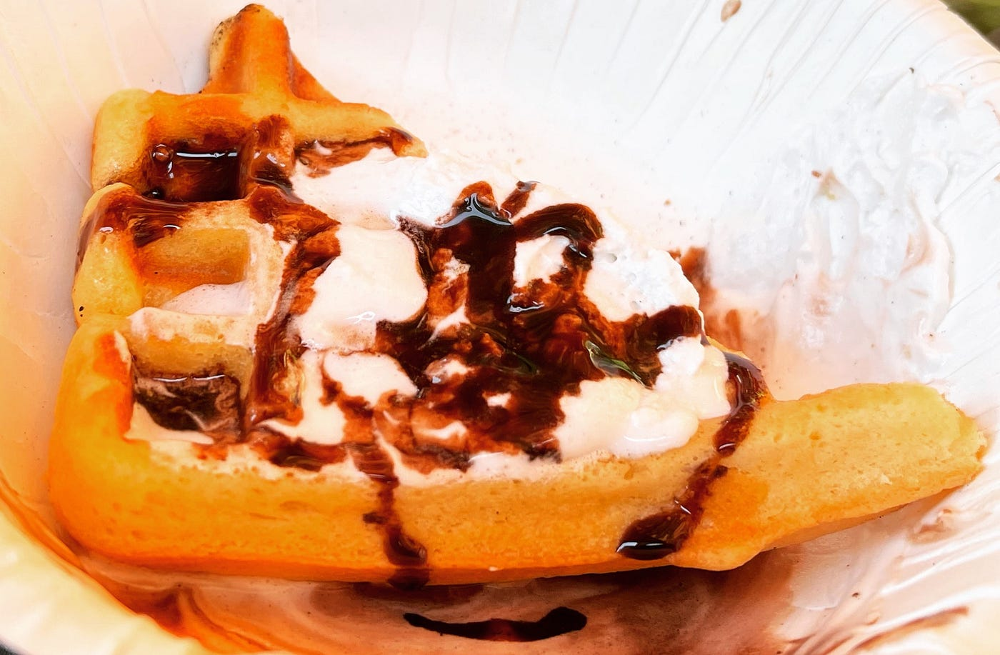

[青山学院大学](https://www.aoyama.ac.jp/) [地球社会共生学部](https://www.aoyama.ac.jp/faculty/gsc/)の**[古橋研究室**](https://github.com/furuhashilab/README#%E5%85%AC%E5%BC%8F%E6%83%85%E5%A0%B1%E7%99%BA%E4%BF%A1%E3%82%B5%E3%82%A4%E3%83%88)といえばキャンプ。

よく、「コンピューターに詳しくないと古橋研究室に入れないですか？」とか、「理数系に強くないと古橋研究室に入れないですか？」という質問を受けるけれど、それは関係ありません。

最新技術を理解して使いこなすのは研究室に入ってからでも十分学ぶことができるし、研究室の方針として定量的でクリエイティブな研究が評価されるので、必然的に数字やデジタル情報との付き合い方も身についていきます。

それよりも重要なことは、実空間を適切に認知し、自分の快適な空間へとデザインするチカラ。もっとシンプルに言うと「**アウトドアスキル**」です。泥臭い言い方をすると「**どこでも生きていけるタフさ**」があれば十分です。

あとは、頻繁に開催されるキャンプ合宿に参加して、ソロテントを建て、快適な寝袋とコットを用意し、美味しいキャンプ飯を楽しめれば、とりあえず古橋研究室では楽しく活動できます。

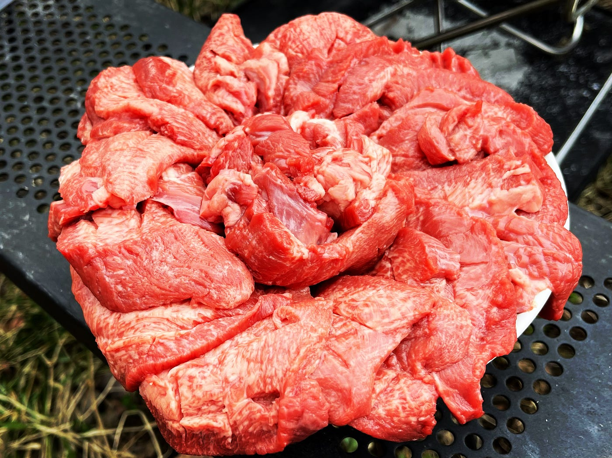

とくに食事は大事。料理をするプロセスはプログラミングに通じるし、調理の状況を見定める観察力も鍛えられます。風土や季節に合わせた食材の選び方、適切な火力となる火起こしと焚き火の管理。古橋研究室は五感をフル活用して、その空間と味覚を存分に楽しむことが最も優先されるため、フィールドワークにおいては食欲を満たすためにその労力を惜しみません。

ということで、2022年をふりかえって、この１年間の古橋研究室キャンプ飯TOP５を順不同で紹介しつつ、2023年はどんなキャンプ飯を作ろうかと今から仕込んでおこうと思います。

### # イチローズモルトで厚切りステーキをフランベ

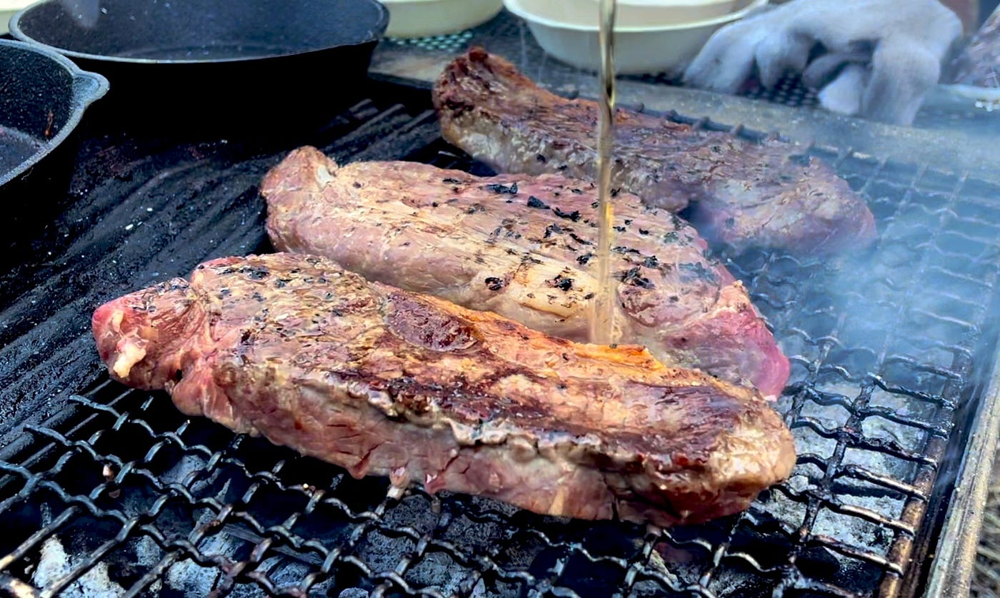

古橋研究室のフィールドワーク施設は、埼玉県秩父郡横瀬町の川沿いにあります。焚き火台が複数設置されて自由に肉を焼いたりできるので、キャンプに参加するメンバーは自由に食材を持ち寄ってやりたい放題です。

**[秩父といえばイチローズモルト**](https://ja.wikipedia.org/wiki/%E3%83%99%E3%83%B3%E3%83%81%E3%83%A3%E3%83%BC%E3%82%A6%E3%82%A4%E3%82%B9%E3%82%AD%E3%83%BC)。昔は駅の売店などでも気軽に手に入りましたが、国内外で大人気となった今では地元でもなかなか入手が難しいわけですが、古橋研究室のフィールドワーク施設ではイチローズモルトを常備。厚切りステーキを炭火でしっかり焼きながら贅沢にイチローズモルトでフランベするのが古橋研究室流のキャンプ飯です。

[ベンチャーウイスキー - Wikipedia
出典: フリー百科事典『ウィキペディア（Wikipedia）』 ベンチャーウイスキーは 東亜酒造設立者の孫である 肥土伊知郎が設立した企業である。肥土の父が経営していた東亜酒造は2000年に経営不振により…ja.wikipedia.org](https://ja.wikipedia.org/wiki/%E3%83%99%E3%83%B3%E3%83%81%E3%83%A3%E3%83%BC%E3%82%A6%E3%82%A4%E3%82%B9%E3%82%AD%E3%83%BC)

### # 朝食の定番となった焼きたてワッフル

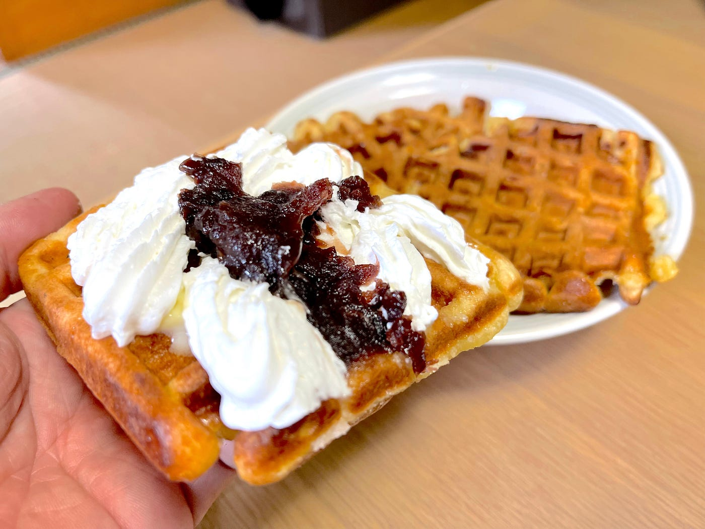

キャンプ用品店に足を運んだ人にはわかってもらえると思うが、ワッフルメーカーが陳列されている棚には魅惑的な香りがするのです。ホットケーキミックスとトッピングだけでできるシンプルな料理ながら、炭火で焼き加減をコントロールするのは実は奥が深い。

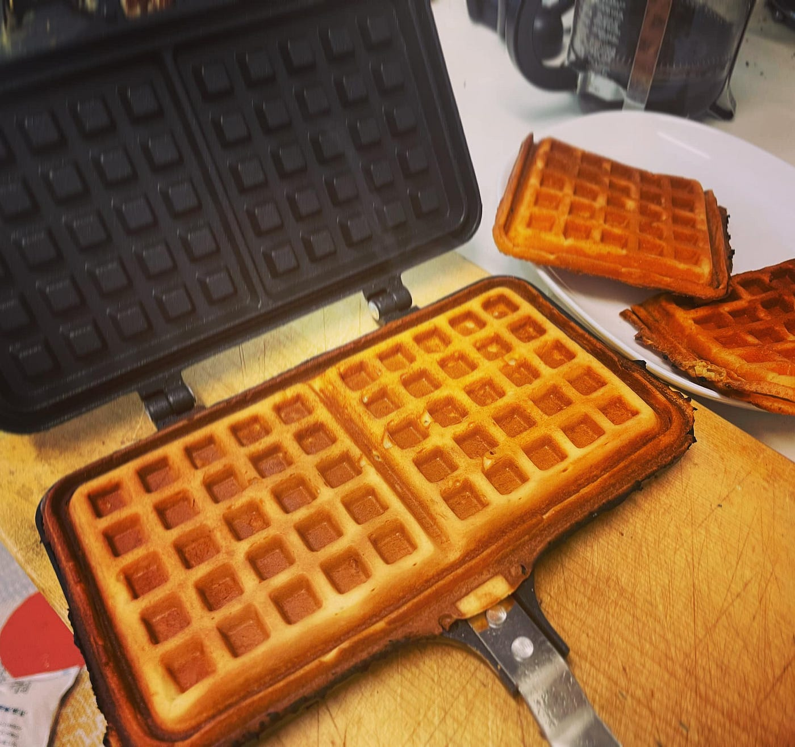

しっかりとオリーブオイルを広げ、生地を流し込みすぎず、焼き上がったら迅速に生クリームと粒あんペーストを載せて頬張るのが好みです。次回は**[セブンプレミアムの”あんバター”**](https://www.life4u.net/2021/01/anko.html)を試してみます。

[粒あん・こしあん コメダ特製なので期待したのですが...
コメダ特製小倉あん ・ つぶあんトッピング ・ あんバター ・ パキッテこしあん 載せるだけで小倉トーストの完成！レトルトあんこの比較です。 ＊2022/6月セブンプレミアム"あんバター"を追加しました。www.life4u.net](https://www.life4u.net/2021/01/anko.html)

### # 手軽に肉まんを別次元で美味しくする方法

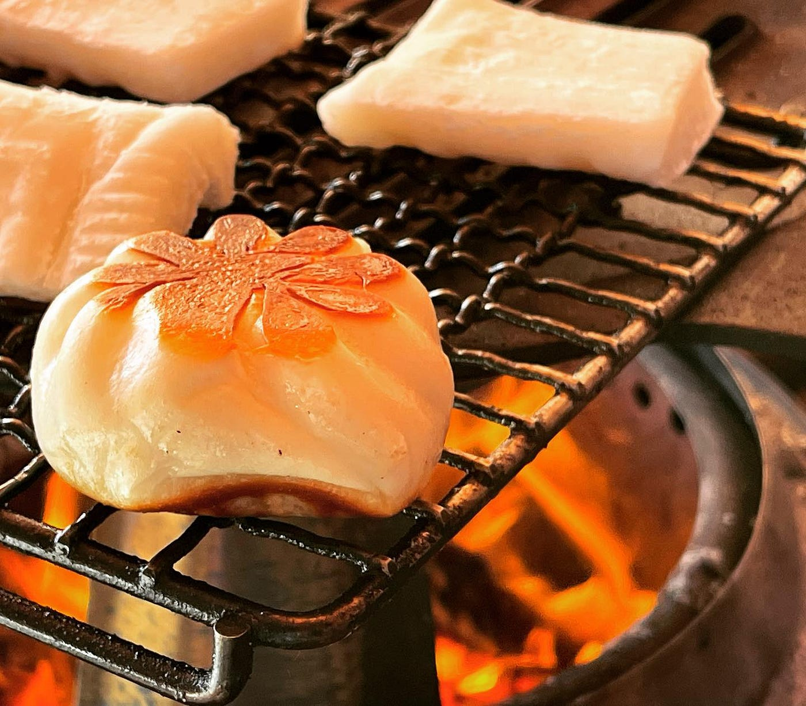

カリッと表面が焼き上がった肉まんを食べたことがあるでしょうか？ただバターを入れてホットサンドメーカーで焼いただけなのに、炭火マジックが為せるお手軽＆至福のキャンプ点心がこのホットサンド肉まん。

通常のコンビニで売っているフルサイズの肉まんだと大きすぎるので、スーパーで売っている小サイズの冷凍肉まんがオススメです。

ホットサンドメーカーも高価なものは必要なく、1000円程度で売られている**[アイリスプラザのホットサンドメーカー**](https://amzn.to/3ilxgE1)レベルでも十分美味いです。

[アイリスプラザ ホットサンドメーカー 直火 ガス火専用 1枚焼き お手入れ簡単 ブラック
オンライン通販のAmazon公式サイトなら、アイリスプラザ ホットサンドメーカー 直火 ガス火専用 1枚焼き お手入れ簡単 ブラックを…amzn.to](https://amzn.to/3ilxgE1)

### # 栗拾いからはじめるモンブランクリームづくり

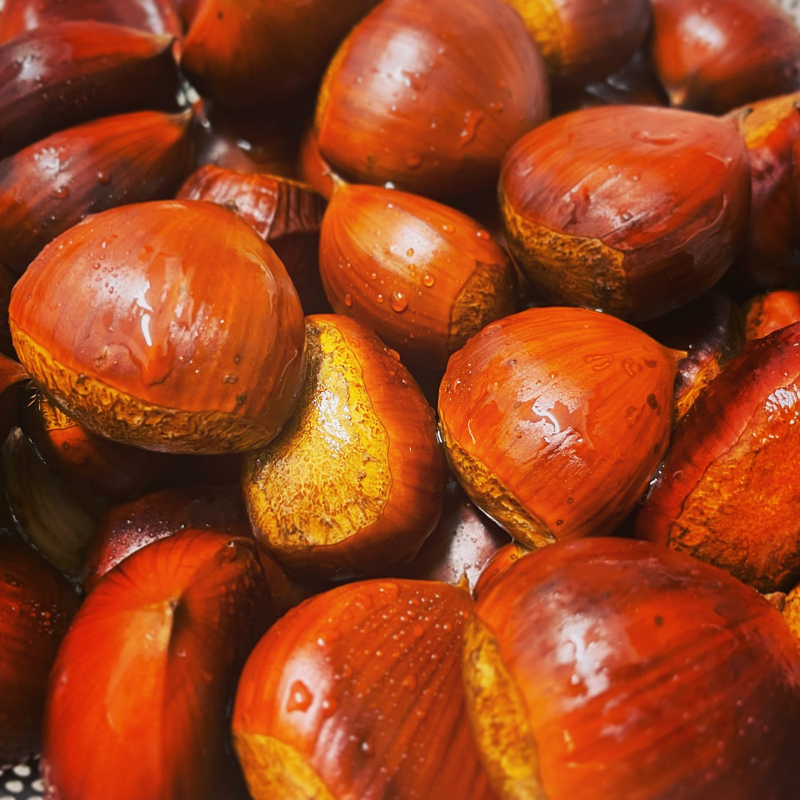

古橋研究室のフィールドワーク施設には大きな栗の木があるので、秋になると栗拾いするのが恒例です。拾った栗は丁寧に皮むきしてモンブランクリームに仕立てるのが鉄板コース。皮むきが苦手な人は[専用のカッター](https://amzn.to/3vFjpLS)がおすすめ。手がかかる分だけ、あせらず時間をかけて好みのモンブランクリームにすれば、あとはロールケーキに塗りたくっても、ポッキーにまぶしても最高です。ああ、今度は焼き立てワッフルに塗るのもいいなとこれを書きながら思いました。

[貝印 KAI 栗剥き器 カッター 栗 皮剥き 殻剥き キッチンツール Kai House Select 日本製 DH7248
貝印 KAI 栗剥き器 カッター 栗 皮剥き 殻剥き キッチンツール Kai House Select 日本製…amzn.to](https://amzn.to/3vFjpLS)

> **古橋家モンブラン 秘伝のレシピ
**・栗： 500g
・生クリーム： 200ml
・[アルメニアのアララトブランデー](https://ja.wikipedia.org/wiki/%E3%82%A2%E3%83%A9%E3%83%A9%E3%83%88_(%E3%83%96%E3%83%A9%E3%83%B3%E3%83%87%E3%83%BC))： 大さじ3杯 *
・牛乳： 200cc *
・バター： 50g *
・砂糖： 100g *

> *印の材料を混ぜながら火を通し、栗を投入してじっくり煮込みながら裏ごしして味を調整。裏ごししたあと冷やしてから生クリームを混ぜ、大人用の場合は更にブランデーを大さじ1–2杯追加。**必ず一晩冷蔵庫で寝かすこと！それが一番大事**。

[アララト (ブランデー) - Wikipedia
ヤルタ会談の際、 ウィンストン・チャーチルが…ja.wikipedia.org](https://ja.wikipedia.org/wiki/%E3%82%A2%E3%83%A9%E3%83%A9%E3%83%88_%28%E3%83%96%E3%83%A9%E3%83%B3%E3%83%87%E3%83%BC%29)

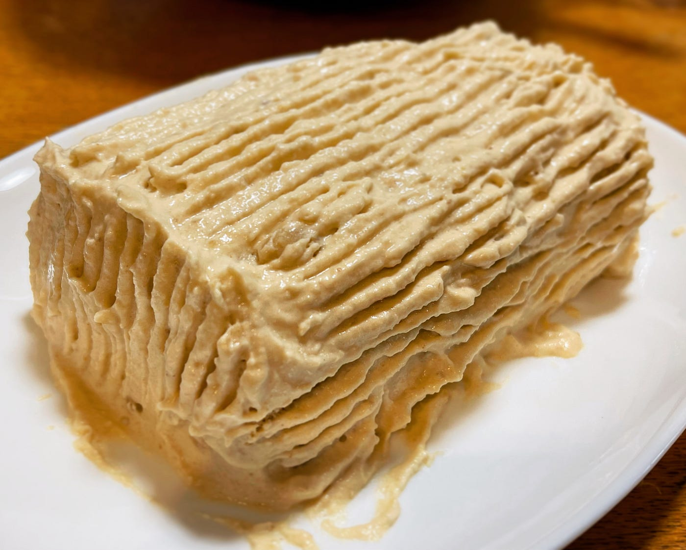

### # 春は揚げ物。採れたての山菜で。

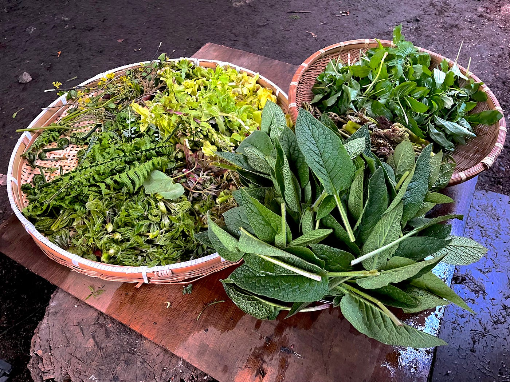

古橋研究室のフィールドワーク施設は、秩父/横瀬だけではありません。長野県大町市にある日本有数のツリーハウス天国「**[千年の森自然学校**](http://morikura.com/)」。北アルプスの斜面に立ち並ぶツリーハウスに囲まれて、学生たちはスコップ片手により快適なテントサイトをつくるため、自然空間における平坦地の人工改変を体で体験します。

一方で、春は山菜、秋はキノコと、自ら採集した自然の恵みを味わうのもフィールドワークの醍醐味。

コゴミ、タラの芽、コシアブラ、ユキザサ、アマドコロ…

揚げたての山菜の天ぷらをそのままいただくもよし、うどんに載せて天ぷらうどんを愉しむもよし。山菜の天ぷらは万能です。

その証拠に山菜の天ぷらを堪能した翌朝に、残った山菜天ぷらを細かく刻み、ご飯へと放り込んで作る山菜天ぷら炒飯がこれまた最高に美味いのです。街の中華屋では絶対に食べれない「**コゴミ天ぷら炒飯**」は至高のキャンプ飯メニューと言えます。

### # 2022年に出会った史上最強の万能ネギだれ

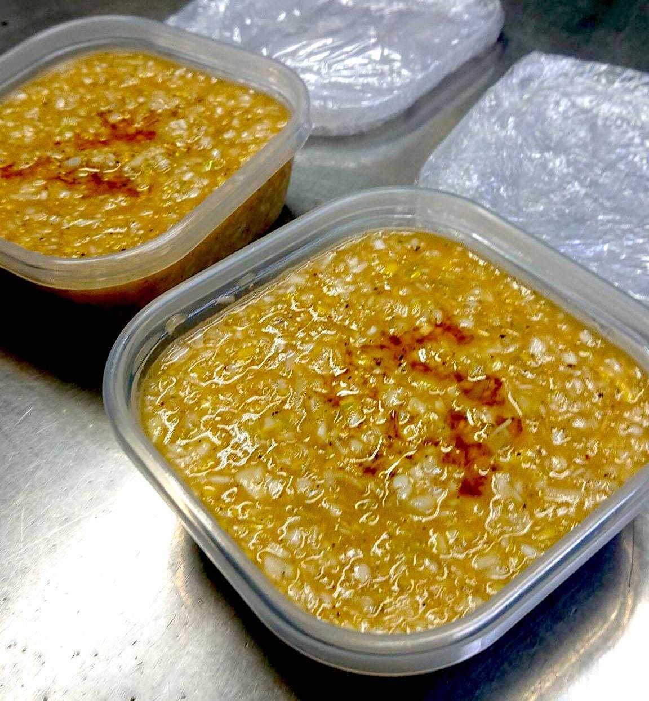

プロの技はすごい。

2022年のキャンプではプロの腕前を持つゲストが度々訪れている古橋研究室のフィールド施設ですが、そんな環境だからこそ想像を超えた絶品を味わえる機会が度々あります。

2022年で驚いたのはこの「**Koizumiシェフ特製ネギソース**」。

最初はさっぱりした焼肉のタレ的感覚で味を愉しんでいたのですが、それ以外でも、とにかく何にでも合う。ちょっと味に変化をつけたいなと思ったら、このネギソースを試してみる価値あります。

驚いたのはそうめんタレの代わりでも十分美味い。
まさに万能。

> **Koizumiシェフ特製ネギソース レシピ
**・長ネギ(白い部分) × 2本分
・ゴマ油 × 大さじ6杯 (75cc)
・塩 × 小さじ1杯(5g)
・黒胡椒 × 沢山
・レモン汁 × 小さじ1杯(5g)
 (ポッカレモンでOK、その他お酢でもOK)
・砂糖(ハチミツ) × 小さじ1杯(5g)
・ニンニク(すりおろし) × 小さじ1杯
・醤油 × 小さじ1杯

> あとは好みでアレンジ
recipe by Hiroshi Koizumi

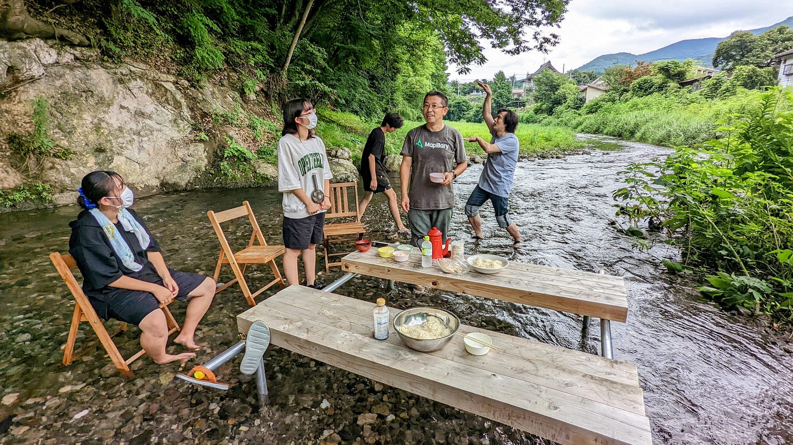

というわけで、言いたいことは、
フィールドワークは美味いものを食べてなんぼです。

**キャンプ好きの学生は古橋研究室でキャンプ飯を極めましょう！！**

**[アドグルもやっている**](https://medium.com/furuhashilab/%E9%9D%92%E5%AD%A6%E3%82%A2%E3%83%89%E3%82%B0%E3%83%AB2022-%E5%A7%8B%E5%8B%95-dronebird%E9%9A%8A%E5%93%A1%E3%81%AB%E3%81%AA%E3%82%8D%E3%81%86-e04764bca887)ので、地球社会共生学部だけでなく、青学全学部から学生を受け入れています！

_このブログは2022年の[古橋研究室アドベントカレンダー](https://qiita.com/advent-calendar/2022/furuhashilab)、[青山学院大学地球社会共生学部アドベントカレンダー](https://adventar.org/calendars/7896)として執筆しました。予定より大幅に遅れての投稿です…orz_

[Furuhashi Lab. のカレンダー | Advent Calendar 2022 - Qiita
Furuhashi Lab. のカレンダーページです。qiita.com](https://qiita.com/advent-calendar/2022/furuhashilab)

[青山学院大学 GSC 1 Advent Calendar 2022 - Adventar
GSC2022groupphoto](https://user-images.githubusercontent.com/416977/201557177-913b2c17-62fc-4c4d-9c66-3c760bd9e80c.jpg)…adventar.org](https://adventar.org/calendars/7896)
