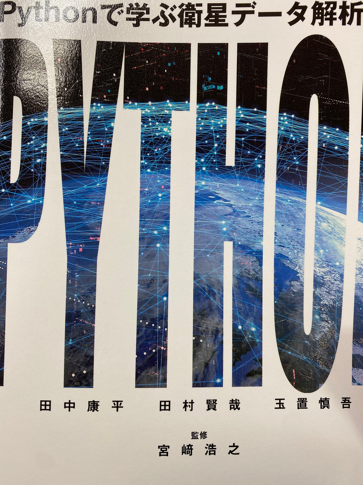
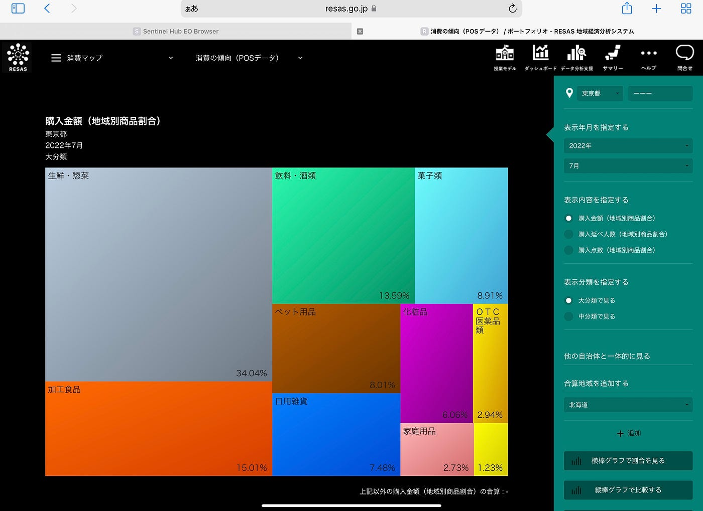

### V&F週報

新年明けましておめでとうございます。 3年植松です。

今回は青山学院大学の非常勤講師でもある田中康平先生が書いた本について少し説明させていただきます。

この本は，Pythonによる衛星データ解析に興味がある初学者に向けた入門書となっています。Pythonでの英語の初学者向けの衛星データ解析の本はあるが、日本語のものはなく、ただ利用普及に向けてはやっぱ本はあった方がいいよなあ、という思いから作ったそうです。

本の大きな流れとして人工衛星による地球観測の概要から始まり，土地の利用区分や海岸線の変化など地球環境に関連した課題について，データサイエンスでよく用いられるプログラミング言語であるPythonを利用して衛星データ解析手法について解説しています。

途中からPythonや衛星画像についての知識が乏しい私にとっては難し買ったですが衛星画像についてよく知れる面白い本でした。

本の中では[EO Browser](https://apps.sentinel-hub.com/eo-browser/)や[RESAS](https://resas.go.jp/#/13/13101)について言及されており私はRESASの性能に驚きました。

> RESAS

今までRESASについて全く知りませんでしたが本当に面白い分析がわかりやすくできるツールであると感じました。これからの分析に活用していこうと思います。

私の全てを読んだわけではありませんがおすすめです。ぜひ読んで見てください。

