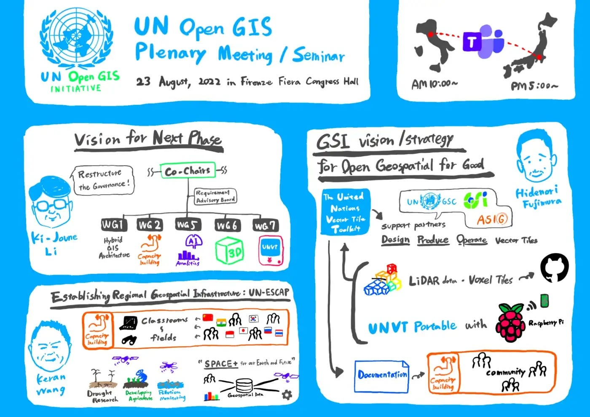
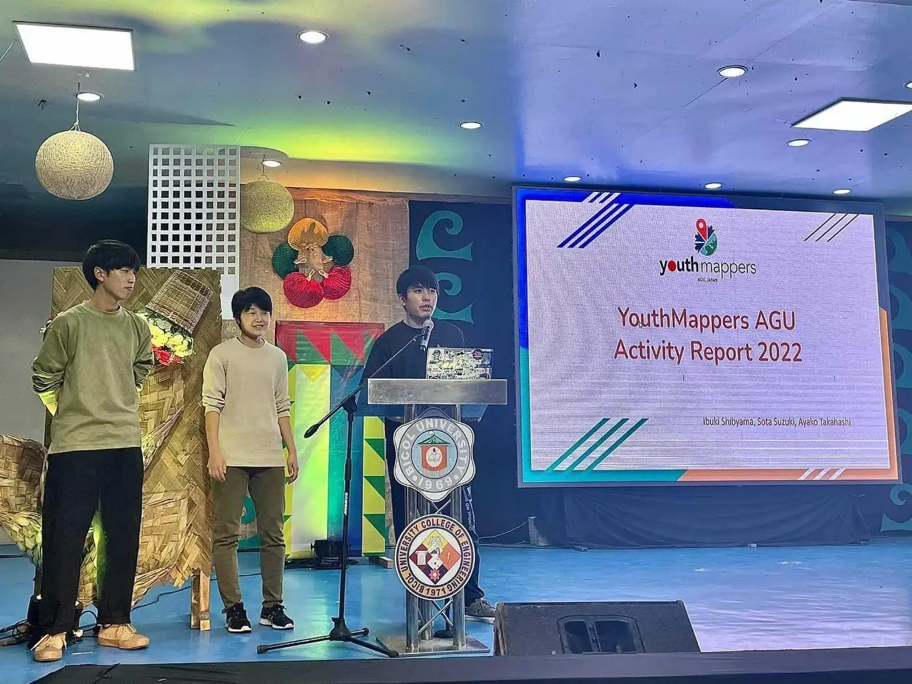
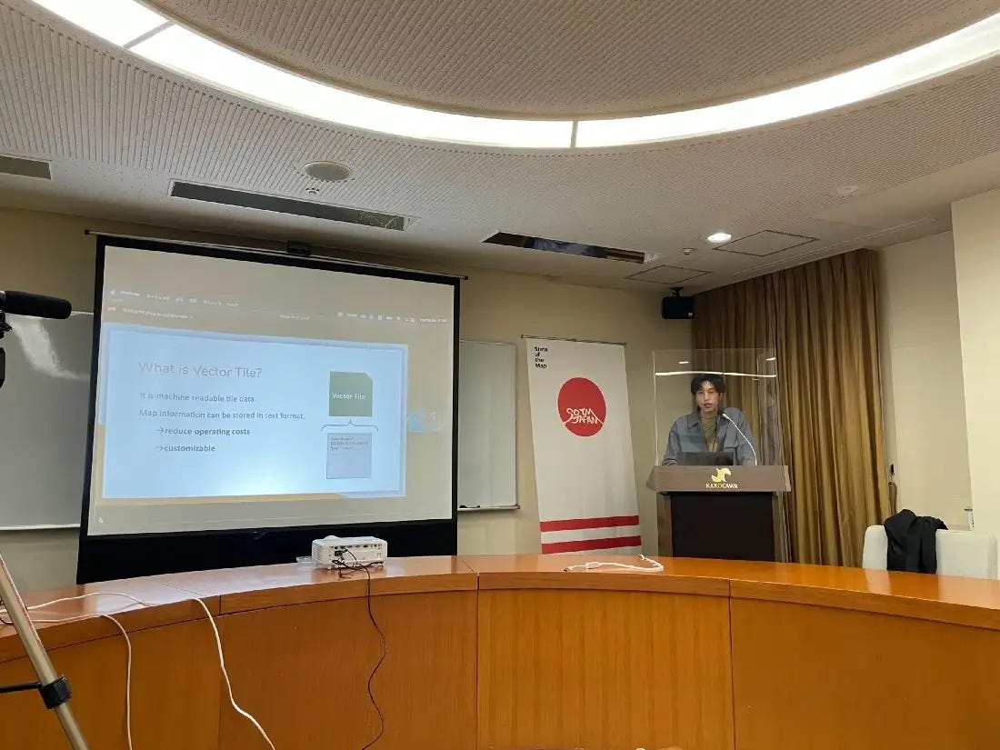
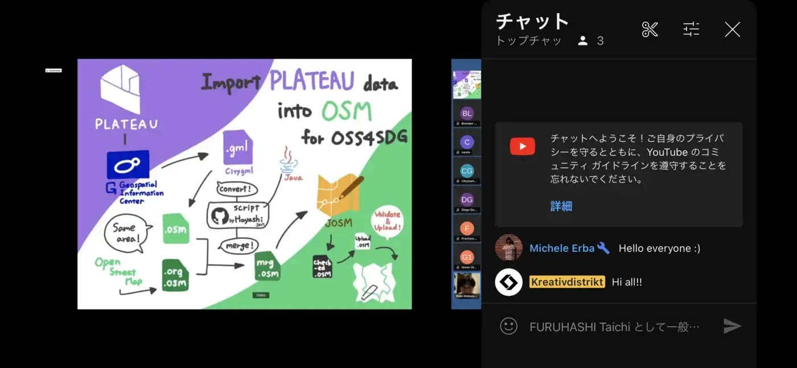
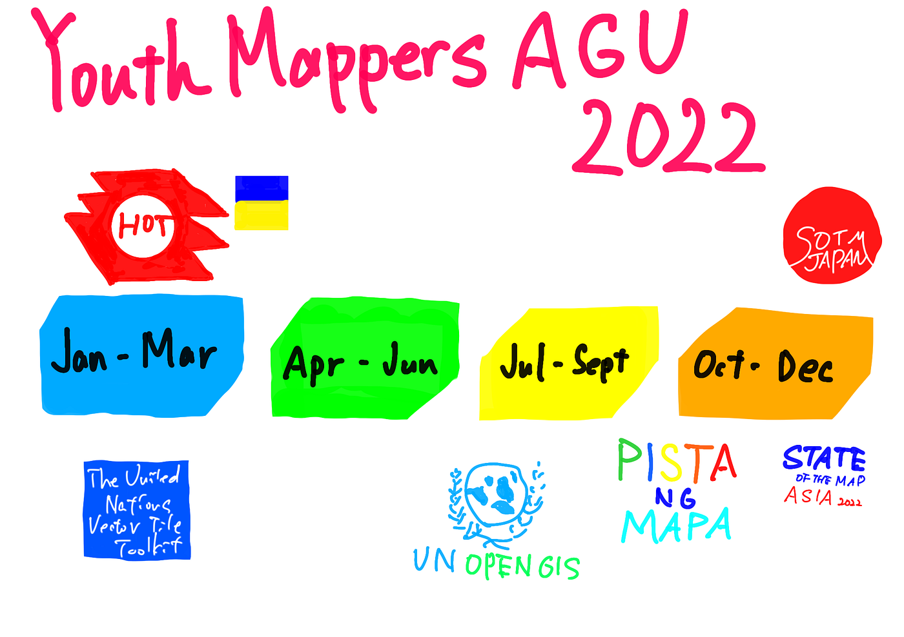

### 2022 Timeline of YouthMappers AGU

こんにちは。4年の柴山です。

今回は2022年度古橋ゼミの最終週報として、1年間の活動のハイライトをお送りします！

> _**YouthMappers Annual Report 2022_**

本題に入る前に、YouthMappers の各チャプターそれぞれの年間活動報告である、YouthMappers Annual Report の提出についてお伝えします。

先月、** **提出期限 (延期前) ギリギリで提出することができました！

来年度の Annual Report 提出時に参考になるように、設問と回答内容を [Google Drive にドキュメントとして共有してあります](https://docs.google.com/document/d/17xcIHrVwv1hE80h_MSOg4C21sJbwrpgPbY2gM14qkTc/)（研究室メンバーのみアクセス可能）。Annual Report 以外でも、活動をアピールしたいときなどに参考にしてみてください！

> _**2022 Timeline_**

#### **ウクライナ支援マッピング (Mar. ~)**

2022年2月下旬から始まったロシアによるウクライナ侵攻を受け、ウクライナから国外へ避難する市民の行動・生活サポートのためのOSMマッピングを3月上旬より行ってきました。

[Help Ukraine
YouthMappers AGUによるウクライナマッピング支援レポートmedium.com](https://medium.com/@ibukilego/list/5df8969f8532)

#### UNVT Workshop with HOT Asia Pacific Communities (Mar.)

HOT Asia Pacific のコミュニティを対象に、UNVTの概要とアジア各国でのユースケースを発信するワークショップを運営しました。

#### UN Open GIS Initiative Seminar, Tech Forum & Meetings in conjunction with FOSS4G 2022 (Aug.)

2022年8月23日、オープンソースの地理空間情報技術を国連の業務で普及・実践していく国連全体の枠組み** [国連 Open GIS Initiative](http://unopengis.org/unopengis/main/main.php) **主催の国際会議に参加しました。
UNVT 共同主任の藤村英範氏をはじめ、国連のプロジェクトで活躍されている方々の貴重な講演を視聴することができました。

#### OSS4SDG Hackathon Submission (Oct.)

国連主催のハッカソン、**[OSS4SDG**](https://ideas.unite.un.org/sdg11/Page/Overview) に参加し、CityGMLデータのOSMへのインポート作業のマニュアルを完成＆提出しました。

#### Pista ng Mapa / State of the Map Asia 2022, Legazpi (Nov.)

2022年11月21日~25日にかけて、フィリピンのレガスピで開催された Pista ng Mapa 2022 / SotM Asia 2022 に、現地参加・登壇してきました。
YouthMappers AGUの活動を海外で発信できたほか、アジアのOSMコミュニティとのオフラインでの交流もできました。

#### State of tha Map Japan 2022, Kakogawa (Dec.)

12月3日、兵庫県加古川市の[加古川商工会議所](https://www.openstreetmap.org/?mlat=34.76444&mlon=134.84003#map=19/34.76444/134.84003)にて開催された [State of the Map Japan 2022](https://stateofthemap.jp/2022/) に参加、登壇してきました。

#### OSS4SDG Hackathon Award Ceremony (Dec.)

12月7日、国連主催の [OSS4SDG Hackathon](https://ideas.unite.un.org/sdg11/Page/Overview) の授賞式に、ファイナリストに選出された YouthMappers AGU チーム代表として柴山が出席しました。

#### PLATEAU Award 2022 Selection (Dec. ~)

OSS4SDG で提出した内容、CityGML データの OSM へのインポート作業の公式マニュアルを、PLATEAU AWARD 2022 へ提出しました。
現在は2月の最終審査会に向けて準備中です！

[PLATEAU NEXT | AWARD 2022
国土交通省が主導する、日本全国の3D都市モデルの整備・オープンデータ化プロジェクト「PLATEAU」を活用したサービス・アプリ・コンテンツ作品コンテスト。www.mlit.go.jp](https://www.mlit.go.jp/plateau-next/award/#top)

> _**グラレコ_**

