### AIで2023のモチーフを作ろう

デザイン部の週報です！

年始、古橋先生がMidjourneyのイラストを活用して

年賀状を作成されました！

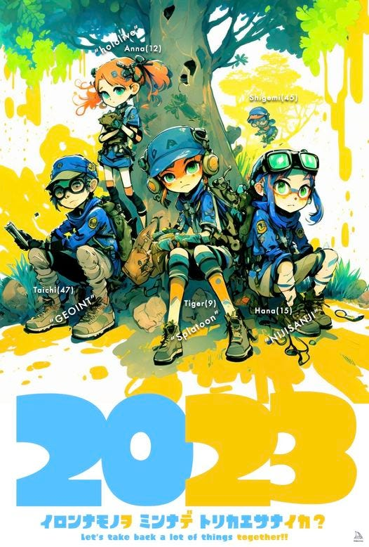

2023年の１発目ということで、デザイン部でも。干支のうさぎ、地図、青学、古橋研などにまつわるイラストをAIで作成することにしました

[Midjourney](https://midjourney.com/home/?callbackUrl=%2Fapp%2Fhttps://midjourney.com/home/?callbackUrl=%2Fapp%2F)（こうき作成）

うさぎと地図

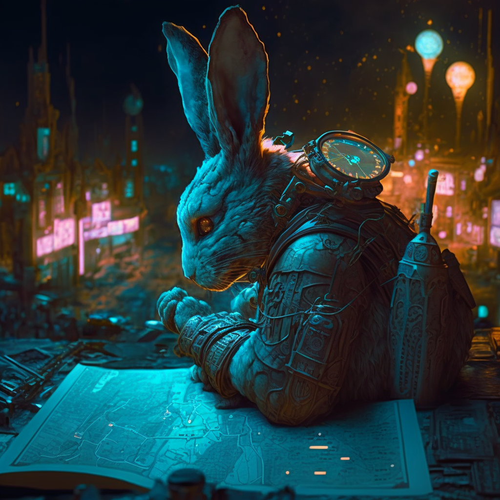

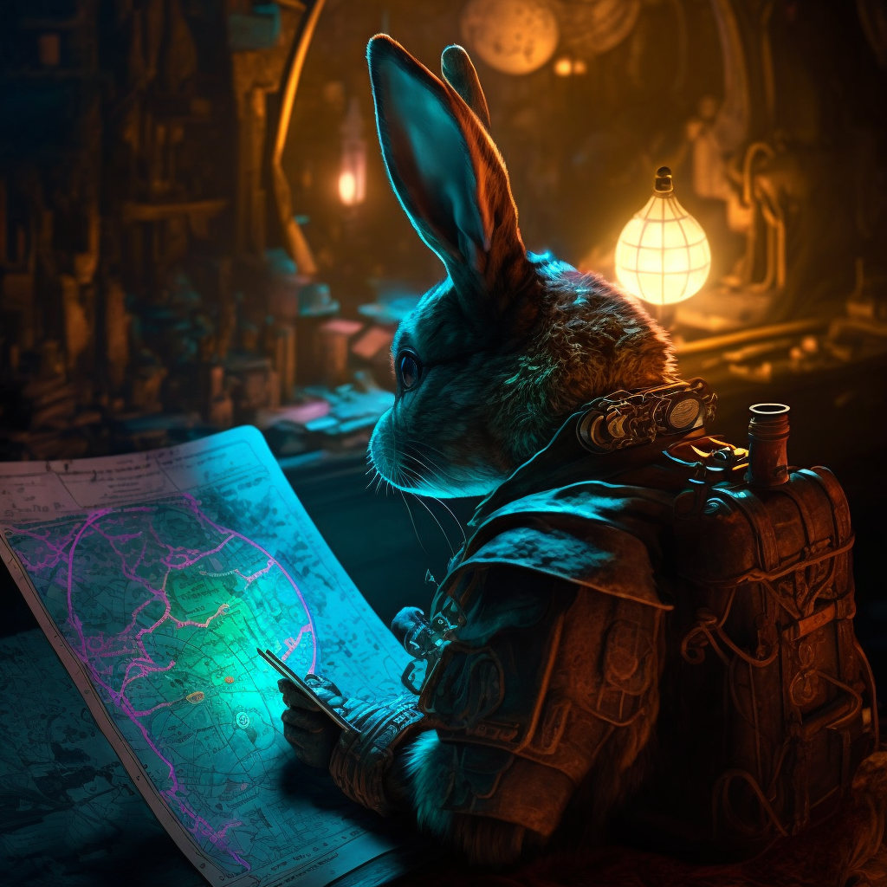

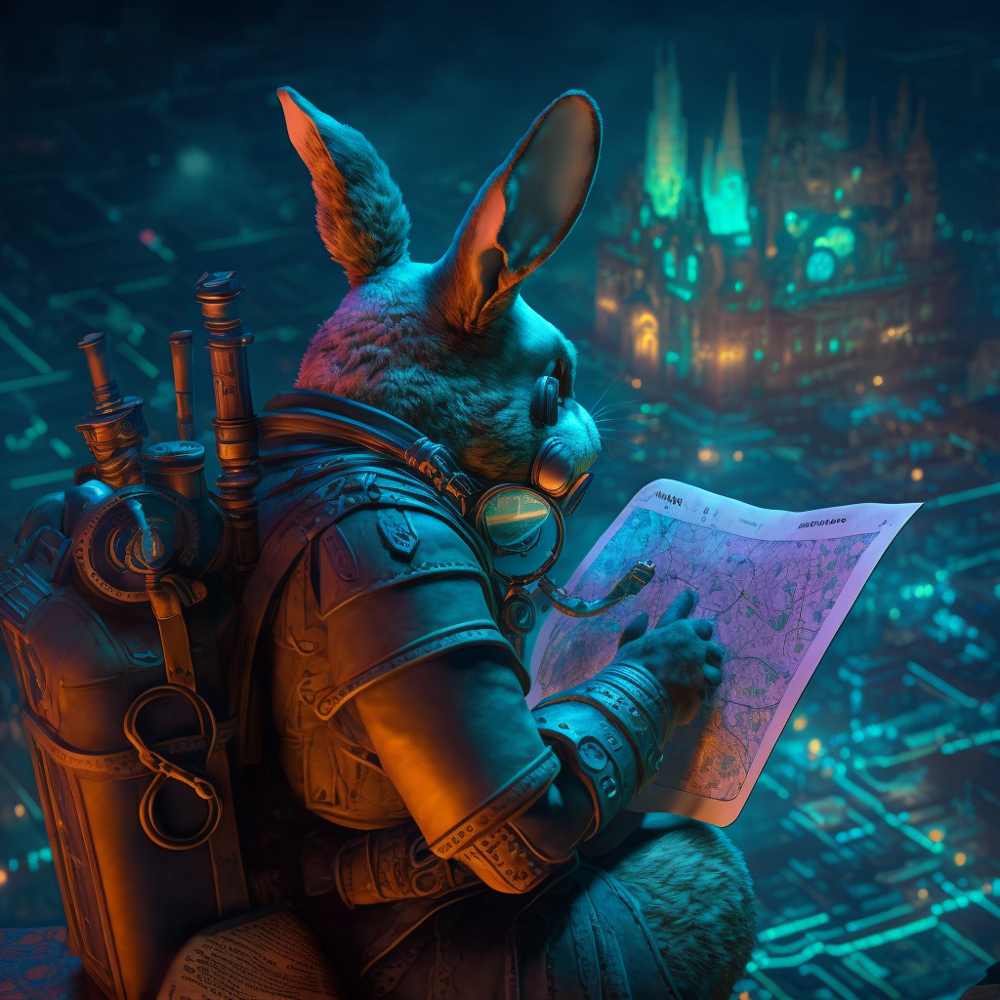

ウサギと駅伝

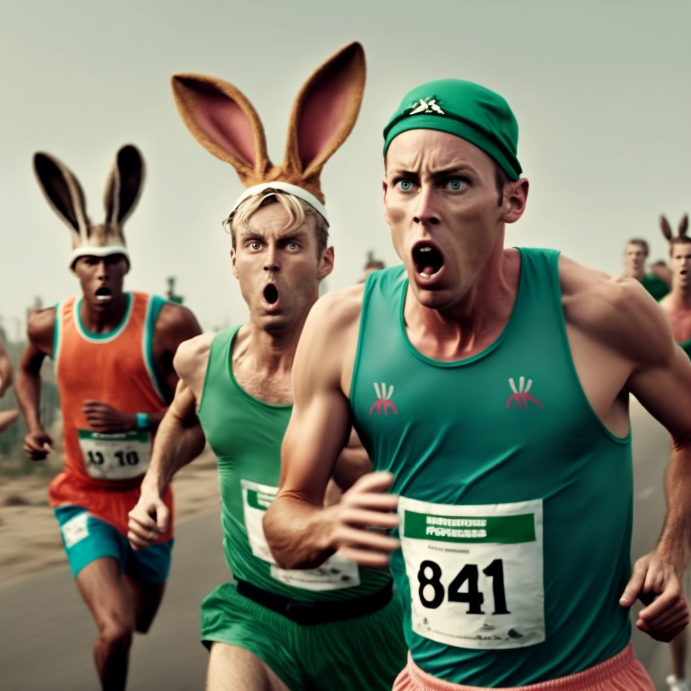

[お絵かきばりぐっどくん](https://vgu.community/house/varygoodkun/drawing)

日本語でキーワード入力ができるAIです。

入力したキーワードは

「ゴッホが描いた地図を見るうさぎ、かわいい、ペン、メガネ」

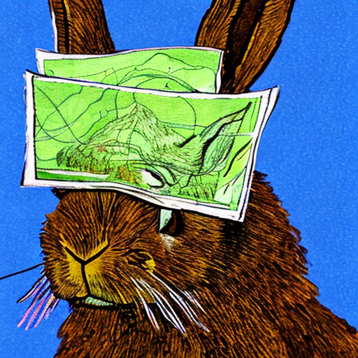

「2023年のうさぎ」

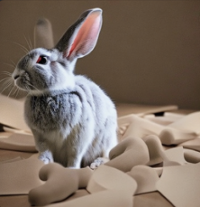

「ゴッホが描いた相模原市の青山学院大学、うさぎ、地図」

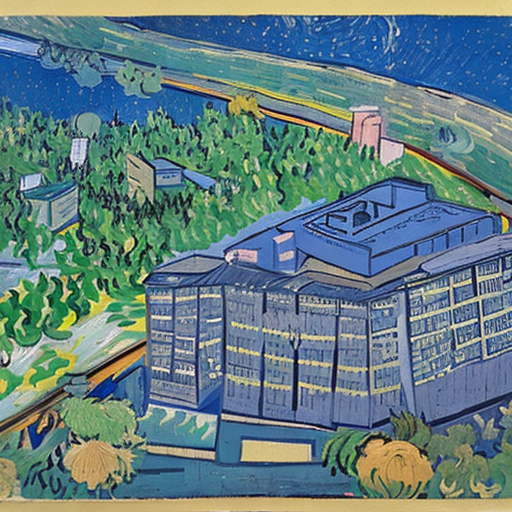

「ピカソが描いた相模原市の青山学院大学、うさぎ、地図」

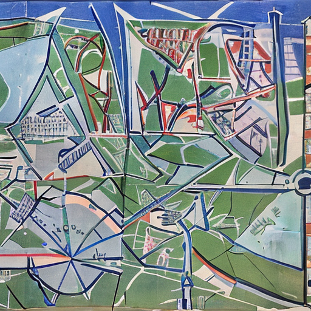

[Stable Diffusion](https://stablediffusionweb.com/)（うらら作成）

成功例

「Rabbit is reading the map.」

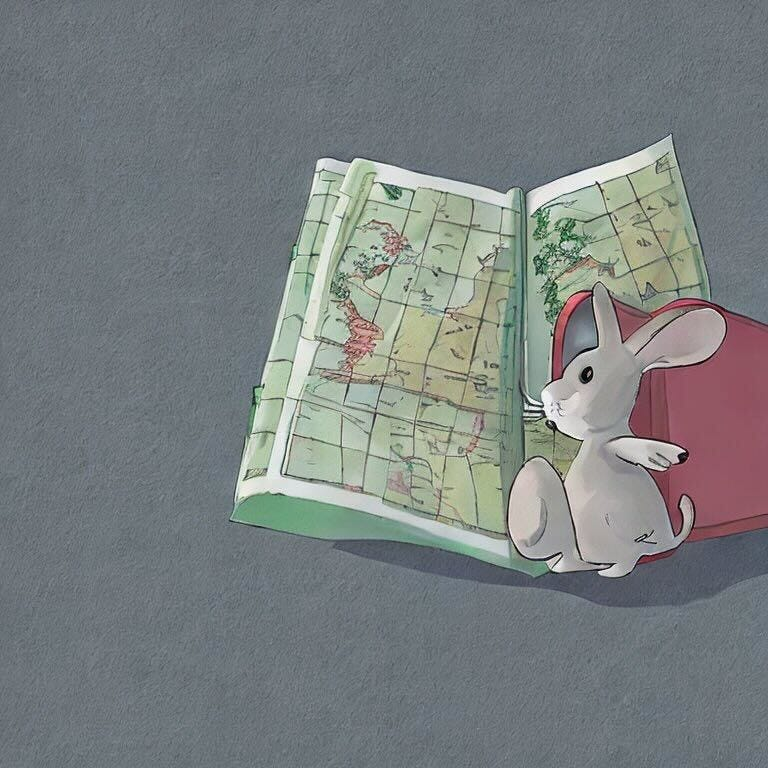

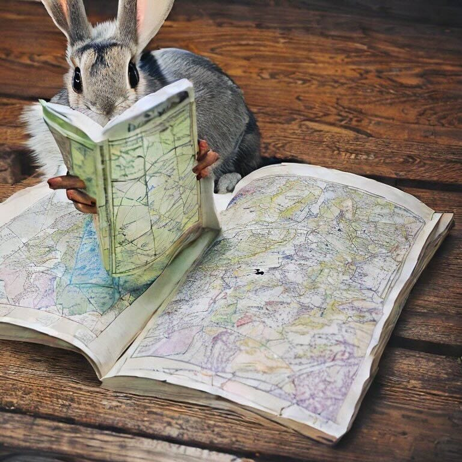

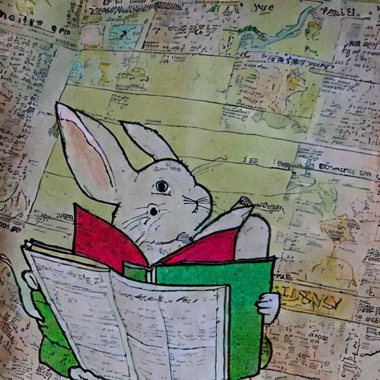

Rabit map

地図の中にウサギが入ってしまいました。（うらら作成）

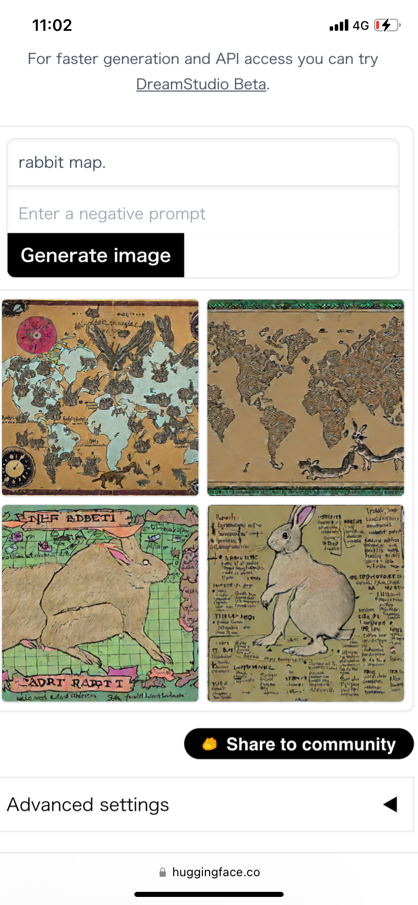

### 週報のグラレコ

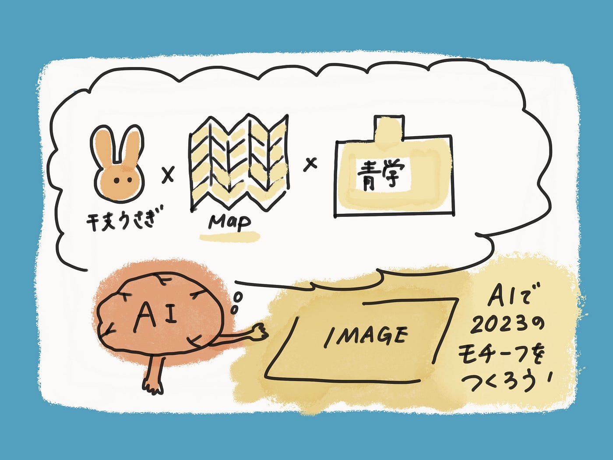
