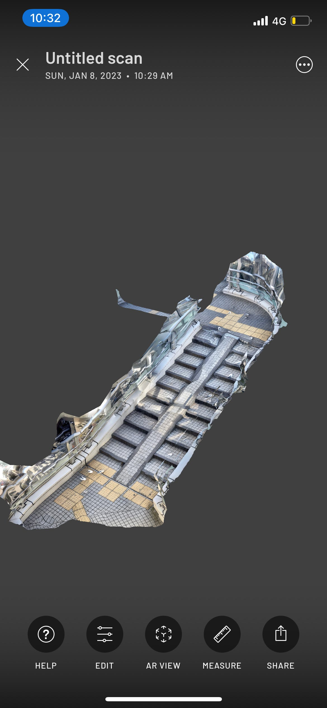

### Youth週報

こんにちは！3年の吉田です。

今回私は1月8日の早朝に渋谷駅の三次元点群計測のフィールドワークを行いました！

内容は渋谷駅周辺のペデストリアンデッキをiPhone、iPadのLiDARまたはカメラを用いて[Scaniverse](https://apps.apple.com/jp/app/scaniverse-3d-scanner/id1541433223)で3Dスキャニングし、PLATEAUデータでは足りないアセットを追加、マージするプロセスを確認する、といったものでした。

早朝に開催する理由は通行人が少ないからなのですが、冬の早朝はかなり寒く、がちがちの手でスキャニングしていました。

スキャニングは渋谷駅とヒカリエを繋ぐ連絡橋、ヒカリエと渋谷ストリームを繋ぐ連絡橋、ヒカリエ・渋谷ストリーム方面の渋谷駅東口ペデストリアンデッキで実施しました。

スキャニングは初めヒカリエの連絡橋から行ったのですが私は容量不足のせいなのか、レンダリング処理ができませんでした、、(その後のスキャニングの際に容量不足のためスキャニングできないと表示されていました)

このようなこともあり、渋谷駅東口ペデストリアンデッキではスキャニング範囲の狭い階段やスロープを担当することになりました。

初めは難しかったスキャニング作業ですが、やっていくうちにコツがわかり、慣れていきました。

そこで今回は3Dスキャニングする際のTIPsをご紹介したいと思います！

> _**TIPs_**

①スマホを縦方向に振りながらスキャニングする

②移動する際は足元を映しながら(足元はテクスチャがはっきりとしているためアプリが認識しやすい)

→逆に空(上側)を映しながらの移動はダメ！(首都高は撮らない)

③対象の物体をあらゆる方向から(なめるように)全体的にスキャニングするときれいに撮れる

④階段を撮る際は下側からスキャニングする(段差がはっきりと見えるため)

⑤フォトグラメトリでスキャニングする場合は明るさがあることが重要

→暗いと品質が悪くなる

⑥レンダリング処理をする際、高品質モード(Detailモード)で実施するのが理想だが、たまに穴が開いてしまうことがあるため、その際は**「Areaモード」でレンダリング処理**する

⑦iPad/iPad Proでスキャニングする際は重要がかなり重いので気を付ける

⑧複数人で分担作業するときは、スタート地点をばらけさせる

⑨冬の早朝はかなり寒いため、理想の時期は夏ごろ？

⑩Slow Downが出るとズレが起きやすいため、それがでないように丁寧に動かして撮影する

⑪歩行者に十分気を付けながらスキャニングすること

最後に、自分がスキャニングした中で一番ましなものをあげておきます！

Scaniverseでスキャニングした後、同じ場所をLiDARでスキャニングしたものを見せてもらったのですが、精度・鮮明さの違いに驚きました。

[Taichi Furuhashi](None)先生も言っていましたが、現在のLiDARのRangeが5mなので、10mになったらiPhoneを買い替えたいと思ってます！
