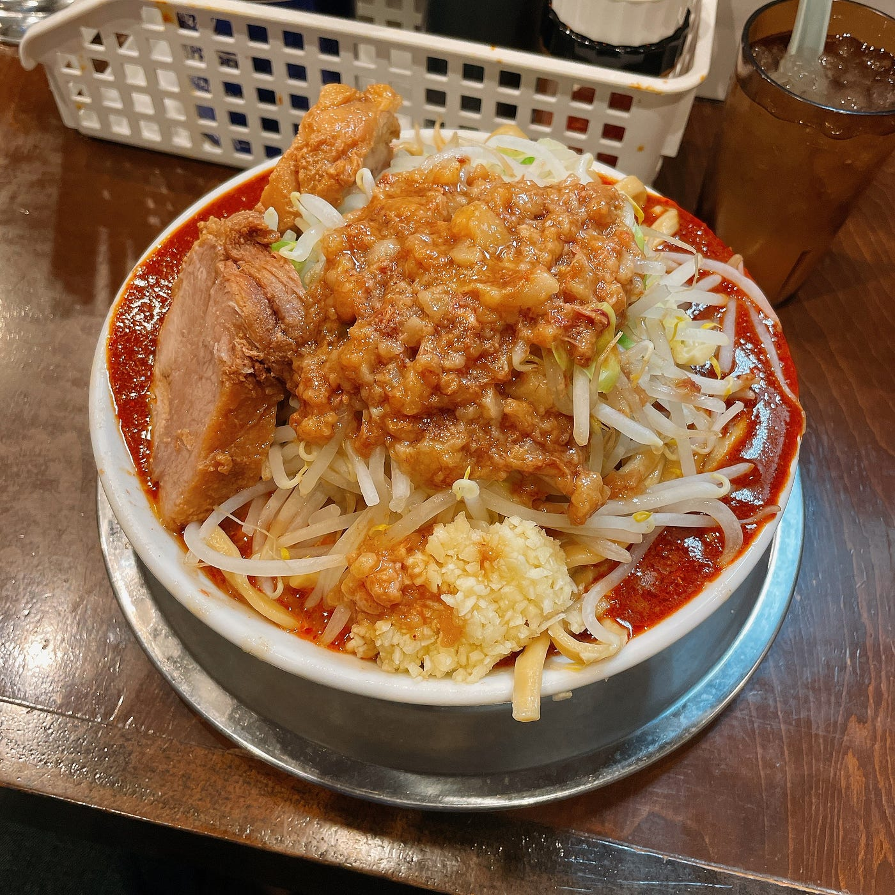

### 二郎（系）を食べたい！！！

古橋ゼミ4年の鈴木です。12月21日のアドベントカレンダーを担当させていただきます。年末にしばらく体調を崩しており、記事を書くほどの作業をできず、投稿が大幅に遅れてしまいました。申し訳ありません。

今回の記事は、古橋研の毎年の恒例行事である[ゼミ論のアドベントカレンダー](https://qiita.com/advent-calendar/2022/furuhashilab)ということで、私のゼミ論ラーメン二郎マップについて書かせていただきたく思います。

私は[昨年度のゼミ論](https://github.com/furuhashilab/2021gsc_SotaSuzuki)に引き続き、ラーメン二郎マップの継承に努めることにいたしました。

#### 振り返り

まずは昨年行った内容について振り返ってみたいと思います。

昨年度は2018年度卒業生の[渡邊結奈 先輩の卒業論文](https://furuhashilab.github.io/www4yunawatanabe/)であるラーメン二郎マップ（別称）に着想を得て、神奈川県内の_**二郎系ラーメン店舗_**をまとめる作業を行いました。

具体的な作業としては、渡邊先輩や[依田先輩](https://github.com/furuhashilab/2020gsc_shunsuke-yoda)が設定されたタギングルールに従い、現地調査（source=survey）によって収集した情報を[OSM](https://openstreetmap.jp/)に入力していくものです。

主な反省点としては、二郎系とインスパイアの定義の違いについて明確にできなかった点で、本年はインスパイアを二郎系の英語版という形で定義し、神奈川県内の二郎系店舗と全国のラーメン二郎店舗のデータ更新を行うことにしました。

#### 本年の進捗

続いて現在の進捗について報告させていただきます。

現在、全国のラーメン二郎店舗及び、神奈川県内の二郎系ラーメンを提供するお店をまとめる作業を終えたところになります。その結果、

全国ラーメン二郎：４２店鋪

神奈川県内二郎系：８３店舗

確認することができました。まとめた店舗一覧は[こちら](https://github.com/orgs/furuhashilab/projects/11/views/1?pane=issue&itemId=10782009)

ここからの作業としましては、

・県内の二郎系を提供するお店の中でも二郎系をメインとして提供している店舗に絞る

・各店舗の営業時間などの情報をまとめる

・店舗情報をタギングルールに従いOSMに入力

#### まとめ

昨年度のゼミ論とは少し違い、今年度は県内の二郎系店舗だけでなく全国のラーメン二郎店舗のデータも更新することにしているため、単純な作業量としては昨年度の倍ほどになっていると実感しています。その分、昨年度行った作業を思い出しながらスムーズに進めることができていることも事実です。この調子で頑張っていきたいと考えています。

最後に、皆様には全国のラーメン二郎もしくは、県内の二郎系に赴くことがありましたら、ぜひ食べた一杯の写真とともにその店舗の営業時間などの情報をお教えいただきたく思っています。

よろしくお願い申し上げます。

鈴木颯汰
