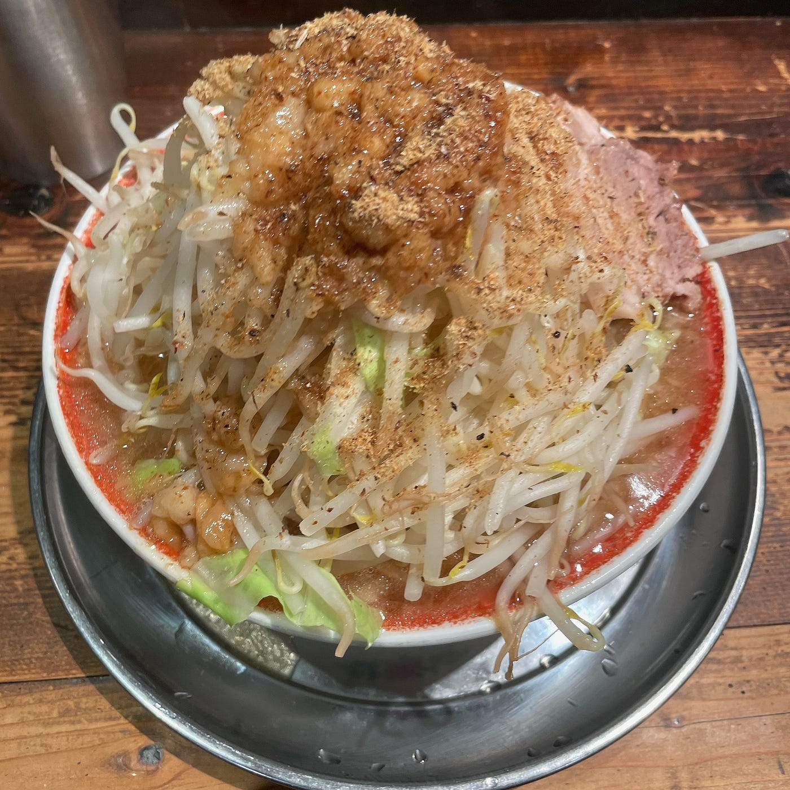
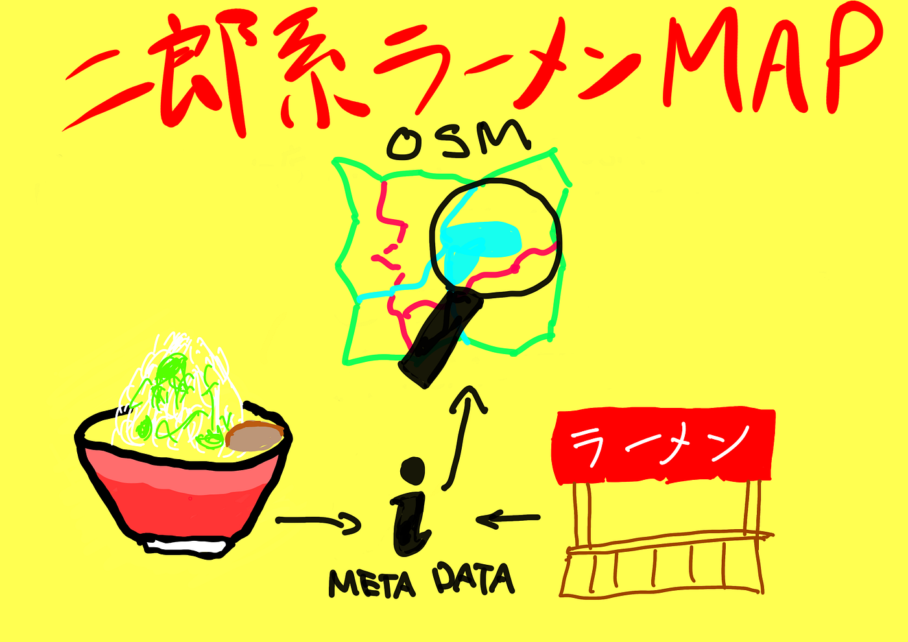

### ラーメン二郎MAP 続

皆様こんにちは。古橋研究室4年の鈴木颯汰です。

今回は2022年度の卒業論文についての記事を書かせていただきます。

_**[全国ラーメン二郎店舗および神奈川県内二郎系ラーメン店舗位置情報オープン化の継続_**](https://github.com/furuhashilab/2022gsc_SotaSuzuki/blob/main/README.md)

> _**概要_**

本研究は2018年度卒業生である渡邊結南氏の卒業論文「[日本全国ラーメン二郎店舗位置情報オープン化の実践](https://furuhashilab.github.io/www4yunawatanabe/)」に着想を得て、神奈川県内の「二郎系ラーメン」店舗の地理空間情報を、[OpenStreetMap](https://openstreetmap.jp/)（以下OSM） データベース内に登録し、だれもが自由にラーメン二郎店舗および二郎系ラーメン店舗のデータにアクセスし、二次利用が可能な状態を構築することが目的です。

> _**Introduction_**

上記した卒業論文の現地調査によって得られた日本全国のラーメン二郎店舗情報をマッピングを渡邊氏が、その研究のデータ更新やタギングルールの統一を依田氏が行ったことで、OSMのオープンな地理空間情報プラットフォームを用いて、日本全国のラーメン二郎店舗データ、およびそのメタデータを整理、網羅することによって、誰もが自由にラーメン二郎店舗データにアクセスし、再利用することが可能な状況が構築構築された。

そこで私はラーメン二郎ではなく「二郎系ラーメン」に着目し、OSMにて神奈川県内に存在する「ラーメン二郎」以外の「二郎系ラーメン」の店舗データ、およびそのメタデータを整理していくことにした。

> _**Method_**

現在営業している[全国のラーメン二郎店舗](https://github.com/orgs/furuhashilab/projects/11?pane=issue&itemId=13827078)は４２店舗。また、[神奈川県内の二郎系ラーメン店舗](https://github.com/orgs/furuhashilab/projects/11?pane=issue&itemId=10782009)は７１店舗確認できている。（2023年1月時点）

情報源は昨年度に引き続き、現地調査を行うことができた店舗にのみsource=surveyを記入した。ほかは更新が行われている公式Twitterなどを参照したほか、DMなどで連絡し、実際に情報の聞き込みを行った。 また、本年は対象店舗の数が昨年度よりも多いことから、Facebookグループの[ラーメン二郎を愛する会](https://www.facebook.com/groups/389660794496077)において対象店舗の投稿がないか逐一確認を行った。そしてこれらの情報をもとに以下のタギングルールに則り書き込みを行った。

> _**Results_**

現在営業をしている全国のラーメン二郎店舗と神奈川県内の二郎系ラーメンの店舗データをOSM上で編集、追加を行い公開する。 2022年度の店舗増減は以下の通りになった。（前年度比）

- ラーメン二郎

ラーメン二郎は一橋学園店が新たにオープンし、合計４１店舗となった。

- 県内二郎系ラーメン

横浜市：新規９店舗、閉店１店舗 → 合計８店舗増

川崎市：新規２店舗、閉店２店舗 → 合計増減なし

その他：新規１３店舗、閉店１店舗 → 合計１２店舗増

総合して新規２４店舗、閉店４店舗で合計２０店舗の増加となった。

情報源は現地調査を行うことができた店舗にのみsource=surveyを記入した。ほかは更新が行われている公式Twitterなどを参照したほか、DMなどで連絡し、実際に情報の聞き込みを行った。

> _**Discussion_**

主な論点は以下の3点である。

1. 二郎系ラーメンに適したcuisineタグのvalueの検討を行った結果、渡邊氏のリファレンスによればcuisine=ramen;jiroは「ラーメン二郎」のみを指すタグではなく、あくまで「二郎系」を指すものであったことから、cuisine=ramen;jiroという組み合わせのタグセットを選択した。また、二郎系の定義を定めることで、ただ二郎系を提供している店舗を二郎系ラーメン店ではなく、二郎系ラーメンをメインで提供している店に絞った。

1. また、 新型コロナウイルスの脅威が未だ収まらない現在、コロナ前の営業時間や時短営業時の営業時間とは異なる、新たな営業時間で営業している店舗が散見された。この営業時間は新型コロナウイルスを考慮しての営業時間であることには変わりはないと判断し、Opening_hours:covid19の欄に記入することにした。そのため、通常の営業時間をOpening_hoursに、時短の営業時間や新たな営業時間をOpening_hours:covid19にそれぞれ誤りのないよう注意を払い入力した。

1. 二郎系ラーメンのお店はラーメン二郎とは異なり、お持ち帰りやUberEatsなどのデリバリーのサービスを実施している店舗が存在することから、その情報の収集を漏らさないようにし、delivery、takeawayのタグにその有無を記入した。

> _**Conclusion_**

本研究を通じて、筆者が現地調査と聞き込み行った全国のラーメン二郎店舗と神奈川県内の二郎系ラーメン１１２店舗分の地理空間情報とメタデータをOSMデータベース内に登録し、既存のデータの見直しを行った。また、渡邊氏のリファレンスにのっとり新たな「二郎系ラーメン」の店舗のメタデータをOSM上で編集、追加し、公開することができた。しかしながら、本年は新型コロナウイルスの流行前と時短営業の時間とも違う新たな営業時間で営業を行なっている店舗がいくつかあり、OSMに記載する際にどれが今の営業時間なのかが分かりずら苦なっているのが課題であると感じた。またお持ち帰りのサービスを始める店舗が多く出てくることが予想され、その情報をどのように素早く反映するか、また現地調査を実施することのできていない店舗が多く残ったことや、コロナ期間前の営業時間についてデータを得られなかったことも課題として残っており、今後徐々に入力していく必要があると考えている。

> _**先行研究_**

[2018年度 卒業論文
2019年1月10日 青山学院大学 地球社会共生学部 地球社会共生学科 渡邊結南 学籍番号：1A115270 指導教員：古橋大地 教授…furuhashilab.github.io](https://furuhashilab.github.io/www4yunawatanabe/)

[GitHub - furuhashilab/2020gsc_shunsuke-yoda: 2020年度古橋ゼミ論用レポジトリ 依田峻輔
２０２０卒論用レポジトリ 2021 ゼミ論 日本全国のラーメン二郎店舗位置情報オープン化とメタデータオープン化の実践 Contributing for Ramen Jiro shop geolocation dataset as open…github.com](https://github.com/furuhashilab/2020gsc_shunsuke-yoda)

[GitHub - furuhashilab/2021gsc_SotaSuzuki: 2021年度古橋ゼミ卒論用リポジトリ
2021年度古橋ゼミ卒論用リポジトリ 鈴木颯汰 2021年度ゼミ論 青山学院大学 地球社会共生学部 地球社会共生学科 鈴木颯汰/SOTA SUZUKI 学生番号 1A119090 指導教員 古橋大地 教授 © Furuhashi…github.com](https://github.com/furuhashilab/2021gsc_SotaSuzuki)

> _**レポート_**

#### 発表スライド

#### グラレコ

#### GitHub Repository

[2022gsc_SotaSuzuki/README.md at main · furuhashilab/2022gsc_SotaSuzuki
2022年度古橋ゼミ論用レポジトリ 全国のラーメン二郎店舗のメタデータ更新及び、新規ラーメン二郎店舗の追加と神奈川県内二郎系ラーメン店舗位置情報データ、メタデータの更新が目的。 2022年度 ゼミ論文 青山学院大学 地球社会共生学部…github.com](https://github.com/furuhashilab/2022gsc_SotaSuzuki/blob/main/README.md)

2023年2月3日 鈴木颯汰
