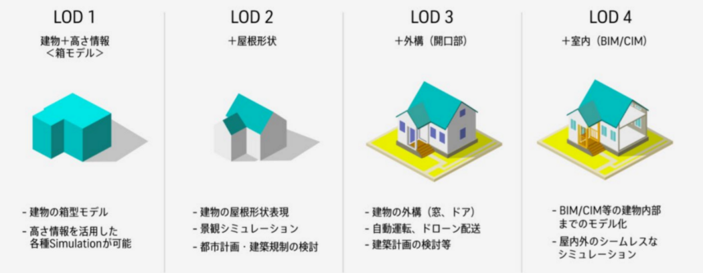
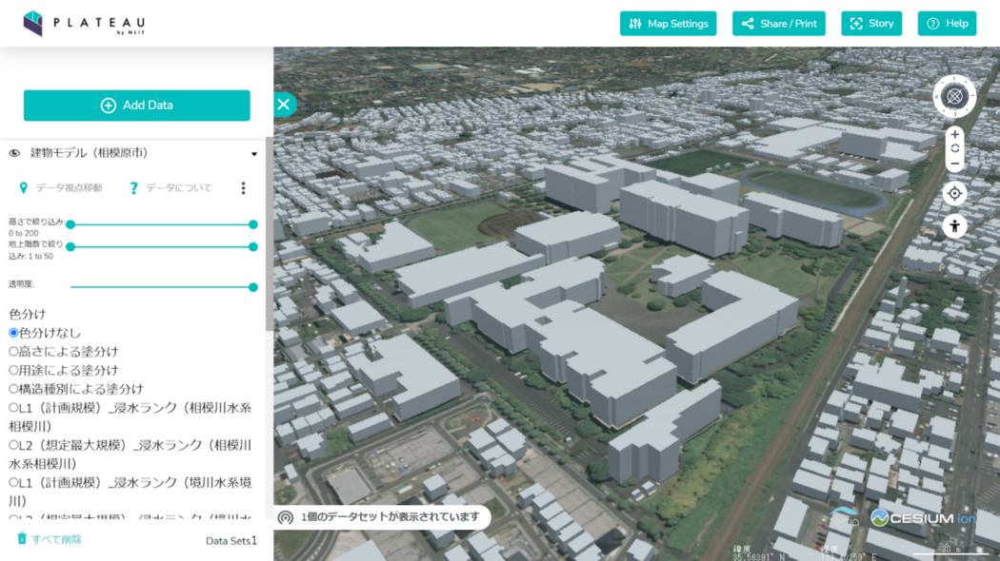
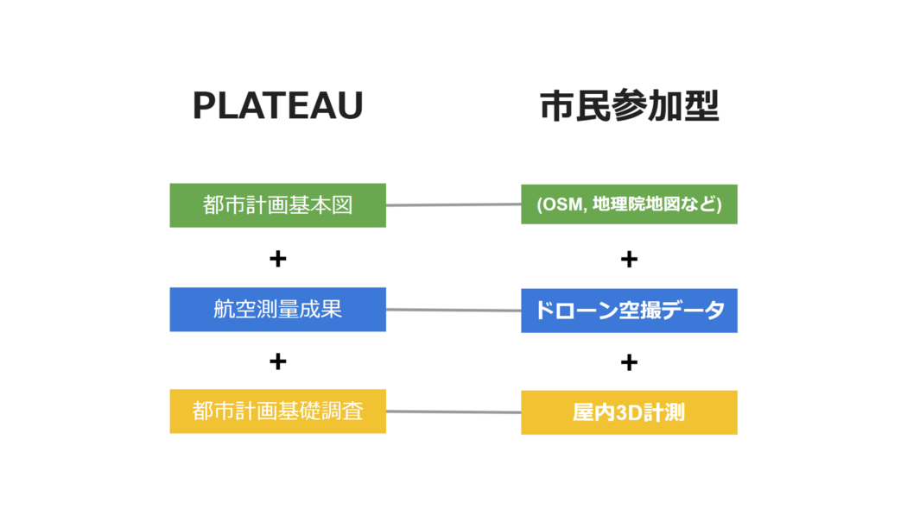
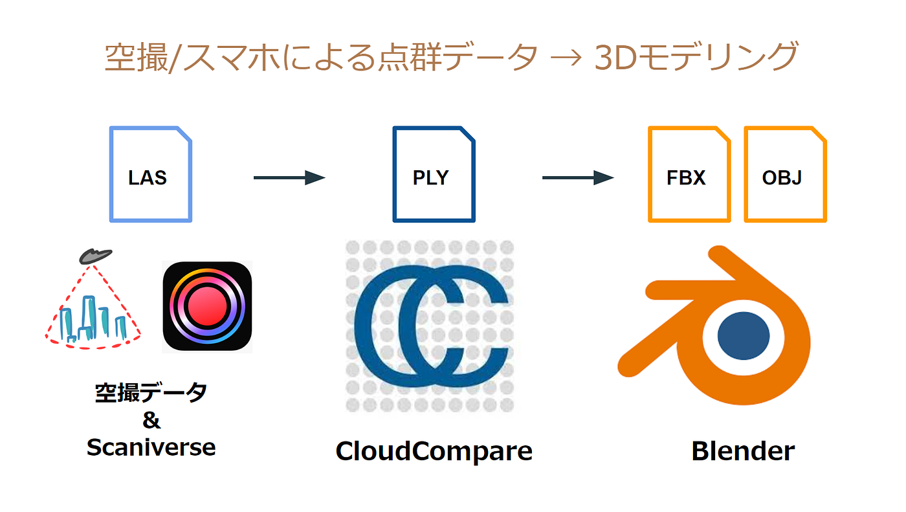
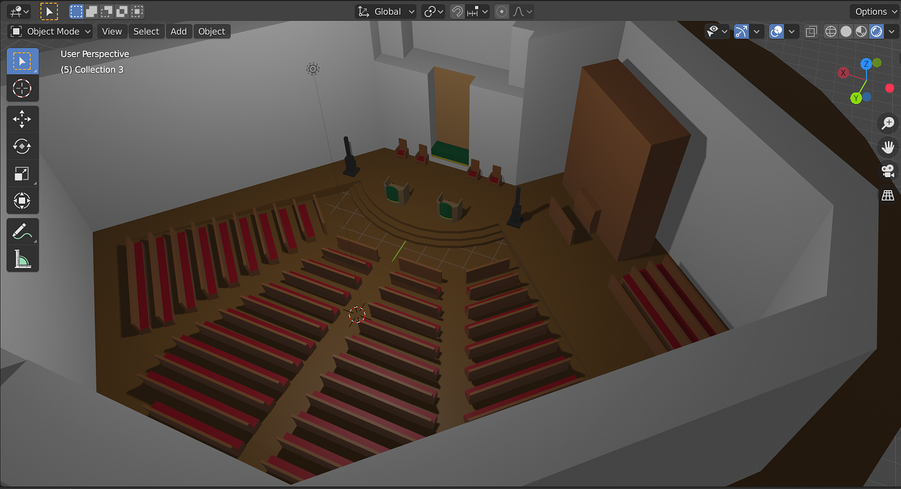
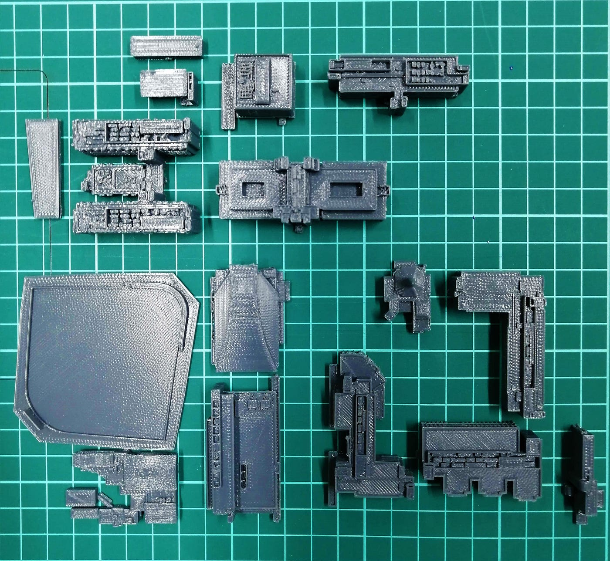
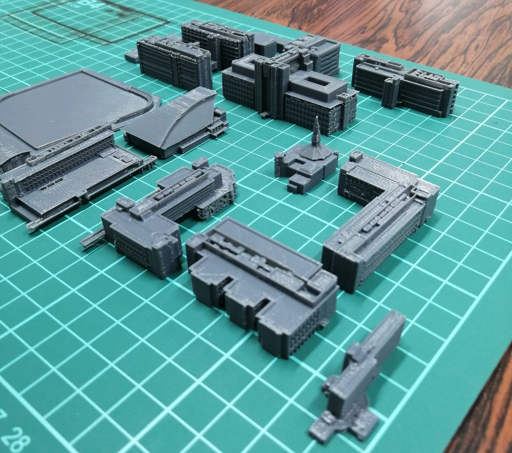
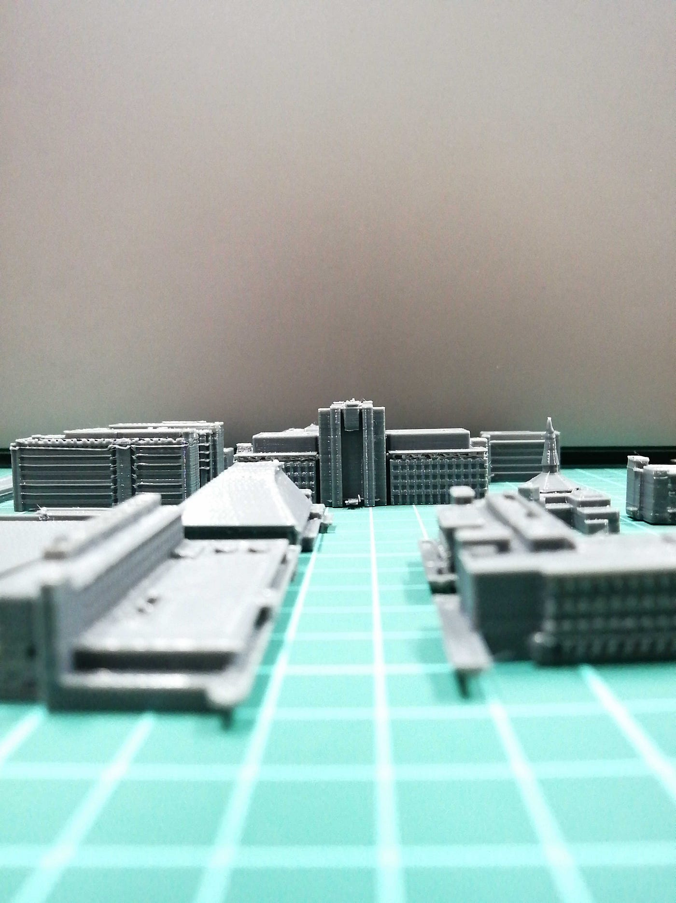
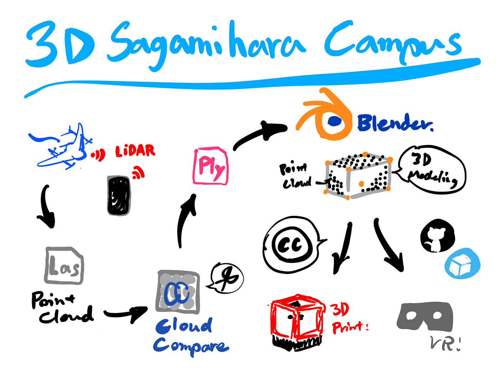

### 3Dさがきゃん 1.0

2022年度卒論

こんにちは。柴山です。
2022年度古橋ゼミ卒論記事をお送りします！

論文本文は[こちら](https://github.com/furuhashilab/2022gsc_IbukiShibayama/blob/main/README.md)からどうぞ！

> _**Introduction_**

私は昨年度より、**[ゼミ論研究・卒論研究として相模原キャンパスの3D都市モデル制作とオープンデータ化**](https://github.com/furuhashilab/2021gsc_IbukiShibayama)を行っています。

[GitHub - furuhashilab/2022gsc_IbukiShibayama: 2022年度古橋卒論用レポジトリ
2022年度古橋卒論用レポジトリ 2022年度 卒論 青山学院大学 地球社会共生学部 地球社会共生学科 柴山息吹/IBUKI SHIBAYAMA 学生番号 1A119084 指導教員 古橋大地 教授 © Furuhashi…github.com](https://github.com/furuhashilab/2022gsc_IbukiShibayama)

国土交通省による3D都市モデルのプロジェクトである **[PLATEAU**](https://www.mlit.go.jp/plateau/) において、高精度な3D建物モデルの整備が進む都心エリアとその他の地域の整備状況の格差に注目し、市民参加型で進められるような整備方法を試験的に実践してきました。

今年度はこの研究の継続、アップデートを行い卒論として提出しました。

> _**Methods_**

PLATEAUの整備フローを参考に、市民が貢献できるフローを以下のように考案しました。

昨年度に引き続き、ドローンによる点群データの取得、そのデータを基にしたモデリング、モデルのオープンデータ化の工程を実践しました。
また、今年度は [LiDAR](https://www.rohm.co.jp/electronics-basics/laser-diodes/ld_what10) 搭載の iPhone で フリーアプリの [Scaniverse ](https://apps.apple.com/jp/app/scaniverse-3d-scanner/id1541433223)を使ってチャペルの屋内のデータを取得しました。

> _**Results_**

相模原キャンパス内の19の棟全てのLOD2~3相当もモデリングが完成、公開できました！
GitHub と Sketchfab でCC BY 4.0 で公開しています。

[青山学院大学 相模原キャンパス - A 3D model collection by mapconcierge
青山学院大学 相模原キャンパス - A 3D model collection by mapconciergeskfb.ly](https://skfb.ly/oCRWu)

[2022gsc_IbukiShibayama/tmp at main · furuhashilab/2022gsc_IbukiShibayama
You can't perform that action at this time. You signed in with another tab or window. You signed out in another tab or…github.com](https://github.com/furuhashilab/2022gsc_IbukiShibayama/tree/main/tmp)

また、オープンデータの利用方法の提示として、3Dプリントとチャペル屋内モデルのVR実装を行いました！

[Hello, WebVR! * A-Frame
Hello, WebVR! * A-Frametrite-voracious-cuticle.glitch.me](https://trite-voracious-cuticle.glitch.me)

> _**Discussion_**

点群とBlenderで高精度な建物モデルを制作することができました。しかし、効率の悪さや難易度の高さ(複雑さ)を踏まえると、このままでは市民参加型の整備フローには適さないと感じられます。
AI やツールを利用して自動化できる部分を模索していくことが必要だと感じました。
ただ今回の研究は手動でここまでできた、という前例として今後何らかの形で参考になってくれればと思っています！

> _**Conclusion_**

ドローンで取得した点群データとBlenderのみで高精度な建物モデルを制作することができました。

ただし、難易度や効率の観点からは市民参加型の整備フローとしての実現性は低いと言えます。今後はAIやツールを用いながら自動で行う作業と、微調整などの手作業を組み合わせた整備フローが用いられることを見据え、その際に参考になるように今回の実践で気付いた点などをTipsとして公開する予定です。

また、オープンデータとして公開したキャンパスの3Dモデルが、ジャンルの垣根を越えてあらゆる場面で二次利用されることを期待しています！

> _**Google Slide_**

> _**グラレコ_**

